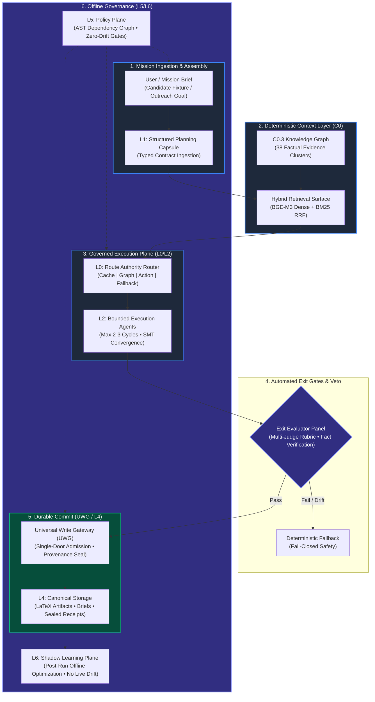

<div align="center">

# AGENTS: The Enterprise Deterministic AI Control Plane

**A production-grade reference architecture for governed autonomous runtimes.**  
*Route Authority • Verified Context • Bounded Execution • Universal Write Gateways • Exact Replay • Zero-Drift Shadow Learning*

[](https://www.python.org/downloads/)
[](docs/EXECUTIVE_OVERVIEW.md)
[](docs/SVP_ENGINEERING_GOVERNANCE_README.md)
[](#)

[**Executive Overview**](docs/EXECUTIVE_OVERVIEW.md) • [**Recruiter & Leadership Guide**](docs/RECRUITER_GUIDE.md) • [**Runtime Control Plane**](docs/RUNTIME_CONTROL_PLANE.md) • [**SVP Engineering Governance**](docs/SVP_ENGINEERING_GOVERNANCE_README.md)

</div>

---

## 🎯 Executive Summary & Thesis

> ### **"The agent is not the product. The governed runtime around the agent is the product."**

Most enterprise AI initiatives fail when moving from prototype to production. They do not fail because frontier models lack raw intelligence; they fail along **five predictable architectural fault lines**:

1. **No Route Authority** — Models hallucinate the sequence of actions and tool dispatches rather than executing through typed, contract-bound state machines.
2. **Unverified Context** — Retrieval engines silently inject stale, unranked, or ungrounded tokens, compromising downstream reasoning.
3. **Unchecked Writes** — Agents mutate databases, files, or external APIs across ad-hoc worker threads without admission control or rollback checkpoints.
4. **Unbounded Latency & Loops** — Unconstrained agent-to-agent loops run indefinitely, leading to token exhaustion, cost spikes, and unpredictable runtime degradation.
5. **Zero Replayability** — Failures cannot be reconstructed deterministically from logs, leaving systems un-auditable for SOC2, HIPAA, or regulatory compliance.

**This repository solves these failure modes.** It is an enterprise-grade reference design demonstrating how an **SVP of Engineering, Head of AI Platform, or CISO** can deploy autonomous agentic systems that behave like **reliable, verifiable, and deterministic software**.

---

## 🏛️ Runtime Control Architecture (L0 – L6)

The platform enforces a layered control plane separating planning, routing, grounding, execution, evaluation, write admission, and learning:



---

## 📦 Production Subsystems

The repository is organized into cleanly decoupled, production-ready engines:

| Subsystem | Mission & Architecture | Key Technical Primitives | Status |
| :--- | :--- | :--- | :---: |
| [`resume_graph_engine/`](resume_graph_engine/) | **Autonomous Career & Skill Intelligence Engine**<br>Constructs mathematically grounded, hallucination-proof executive resumes matching target job descriptions. | • C0.3 Factual Assertion Graph (38 clusters)<br>• BGE-M3 Dense + BM25 Reciprocal Rank Fusion<br>• Multi-Judge Proof Panels & LaTeX Synthesis<br>• 6-Wave Offline Evaluation Surface (G1–G6) | **Production**<br>[Explore](resume_graph_engine/README.md) |
| [`outreach_engine/`](outreach_engine/) | **Autonomous Lifecycle & Outbound Intelligence**<br>Orchestrates hyper-personalized executive engagement, briefing airlocks, and multi-touch cadence sequencing. | • Adversarial Briefing Injection Airlock<br>• Dynamic YAML Prompt Resolution<br>• Forbidden-Claims AST Linting<br>• Multi-Touch Cadence State Machine | **Production**<br>[Explore](outreach_engine/README.md) |
| [`apps_research/`](apps_research/) | **Grounded Deep Research Substrate**<br>Autonomous company profiling, competitive intelligence, and executive dossier synthesis. | • SearXNG Local Search Integration<br>• Autonomous Dossier Extractor<br>• Grounded Evidence Collector | **Active**<br>[Explore](apps_research/README.md) |
| [`apps_eval/`](apps_eval/) | **Evaluation Lab & Model Benchmark Surface**<br>Rigorous offline grading, metric delta ratcheting, and multi-dimensional LLM judge calibration. | • Automated LLM Graders & Rubrics<br>• Regression & Mutation Test Suites<br>• 7-Receipt Cryptographic CI Ratchet | **Active**<br>[Explore](apps_eval/README.md) |
| [`apps_exec/`](apps_exec/) | **Executive Brief & Narrative Synthesizer**<br>Condenses multi-source organizational signals into Board-level strategic summaries. | • Structural Blueprint Schemas<br>• Token-Budgeted Context Compression | **Active** |
| [`apps_architect/`](apps_architect/) | **Architecture Governance & ADG Engine**<br>Enforces compile-time architectural integrity across all platform code. | • AST Static Dependency Graph (ADG)<br>• Anti-Pattern Burndown Ratchets<br>• Single-Door Write Bypass Detectors | **Core Gate** |

---

## 🛡️ Enterprise Engineering Invariants

Engineering leaders care about **guarantees**, not promises. This codebase enforces four architectural invariants across compile and test time:

### 1. Factual Assertion Knowledge Graph (Zero Hallucination)
- **C0.3 Ledger Authority**: The engine evaluates candidate claims against 38 multi-node graph-evidence clusters.
- **Forbidden Claims Guard**: Output generators pass through AST-level assertion checkers that reject unverified metrics, unearned titles, or fabricated achievements before reaching the write gateway.

### 2. Bounded Socratic Iteration (Cost & Latency Ceilings)
- **Deterministic Step Caps**: Agent-to-agent self-correction loops (Generator $\leftrightarrow$ Critic) are hard-capped at 2–3 iterations.
- **Fail-Closed Convergence**: If an agent fails to meet rubric thresholds within the allocated turn quota, the system falls back to a deterministic, pre-certified safe output rather than returning unverified model emissions.

### 3. Universal Write Gateway (UWG)
- **Single-Door Commit**: No agent or tool can directly mutate filesystem storage, caches, or external databases.
- **Atomic Admission**: State mutations must be proposed as typed Write Proposals, evaluated by runtime exit gates, and committed through the Universal Write Gateway with cryptographic provenance seals.

### 4. AST Dependency Graph (ADG) Architecture Defense
- **Compile-Time Drift Elimination**: A custom AST dependency graph maps every module import, function fanout, and cross-layer call.
- **Layer Separation**: Strict separation between Reasoning, Routing, Execution, and Verification prevents architectural decay as engineering teams scale.

---

## ⚡ Quickstart

### Prerequisites
- Python 3.11+ (tested on 3.11 and 3.12)
- Git

### 1. Clone & Environment Setup
```bash
git clone https://github.com/Siamese001/agents.git
cd agents

# Initialize virtual environment
python -m venv .venv
.venv\Scripts\Activate.ps1   # On POSIX: source .venv/bin/activate

# Install dependencies in editable mode
pip install -e .
```

### 2. Run the Resume Graph Engine (`resume_graph_engine`)
```bash
cd resume_graph_engine

# Run the canonical product pipeline (Anthropic JD + Base Resume)
python -m apps_rg run

# Execute the 23-test C0.3 QREL offline evaluation suite
pytest tests/unit/apps_rg/evals/test_c03_owner_solo_qrel.py
```

### 3. Run the Outreach Engine (`outreach_engine`)
```bash
cd outreach_engine

# Run live executive outreach synthesis
python -m outreach_engine --demo

# Ingest and execute an enterprise mission fixture (e.g. Truist Executive Brief)
python -m outreach_engine --brief data/fixtures/charles_truist_mission.json
```

### 4. Verify Architectural Gates
```bash
# Run the platform deterministic validation suite
pytest tests/
```

---

## 📚 Executive & Leadership Reading Guide

For technical hiring executives, hiring managers, and architecture evaluators:

- 📑 [**Executive Overview**](docs/EXECUTIVE_OVERVIEW.md) — Strategic positioning on route authority, write controls, and board-level risk management.
- 🎯 [**Recruiter & Hiring Manager Guide**](docs/RECRUITER_GUIDE.md) — Mapping of codebase architecture to SVP Engineering, Head of AI Platform, and Principal AI Architect competencies.
- ⚙️ [**Runtime Control Plane Specification**](docs/RUNTIME_CONTROL_PLANE.md) — Detailed breakdown of the L0–L6 control plane and Universal Write Gateway.
- 🛡️ [**SVP Engineering Governance Guide**](docs/SVP_ENGINEERING_GOVERNANCE_README.md) — Concrete proof points on AST graph analysis, zero-drift shadow learning, and compliance auditing.

---

## 👤 Author & Leadership Profile

**Amit Ayer**  
*SVP-Level AI Engineering Leader | Platform Architect for Governed Enterprise AI*  
[GitHub Profile](https://github.com/Siamese001)

> *"Building AI that behaves like enterprise software — deterministic, auditable, and resilient."*
