# Agentic Governance & Intelligence Platform
## Reusable Primitives for Building Enterprise AI That Can't Hallucinate, Can't Run Unbounded, and Can't Bypass Controls

[](#enterprise-engineering-invariants)
[](#2-bounded-socratic-iteration-cost--latency-ceilings)
[](https://github.com/Siamese001/decision-intelligence-engine)

---

## The Enterprise AI Governance Gap

Most organizations deploy AI agents that work brilliantly in demos and fail catastrophically in production:

- **They hallucinate facts** — generating plausible-sounding commitments, metrics, and attributions that never occurred, then writing them to authoritative systems.
- **They run unbounded** — agent-to-agent correction loops spiral through hundreds of iterations, burning thousands of dollars in API costs before anyone notices.
- **They bypass governance** — naming conventions and prompt instructions are the first things violated under delivery pressure; nothing mechanically prevents a model from writing directly to production state.
- **They accumulate architectural debt** — without compile-time enforcement of layer boundaries, AI codebases devolve into unmaintainable spaghetti within months.

The failure cost isn't in the AI budget. It's in the downstream decisions made from hallucinated output, the engineering hours lost to debugging non-deterministic systems, and the compliance risk of ungoverned model emissions.

**This repository is a battle-tested toolkit for preventing all four failure modes** — with concrete, executable governance patterns that scale from a single developer to a 200-person AI engineering organization.

---

## Portfolio Architecture

This repository provides the **reusable agentic governance primitives** that are deployed in production in the [NEE Decision Intelligence Engine](https://github.com/Siamese001/decision-intelligence-engine).

```mermaid
flowchart LR
    subgraph Toolkit["THIS REPO: Governance Toolkit"]
        direction TB
        A["Factual Assertion Graph\n(Hallucination Prevention)"] 
        B["Bounded Socratic Iteration\n(Cost & Latency Ceilings)"]
        C["Universal Write Gateway\n(Mutation Control)"]
        D["AST Layer Enforcement\n(Architectural Integrity)"]
        E["Multi-Judge Evaluation\n(Quality Calibration)"]
    end

    subgraph Application["COMPANION REPO: Decision Intelligence Engine"]
        direction TB
        F["Enterprise Meeting Ingestion"]
        G["Forensic Transcript Synthesis"]
        H["Knowledge Graph Mutations"]
        I["Executive Briefing Delivery"]
    end

    Toolkit -->|"Primitives deployed in"| Application
```



The Decision Intelligence Engine is the **application**; this repo is the **platform toolkit**. Together they demonstrate the full lifecycle: from building governed AI primitives to deploying them against a real enterprise problem.

---

## Enterprise Engineering Invariants

Engineering leadership demands **guarantees**, not promises. This codebase enforces four strict architectural invariants across both compile time and runtime:

### 1. Factual Assertion Knowledge Graph (Hallucination Prevention)
- **Graph-Led Authority**: The engine evaluates candidate claims against deeply curated, multi-node factual evidence clusters. Every assertion must trace back to a verified source node before it can pass the write gateway.
- **Forbidden Claims Guard**: Output generators pass through strict assertion checkers that reject unverified metrics, unearned titles, or fabricated achievements *before* any data reaches the write gateway.

**How it works**: When an agent proposes a factual claim (e.g., "Led a team of 50 engineers"), the Factual Assertion Graph requires at minimum one corroborating evidence node with source provenance. Claims without graph-backed evidence are rejected at generation time — they never reach the output.

### 2. Bounded Socratic Iteration (Cost & Latency Ceilings)
- **Deterministic Step Caps**: Agent-to-agent self-correction loops are hard-capped at bounded iterations (configurable per pipeline) to prevent runaway execution costs.
- **Fail-Closed Convergence**: If an agent fails to meet rubric thresholds within its allocated turn quota, the system falls back to a deterministic, pre-certified safe output rather than returning unverified model emissions.

**How it works**: Consider a 3-turn correction sequence:
```
Turn 1: Agent generates candidate output → Judge scores 62/100 (below 80 threshold)
Turn 2: Agent receives structured rubric feedback → Revises → Judge scores 78/100 (still below)
Turn 3: Agent receives delta feedback → Revises → Judge scores 85/100 (passes) → Output committed

Alternate path (fail-closed):
Turn 3: Agent revises → Judge scores 74/100 (still below after final turn)
→ System emits pre-certified safe fallback with explicit "convergence_failed" diagnostic
→ Zero unverified content reaches downstream consumers
```

The cost ceiling is predictable. The quality floor is guaranteed. The worst case is a safe fallback, never a hallucinated output.

### 3. Universal Write Gateway (UWG)
- **Single-Door Commit**: No agent or tool can directly mutate filesystem storage, caches, or external databases.
- **Atomic Admission**: State mutations must be proposed as typed payloads, evaluated by runtime exit gates, and committed through the Universal Write Gateway with cryptographic provenance seals.

This is the same architectural pattern deployed in the [Decision Intelligence Engine's graph mutation path](https://github.com/Siamese001/decision-intelligence-engine#4-the-universal-write-gateway-uwg) — LLMs propose, deterministic code disposes.

### 4. Strict Layer Separation (Compile-Time Drift Elimination)
- **AST Dependency Graph**: A custom static analyzer maps every module import, function fanout, and cross-layer call to detect and reject architectural boundary violations at commit time — not at code review time, not at deployment time.
- **Clean Boundaries**: Strict separation between Reasoning, Routing, Execution, and Verification layers ensures the system scales predictably across engineering teams.

**Why this matters at scale**: In a 50-person AI engineering org, naming conventions last about 3 months before someone "temporarily" bypasses a layer boundary. AST-based enforcement catches violations mechanically — you literally cannot merge a layer-violating import. This is the difference between aspirational architecture and enforced architecture.

---

## Platform Subsystems

The repository is organized into independent, highly cohesive engines ordered by enterprise applicability:

### Active Platform Engines

| Subsystem | Mission & Architecture | Key Technical Primitives |
| :--- | :--- | :--- |
| [`apps_eval/`](apps_eval/) | **Evaluation Lab & Model Benchmark Surface**<br>Rigorous offline grading, metric delta ratcheting, and multi-dimensional LLM judge calibration. Ensures model quality doesn't silently regress between releases. | • Automated LLM Graders & Rubrics<br>• Regression & Mutation Test Suites<br>• CI Ratcheting |
| [`apps_research/`](apps_research/) | **Grounded Deep Research Substrate**<br>Autonomous company profiling, competitive intelligence, and executive dossier synthesis — all evidence-grounded through the Factual Assertion Graph. | • Local Search Integration<br>• Autonomous Dossier Extractor<br>• Grounded Evidence Collector |
| [`apps_model_telemetry/`](apps_model_telemetry/) | **Model Telemetry & Observability Substrate**<br>Real-time execution telemetry, token consumption, latency profiling, and cross-model performance observability across agent pipelines. | • OpenTelemetry Instrumentation<br>• Token & Latency Profiling<br>• Real-Time Spend Tracking |
| [`outreach_engine/`](outreach_engine/) | **Autonomous Lifecycle & Engagement Intelligence**<br>Orchestrates hyper-personalized executive engagement with multi-touch cadence sequencing. Demonstrates the governance primitives applied to external communication. | • Adversarial Briefing Injection Airlock<br>• Forbidden-Claims Linting<br>• Multi-Touch State Machine |
| [`resume_graph_engine/`](resume_graph_engine/) | **Career & Skill Intelligence Engine**<br>Constructs mathematically grounded, hallucination-proof professional narratives. A focused demonstration of the Factual Assertion Graph applied to career data. | • Factual Assertion Graph<br>• Dense + BM25 Reciprocal Rank Fusion<br>• Multi-Judge Proof Panels |

### Foundational & Archived Governance Engines

The architectural and executive governance engines are preserved in [`docs/archive/legacy_apps/`](docs/archive/legacy_apps/) as part of package single-source-of-truth consolidation:

| Subsystem | Mission & Architectural Heritage | Key Technical Primitives |
| :--- | :--- | :--- |
| [`apps_architect/`](docs/archive/legacy_apps/apps_architect/) | **Architecture Governance Engine**<br>Enforces compile-time architectural integrity across platform code. Prevents the layer boundary violations that cause AI codebases to decay. | • Static AST Dependency Graph<br>• Anti-Pattern Burndown<br>• Write Bypass Detectors |
| [`apps_exec/`](docs/archive/legacy_apps/apps_exec/) | **Executive Brief & Narrative Synthesizer**<br>Condenses multi-source organizational signals into Board-level strategic summaries. Complements the Decision Intelligence Engine's executive recap pipeline. | • Structural Blueprint Schemas<br>• Context Compression |

---

## Key Trade-offs & Architectural Lessons

### 1. Bounded vs. Unbounded Agent Iteration
**Trade-off**: Capping Socratic correction loops at N iterations sacrifices some quality ceiling in exchange for predictable cost and guaranteed safety.

**Lesson**: The ceiling matters far less than the floor. A guaranteed-safe output at turn N is more valuable than a potentially-brilliant output at turn N+∞. In enterprise settings, a single unverified model emission that reaches a customer-facing system costs more to remediate than 100 safe fallbacks.

### 2. AST-Based vs. Convention-Based Layer Enforcement
**Trade-off**: Static AST analysis is expensive to build and maintain. Most teams rely on naming conventions and code review to enforce layer boundaries.

**Lesson**: Naming conventions are the first thing teams violate under delivery pressure. By month 3 of a growing AI codebase, someone will "temporarily" import a reasoning module from the execution layer. The AST graph catches violations mechanically — the build breaks immediately, not 6 months later during a production incident.

### 3. Multi-Judge vs. Single-Judge Evaluation
**Trade-off**: Running multiple LLM judges per evaluation increases API cost by 2-3x compared to single-judge scoring.

**Lesson**: Single-judge evaluations have unacceptable variance for production decisions. A candidate output that one judge scores 90 might score 65 from another. Multi-judge panels with inter-judge agreement metrics produce calibrated, defensible quality signals. The additional cost is negligible compared to the cost of shipping a model regression.

### 4. Pre-Certified Fallback vs. Best-Effort Output
**Trade-off**: Maintaining pre-certified safe outputs for every pipeline adds development overhead and limits the range of outputs the system can produce.

**Lesson**: In enterprise AI, silence is safer than speech. A system that says "I could not produce a verified output for this input" is infinitely more trustworthy than one that confidently emits hallucinated content. The fail-closed pattern costs development time but buys organizational trust — which is the scarcest resource in enterprise AI adoption.

---

## Competitive Differentiation

### Why Not LangChain / AutoGen / CrewAI?
Agent orchestration frameworks provide composability and rapid prototyping. They do not provide:
- **Fail-closed convergence** with pre-certified safe fallbacks when agents can't meet quality thresholds
- **Compile-time layer enforcement** via static AST analysis that mechanically prevents architectural decay
- **Bounded iteration with cost ceilings** that make agent execution costs predictable for enterprise budgeting
- **Factual assertion graphs** that ground every claim in verifiable evidence before it reaches the write path

**The gap**: Frameworks optimize for agent *flexibility*; this toolkit optimizes for agent *trustworthiness*. In enterprise settings, trustworthiness is the constraint that determines adoption.

---

## Quickstart

### Prerequisites
- Python 3.11+ (tested on 3.11 and 3.12)
- Git

### 1. Clone & Environment Setup
```bash
git clone https://github.com/Siamese001/agents.git
cd agents

# Initialize virtual environment
python -m venv .venv
.venv\Scripts\Activate.ps1   # On POSIX: source .venv/bin/activate

# Install dependencies in editable mode
pip install -e .
```

### 2. Verify Architectural Gates
```bash
# Run the platform deterministic validation suite
pytest tests/
```

### 3. Run the Research Substrate
```bash
cd apps_research
python -m apps_research --demo
```

### 4. Run the Resume Graph Engine
```bash
cd resume_graph_engine

# Run the canonical product pipeline
python -m apps_rg run

# Execute the offline evaluation suite
pytest tests/unit/apps_rg/evals/test_c03_owner_solo_qrel.py
```

---

## Executive & Leadership Reading Guide

For technical hiring executives, hiring managers, and architecture evaluators:

| Document | Audience | Focus |
|---|---|---|
| [**Executive Overview**](docs/EXECUTIVE_OVERVIEW.md) | C-Suite, Board Advisors | Strategic positioning on route authority, write controls, and board-level risk management |
| [**Recruiter & Hiring Manager Guide**](docs/RECRUITER_GUIDE.md) | Hiring Committees | Mapping of codebase architecture to SVP Engineering, Head of AI Platform, and Principal AI Architect competencies |
| [**Runtime Control Plane Specification**](docs/RUNTIME_CONTROL_PLANE.md) | CTOs, Platform Architects | Detailed breakdown of the control plane and Universal Write Gateway |
| [**SVP Engineering Governance Guide**](docs/SVP_ENGINEERING_GOVERNANCE_README.md) | Engineering Leadership | Proof points on AST graph analysis, zero-drift shadow learning, and compliance auditing |

---

## Author & Portfolio

**Amit Ayer**
*Enterprise AI Architecture · Governed Agentic Platforms · Decision Intelligence Systems*

- **Portfolio**: [decision-intelligence-engine](https://github.com/Siamese001/decision-intelligence-engine) — Enterprise meeting intelligence platform deploying these governance primitives
- **GitHub**: [github.com/Siamese001](https://github.com/Siamese001)
