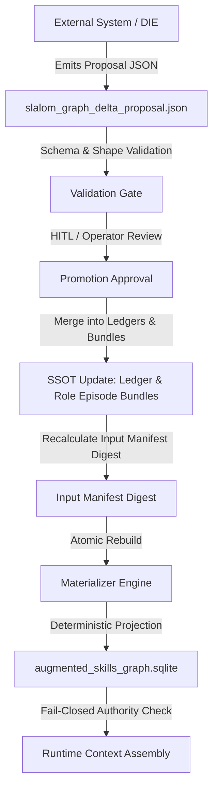

# External Import Lane Contract — Skills Graph (Apps RG)

## 1. Overview & Architectural Invariant

The GraphSkills database (`augmented_skills_graph.sqlite`) is a **purely deterministic, derived projection** of upstream canonical ledgers and bundle files. Direct modification, manual schema alteration, or out-of-band insertion into `augmented_skills_graph.sqlite` by external systems (including `decision-intelligence-engine`, batch scripts, or CLI utilities) is **strictly forbidden**.

All external imports MUST flow through the declared **Delta Proposal Ingestion Lane** described in this specification.

---

## 2. SSOT Hierarchy & Authority Boundaries

### Canonical Single Source of Truth (SSOT)
The canonical state of the skills graph is exclusively governed by:
1. **Master Skills Arsenal Ledger**: `resume_graph_engine/src/apps_rg/fact_inventory/master_skills_arsenal_ledger.json`
2. **Role Episode Bundles**: `resume_graph_engine/src/apps_rg/fact_inventory/*_role_episode_bundles.json`
3. **Candidate Skills Fact Ledger**: `resume_graph_engine/artifacts/apps_rg/fact_inventory/master_candidate_skills_fact_ledger_*.json`
4. **Edge Semantic Contracts**: `resume_graph_engine/src/apps_rg/fact_inventory/c03_graph_edge_semantic_contract.v*.json`

### Allowlisted Source Authorities
Every node and edge projected into SQLite must carry a `source_authority` from the allowlist:
- `augmented_skills_graph`: Canonical nodes and edges originating from the master skills arsenal ledger or role episode bundles.
- `candidate_skills_fact_ledger`: Promoted facts from the candidate ledger.
- `role_episode_bundles`: Metric outcomes and bundle anchoring edges materialized from verified bundle files.

Any other `source_authority` value (e.g. `die_graph_import`) is strictly disallowed and triggers immediate fail-closed termination.

---

## 3. External Import Lane: Delta Proposal Protocol

External systems producing candidate skills, facts, or metric outcomes must format their output as a **Delta Proposal Package** (`.json`).

### Proposal Schema (`graph_delta_proposal_v1`)

```json
{
  "$schema": "https://json-schema.org/draft/2020-12/schema",
  "proposal_id": "proposal_slalom_001",
  "source_system": "decision-intelligence-engine",
  "source_authority": "candidate_skills_fact_ledger",
  "timestamp": "2026-10-05T00:00:00Z",
  "provenance": {
    "source_documents": ["docs/extraction/slalom_experience.md"],
    "extraction_run_id": "run_20261005_slalom_ext_01",
    "sha256": "..."
  },
  "candidate_nodes": [
    {
      "node_id": "fact_slalom_001",
      "node_type": "fact",
      "label": "fact_slalom_001",
      "description": "Led production agentic AI client engagements across enterprise accounts...",
      "career_epoch": "epoch_slalom_era",
      "phase_ordinal": 3,
      "confidence": "HIGH",
      "support_level": "PRIMARY_DIRECT"
    }
  ],
  "candidate_metrics": [
    {
      "metric_id": "metric_slalom_production_agentic_client_engagements",
      "label": "production agentic AI client engagements delivered across enterprise accounts",
      "employer_id": "employment_exp_slalom_001",
      "bound_fact_ids": ["fact_slalom_001"]
    }
  ],
  "candidate_edges": [
    {
      "source_node_id": "skill_governed_agentic_systems_architecture",
      "target_node_id": "fact_slalom_001",
      "edge_type": "skill_supported_by_fact",
      "confidence": "HIGH",
      "rationale": "Direct executive engagement oversight"
    }
  ]
}
```

---

## 4. Promotion & Ingestion Lifecycle



1. **Submission**: External extraction engines deposit proposals in the candidate intake folder.
2. **Review & Promotion**: Operator reviews candidate facts against evidence bounds.
3. **SSOT Synchronized Merge**: Approved items are merged into `master_skills_arsenal_ledger.json` and the corresponding `*_role_episode_bundles.json`. Ledger shape invariants (edge counts, semantic hardening hashes, authority markers) are updated atomically.
4. **Digest Recalculation**: `compute_input_manifest(repo_root)` recalculates `input_manifest_digest` over all input files.
5. **Deterministic Materialization**: `materialize_augmented_skills_graph_sqlite` generates the new projection with canonical authority `augmented_skills_graph`.

---

## 5. Fail-Closed Runtime Verification

The runtime projection loader enforces two deterministic integrity gates:
1. **Freshness Invariant (`input_manifest_digest`)**:
   `summary["input_manifest_digest"]` in `graph_metadata` must match `compute_input_manifest_digest(repo_root)`. If any SSOT file or bundle is edited without rebuilding, the runtime detects staleness.
2. **Authority Conformance (`validate_projection_source_authorities`)**:
   Every row in `graph_nodes` and `graph_edges` is scanned. If any row contains an unallowlisted `source_authority` (such as `die_graph_import`), the runtime raises `C03UnauthorizedSourceAuthorityError` immediately.
   `ensure_c03_graph_sqlite` will **fail closed** and refuse to rebuild, preserving the evidence of tamper.
