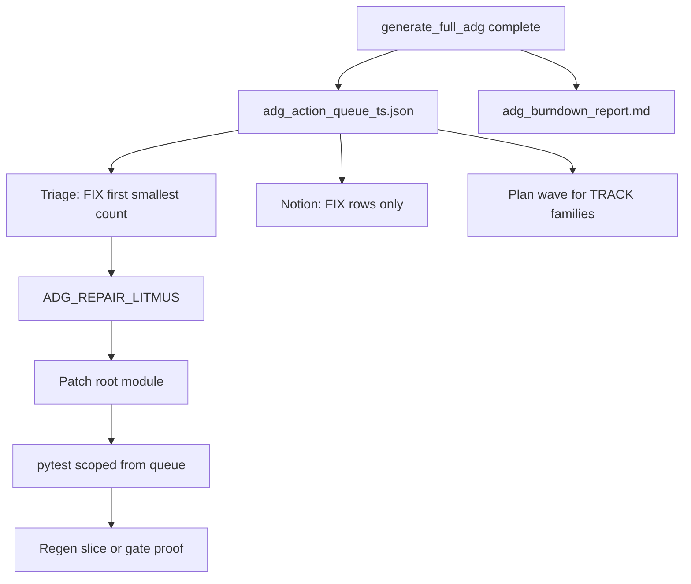

> ARCHIVED MEMORIAL RECORD: This file is preserved for review and lessons learned. Do not execute it as an active plan.

---
---
plan_id: adg-action-dispatch-c9e4a2
plan_type: governance
touches_agentic_core: false
touches_governance_ci: true
touches_cursor_rules: true
touches_plan_templates: false
core_addition_author_gate_required: false
author_gate_receipt_ref: ""
dod_exempt: false
---

# ADG post-run action dispatch — GraphDB, MVs, and reports → next best action

Close the gap between **diagnostic** ADG outputs (GraphDB projection, materialized views, burndown, app hotspot markdown) and **executable** next steps (one seam, scoped tests, plan wave, Notion backlog). Today artifacts accumulate under `artifacts/adg/` and `docs/reports/adg/` without a single ranked action queue.

> **plan_id discipline:** `plan_id` matches filename stem `adg-action-dispatch-c9e4a2`.

**Related:** [adg-analysis-procedures.mdc](.cursor/rules/adg-analysis-procedures.mdc) §2–§5, [adg-post-run-burndown.mdc](.cursor/rules/adg-post-run-burndown.mdc), [adg-ci-unified-migration-a7f3b2.md](.cursor/plans/adg-ci-unified-migration-a7f3b2.md).

**Baseline (2026-05-25):** Burndown shows **FIX=8** (2 P0 block + 6 ratchet REGR), **TRACK=17** (CI OK hygiene). App hotspot reports exist but lack gate linkage, violations, and `impacted_tests`.

**Non-negotiables (charter):** No `agentic_core` edits. No auto-repair from queue rows. No TRACK mass cleanup in this plan. No gate weakening or ratchet baseline changes.

---

## Plan State Markers

FORMAT_VERSION: simplified-plan-format-v1  
PLAN_STATUS: DONE  
HARDENING_REVIEW: APPLIED 2026-05-25 (was NEEDS_HARDENING)  
CURRENT_WAVE: —  
LAST_COMPLETED_WAVE: W3  
LAST_UPDATED: 2026-05-25

PLAN_COMPLETE: plan=adg-action-dispatch-c9e4a2 note="dispatch loop live; W0-W3 complete"

PLAN_CREATED: slug=adg-action-dispatch-c9e4a2 path=.cursor/plans/adg-action-dispatch-c9e4a2.md status=Not Started

---

## Context (SCQA)

- **Situation** — Full ADG runs produce SQLite + 42 MVs, P7 analyst artifacts (`adg_refactor_accelerator_*`, `adg_structural_outputs_*`), `p0_remediation_wave_plan_*`, burndown with FIX/TRACK/CLEAR, and per-app hotspot markdown. MCP tools (`adg_p0_wave_plan`, `adg_mv_hotspot_centrality`, `adg_blast_radius`) expose live ranking. Procedures document hotspot protocol and repair litmus.
- **Complication** — Operators read tables and raw MV tuples but lack a **dispatch artifact**: no merged queue linking gate verdict → file → scoped tests → plan hint. TRACK backlog (thousands of findings) drowns FIX/REGR. GraphDB JSON is for tools, not human next-step. Hotspot reports stop at fan-in without violations or test surface.
- **Question** — How do we turn every full ADG run into **one ranked action queue** and a **15-minute triage ritual** that feeds plans, scoped repair, and Notion backlog?
- **Answer** — Emit `adg_action_queue_<ts>.json` post-run; extend burndown with operator ladder; enrich hotspot reports; wire Cursor post-run rule + optional Notion FIX rows; document P7-first consumption in procedures.

---

## Target operating model



| Priority | Verdict cluster | Operator rule | Artifact source |
|----------|-----------------|---------------|-----------------|
| 1 | **FIX** (FAIL/REGR/SEED) | One gate per session; smallest `violation_count` first among REGR | Burndown § Fix now + queue row |
| 2 | **P0 wave** | One file from wave 1 if layer violations | `artifacts/adg/issues/p0_remediation_wave_plan_*` |
| 3 | **Refactor** | Top-1 `candidates[]` when FIX empty | `adg_refactor_accelerator_*` |
| 4 | **TRACK** | Plan wave only; never same-day mass fix | Gate → MV/P-view query; `DEFERRED_SCOPE` |

---

## Status Tables

### Wave Progress

| Wave | Phase IDs | Focus | Est. Tokens | Assumptions | Status | Success Criteria |
|------|-----------|-------|-------------|-------------|--------|------------------|
| W0 | W0.1–W0.2 | Operator SSOT + post-run rule | ~8K | Burndown FIX/TRACK exists | ✅ DONE | Playbook + rule; index linked |
| W1 | W1.1–W1.3 | `adg_action_queue` + provenance validation + schema | ~35K | Required gate_results + burndown | ✅ DONE | 7/7 tests; JSON + markdown CLI; gen hook |
| W2 | W2.1–W2.2 | Hotspot deterministic linkage + burndown link | ~22K | gate_results/MV/accelerator only | ✅ DONE | 6/6 tests; burndown `## Next action`; hotspot linkage table |
| W3 | W3.1 | Notion FIX sync (optional, non-cert) | ~12K | Manual or post-plan only | ✅ DONE | 6 tests; dry-run 3 FIX payloads; SKIP on missing token |

### Phase-Level Summary

| Phase ID | Title | Scope (files) | Pain Points | Est. Tokens | Status |
|----------|-------|---------------|-------------|-------------|--------|
| W0.1 | Operator playbook markdown | `docs/reports/cursor/adg_action_dispatch_playbook.md` | No single triage doc | ~4K | ✅ DONE |
| W0.2 | Post-run rule upgrade | `.cursor/rules/adg-post-run-burndown.mdc` | Rule only opens burndown | ~4K | ✅ DONE |
| W1.1 | Queue builder + provenance validation | `tools/reports/adg_action_queue.py`, `.cursor/schemas/adg_action_queue.schema.json` | Paths-only provenance | ~18K | ✅ DONE |
| W1.2 | Generator integration (non-blocking) | `tools/generate/generate_full_adg.py` | Queue failure could greenwash | ~8K | ✅ DONE |
| W1.3 | Schema + negative tests | `tests/unit/tools/reports/test_adg_action_queue.py` | No noise-suppression proofs | ~9K | ✅ DONE |
| W2.1 | Hotspot deterministic linkage | `tools/adg/scan_apps_hotspots.py`, `tools/adg/hotspot_gate_linkage.py` | Vague linked_gates | ~14K | ✅ DONE |
| W2.2 | Queue cross-link in burndown | `tools/reports/adg_burndown_report.py` | No NEXT_ACTION link | ~8K | ✅ DONE |
| W3.1 | Notion FIX backlog script | `tools/notion/adg_fix_backlog_sync.py` | FIX items not in Backlog | ~12K | ✅ DONE |

### Wave Progress (hook table)

| Wave | Focus | Status | Tests Added | Files Changed |
|------|-------|--------|-------------|---------------|
| W0 | Operator SSOT | ✅ DONE | — | 3 files, scope=playbook+rule |
| W1 | Action queue | ✅ DONE | 7 tests | 4 files, scope=action-queue |
| W2 | Hotspot enrichment | ✅ DONE | 6 tests | 5 files + 6 hotspot reports |
| W3 | Notion FIX sync | ✅ DONE | 6 tests | 2 files (script + tests) |

### Phase Progress

| Phase | Title | Status |
|-------|-------|--------|
| W0.1 | Operator playbook | ✅ DONE |
| W0.2 | Post-run rule | ✅ DONE |
| W1.1 | Queue builder + schema | ✅ DONE |
| W1.2 | Full ADG wire-up (non-blocking) | ✅ DONE |
| W1.3 | Schema + negative tests | ✅ DONE |
| W2.1 | Hotspot columns | ✅ DONE |
| W2.2 | Burndown cross-link | ✅ DONE |
| W3.1 | Notion FIX sync | ✅ DONE |

---

## Out Of Scope

- Rebuilding GraphDB or MV schema (consume existing surfaces only).
- Burning down entire TRACK gates (2792 orphans, 1600 UWG bypass) in this plan — those become **plan waves** elsewhere.
- Changing ratchet baselines or weakening gates to greenwash ADG.
- **Auto-repair** — queue rows are dispatch hints only; patches require ADG_REPAIR_LITMUS + human/agent execution.
- **TRACK mass cleanup** — same-day or bulk TRACK remediation is forbidden; TRACK → plan waves + `DEFERRED_SCOPE` only.
- **Notion as ADG certification** — W3 is optional tooling, never a blocking plane for `generate_full_adg` or certification.
- Consuming `adg_failure_clusters.json` for queue ordering unless snapshot timestamp matches active ADG snapshot (see Hardening §1).

---

## Hardening contract (review 2026-05-25)

MUST-FIX items below are **blocking for W1 closeout**. Optional item 8 is high-value but not blocking.

### 1. Provenance validation (not paths-only)

Each consumed input in `provenance.inputs[]` MUST record:

| Field | Required | Notes |
|-------|----------|-------|
| `artifact_key` | yes | `gate_results` \| `burndown` \| `p0_wave_plan` \| `refactor_accelerator` \| `failure_clusters` |
| `path` | yes | Repo-relative path |
| `snapshot_ts` | yes | Parsed from file body or filename; ISO-8601 |
| `digest_sha256` | yes | Hex digest of file bytes at read time |
| `status` | yes | `present` \| `missing` \| `stale` \| `rejected` |
| `required` | yes | `true` for gate_results + burndown; `false` for optional artifacts |

**Rules:**
- Active ADG `snapshot_ts` = canonical timestamp from `gate_results.timestamp` (SSOT).
- Optional artifact `missing` → emit **degraded** queue; do **not** fail full ADG generation.
- Optional artifact `stale` when `snapshot_ts` ≠ active snapshot → set `status=stale`, **exclude** from merge ordering.
- `adg_failure_clusters.json`: default `status=rejected` unless `snapshot_ts` matches active snapshot exactly; stale clusters **never** influence ordering.
- Malformed **required** `gate_results` or `burndown` → queue emit fails with explicit error (no empty queue masquerading as success).

Top-level `provenance.degraded` (bool) and `provenance.degradation_reasons[]` when any optional input is missing or stale.

### 2. Executable, auditable ordering fields

Every `actions[]` row MUST include ordering audit fields (in addition to `rank`):

| Field | Type | Purpose |
|-------|------|---------|
| `sort_bucket` | int | 0=FIX block, 1=FIX regr, 2=FIX seed, 3=P0 wave file, 4=refactor candidate, 5=reserved (TRACK never emitted) |
| `sort_band` | str | `P0` \| `P1` \| `P2` \| `P3` \| `L_APP` |
| `violation_count` | int | From gate or candidate; 0 for file-only rows |
| `source_artifact` | str | `gate_results` \| `p0_wave_plan` \| `refactor_accelerator` |
| `source_digest` | str | Digest of source file used for this row |
| `ordering_reason` | str | Human-readable sort key, e.g. `fix_block_p0_violations_asc` |

**Sort tuple (ascending):** `(sort_bucket, sort_band_ord, violation_count, gate_id|file_path)`.

**Invariant:** While any FIX action exists, no refactor candidate may have `rank` less than the last FIX rank. TRACK verdicts are **never** written to `actions[]`.

### 3. Hotspot gate linkage — deterministic sources only

W2 linkage MUST come from one of:

| `linkage_source` | Derivation |
|------------------|------------|
| `gate_results` | Gate row references module via structured gate output / violation index (not markdown grep) |
| `MV` | Row from `mv_debt_concentration_hotspots` or `mv_hotspot_centrality` keyed by `module_path` |
| `accelerator` | `candidates[].file_path` match |
| `unknown` | No deterministic join; **must** set `linkage_confidence=missing` and empty `linked_gate_ids` |

Per hotspot row required fields: `module_path`, `linked_gate_ids[]`, `violation_refs[]`, `impacted_tests_sample[]`, `linkage_source`, `linkage_confidence` (`exact` \| `inferred` \| `missing`).

**Forbidden:** inventing gate relationships; markdown text matching; guessing from gate display names.

### 4. Negative tests (W1.3 — blocking)

`tests/unit/tools/reports/test_adg_action_queue.py` MUST prove:

| Test | Assertion |
|------|-----------|
| `test_track_never_in_actions` | No action has `verdict_cluster=TRACK` |
| `test_track_never_in_notion_payload` | W3 dry-run payload contains zero TRACK rows |
| `test_refactor_does_not_outrank_fix` | With FIX fixtures present, all FIX ranks < first refactor rank |
| `test_missing_accelerator_fix_only` | Degraded queue: `actions` all FIX; `provenance.degraded=true` |
| `test_cap_preserves_rank1_fix` | With 15 FIX gates and cap=10, rank-1 FIX gate unchanged |
| `test_stale_failure_clusters_rejected` | Stale cluster file does not appear in merge |
| `test_schema_validation` | Output validates against `adg_action_queue.schema.json` |

### 5. Generator integration boundary (W1.2)

Call queue emitter **after** `emit_mandatory_adg_burndown_report`, same `ts`:

| Condition | Behavior |
|-----------|----------|
| Required input malformed | `NEXT_ACTION_ERROR=...` on stderr; queue file absent or `emit_status=failed` |
| Optional P0 wave / accelerator missing | Degraded queue + `degradation_reasons`; full ADG exit code **unchanged** |
| Queue emitter uncaught exception | stderr `NEXT_ACTION_ERROR=<exc>`; **do not** flip ADG pass/fail; preserve original ADG semantics |
| Success | stderr `NEXT_ACTION=artifacts/adg/adg_action_queue_<ts>.json` |

Queue emit failure MUST NOT greenwash a failing ADG run.

### 6. Schema validation (W1.1)

SSOT: `.cursor/schemas/adg_action_queue.schema.json` (JSON Schema draft 2020-12 or repo convention).

Implement typed builder + `validate_action_queue(doc) -> list[str]` (or dataclass `ActionQueueV1`).

**Required top-level:** `schema_version`, `snapshot_ts`, `provenance`, `summary`, `actions`, `emit_status`.

**Required per action:** `rank`, `verdict_cluster`, `action_kind`, `plan_hint`, `signal`, `source_artifact`, `source_digest`, `sort_bucket`, `sort_band`, `violation_count`, `ordering_reason`; plus `gate_id` **or** `source_id` (file path for non-gate rows).

**Constraints:** `rank` unique, strictly 1..N monotonic; `len(actions) <= max_actions` (default 10, override via `--max-actions` only in CLI).

### 7. Notion W3 — optional and non-blocking

- **Not** part of ADG certification or `generate_full_adg` required path.
- `NOTION_TOKEN` missing → exit **0**, stderr `SKIP_NOTION_TOKEN_MISSING`.
- Notion API failure on **direct script invocation** → exit **nonzero**; on optional post-hook → log only, exit 0.
- **Zero** TRACK rows created.
- Idempotency key: `gate_id + snapshot_ts`; fallback `gate_id + source_digest` when `snapshot_ts` differs on regenerated identical inputs.

### 8. CLI dry-run view (optional, high-value)

```bash
python tools/reports/adg_action_queue.py --latest --top 10 --format markdown
```

Stdout: compact triage table (rank, verdict, gate_id/file, ordering_reason, signal). Does not replace JSON SSOT.

---

## Wave 0 — Operator SSOT and Cursor discipline

WAVE_ID: W0  
WAVE_STATUS: DONE  
WAVE_COMPLETE: YES  
AUTHORIZATION_STATUS: NOT_REQUIRED  
CHECKPOINT: A

WAVE_COMPLETE: plan=adg-action-dispatch-c9e4a2 wave=0 note="0 tests, 3 files, scope=playbook+rule"

**Phases:**
- **W0.1** — Playbook: triage ladder, P7 routing table, ADG_REPAIR_LITMUS template, TRACK→plan mapping | PHASE_STATUS: DONE | PHASE_COMPLETE: YES
- **W0.2** — Extend `adg-post-run-burndown.mdc`: require `adg_action_queue` path when present; FIX-first ritual | PHASE_STATUS: DONE | PHASE_COMPLETE: YES

**Acceptance:**
- Playbook: [adg_action_dispatch_playbook.md](docs/reports/cursor/adg_action_dispatch_playbook.md)
- Post-run rule: [adg-post-run-burndown.mdc](.cursor/rules/adg-post-run-burndown.mdc)
- Index updated: [adg_action_dispatch_plan_index.md](docs/reports/cursor/adg_action_dispatch_plan_index.md)

### W0.1 — Operator playbook

**Scope:** Single markdown SSOT for humans and agents after full ADG.

**Content sections:**
1. 15-minute triage ladder (FIX → P0 wave → accelerator → TRACK deferral)
2. Question → artifact routing (from adg-analysis-procedures §4)
3. Testing hotspots: gate + module + `impacted_tests` trilogy
4. Example using 2026-05-25 baseline (2 block, 6 REGR)

**Commands:**
```bash
python tools/reports/adg_burndown_report.py
# After W1:
python tools/reports/adg_action_queue.py --latest --top 10 --format markdown
python tools/reports/adg_action_queue.py --gate-results artifacts/adg/adg_gate_results_<ts>.json --burndown artifacts/adg/adg_burndown_table.json
```

---

## Wave 1 — Action queue emitter (core deliverable)

WAVE_ID: W1  
WAVE_STATUS: DONE  
WAVE_COMPLETE: YES  
AUTHORIZATION_STATUS: NOT_REQUIRED  
CHECKPOINT: B

WAVE_COMPLETE: plan=adg-action-dispatch-c9e4a2 wave=1 note="+7 tests, 4 files, scope=action-queue"

**Phases:**
- **W1.1** — `tools/reports/adg_action_queue.py` + `.cursor/schemas/adg_action_queue.schema.json` | PHASE_STATUS: DONE
- **W1.2** — Non-blocking hook in `generate_full_adg.py` | PHASE_STATUS: DONE
- **W1.3** — Schema validation + negative tests | PHASE_STATUS: DONE

**Acceptance:** Met — see [adg_action_queue_20260525_130122.json](artifacts/adg/adg_action_queue_20260525_130122.json) (live emit).

### W1.1 — Queue schema (v1)

```json
{
  "schema_version": "1.0",
  "snapshot_ts": "2026-05-25T12:04:01+00:00",
  "emit_status": "ok",
  "provenance": {
    "active_snapshot_ts": "2026-05-25T12:04:01+00:00",
    "degraded": false,
    "degradation_reasons": [],
    "inputs": [
      {
        "artifact_key": "gate_results",
        "path": "artifacts/adg/adg_gate_results_20260525_120401.json",
        "snapshot_ts": "2026-05-25T12:04:01+00:00",
        "digest_sha256": "<64-hex>",
        "status": "present",
        "required": true
      },
      {
        "artifact_key": "refactor_accelerator",
        "path": "artifacts/adg/adg_refactor_accelerator_20260525_120401.json",
        "snapshot_ts": null,
        "digest_sha256": null,
        "status": "missing",
        "required": false
      }
    ]
  },
  "summary": {
    "fix_count": 8,
    "track_count": 17,
    "actions_emitted": 10,
    "max_actions": 10,
    "recommended_rank": 1,
    "degraded": false
  },
  "actions": [
    {
      "rank": 1,
      "verdict_cluster": "FIX",
      "gate_id": "10_infra_wiring",
      "source_id": null,
      "action_kind": "fix_gate",
      "file_path": null,
      "scoped_tests": [],
      "plan_hint": "immediate_session",
      "signal": "P0 block; 2 findings",
      "sort_bucket": 0,
      "sort_band": "P0",
      "violation_count": 2,
      "source_artifact": "gate_results",
      "source_digest": "<64-hex>",
      "ordering_reason": "fix_block_p0_violations_asc"
    }
  ]
}
```

**Merge rules (executable):**

| Step | Source | `sort_bucket` | Inclusion |
|------|--------|---------------|-----------|
| 1 | FIX gates from `gate_results` where `display_verdict=FIX` | 0=block, 1=regr, 2=seed | Always while under cap |
| 2 | P0 wave files when `plan_required` and input `status=present` | 3 | Max 3 files |
| 3 | Refactor `candidates[]` when accelerator `status=present` | 4 | Max 3; only if FIX exhausted **or** FIX count < cap |
| — | TRACK gates | — | **Never** emitted to `actions[]` |

Sort within bucket: `(sort_band_ord, violation_count, gate_id|file_path)`.

**Cap rule:** When truncating to `max_actions` (default 10), drop from **lowest priority tail** (refactor → P0 wave → highest violation_count FIX). **Rank-1 FIX MUST survive truncation.**

### W1.2 — Generator integration

**Scope:** After `emit_mandatory_adg_burndown_report` in `tools/generate/generate_full_adg.py`, invoke queue builder inside try/except; never alter ADG exit code on optional enrichment failure.

**stderr contract:**
- Success: `NEXT_ACTION=artifacts/adg/adg_action_queue_<ts>.json`
- Degraded: same path + `NEXT_ACTION_DEGRADED=1`
- Failure: `NEXT_ACTION_ERROR=<message>` (no greenwash)

### W1.3 — Tests and schema

**Files:**
- `.cursor/schemas/adg_action_queue.schema.json`
- `tests/unit/tools/reports/test_adg_action_queue.py` (fixtures for FIX+TRACK mix, missing accelerator, stale clusters, cap truncation)

**Commands:**
```bash
PYTEST_DISABLE_PLUGIN_AUTOLOAD=1 pytest tests/unit/tools/reports/test_adg_action_queue.py -q
python tools/reports/adg_action_queue.py --latest --top 10 --format markdown
```

---

## Wave 2 — Hotspot and burndown enrichment

WAVE_ID: W2  
WAVE_STATUS: DONE  
WAVE_COMPLETE: YES  
AUTHORIZATION_STATUS: NOT_REQUIRED  
CHECKPOINT: C

WAVE_COMPLETE: plan=adg-action-dispatch-c9e4a2 wave=2 note="+6 tests, 5 files, scope=hotspot-linkage+burndown-footer"

**Phases:**
- **W2.1** — `scan_apps_hotspots.py` + `hotspot_gate_linkage.py`: deterministic linkage per Hardening §3 | PHASE_STATUS: DONE
- **W2.2** — Burndown footer: `## Next action` + queue path + `emit_status` | PHASE_STATUS: DONE

**Acceptance:** Met — see [apps_lic_hotspots_20260525T132938Z.md](docs/reports/adg/apps_lic_hotspots_20260525T132938Z.md) (`unknown`/`MV` rows); [adg_burndown_report.md](artifacts/adg/adg_burndown_report.md) `## Next action`.

### W2.1 — Hotspot row shape (markdown + JSON sidecar optional)

| Column | Source |
|--------|--------|
| `module_path` | MV / fan-in table |
| `linked_gate_ids` | `gate_results` violation index join OR empty |
| `violation_refs` | P-view / violations table node ids |
| `impacted_tests_sample` | `refactor_accelerator.candidates[]` match OR `[]` |
| `linkage_source` | `gate_results` \| `MV` \| `accelerator` \| `unknown` |
| `linkage_confidence` | `exact` \| `inferred` \| `missing` |

---

## Wave 3 — Notion FIX backlog (optional, non-certification)

WAVE_ID: W3  
WAVE_STATUS: DONE  
WAVE_COMPLETE: YES  
AUTHORIZATION_STATUS: NOT_REQUIRED  
CHECKPOINT: D

WAVE_COMPLETE: plan=adg-action-dispatch-c9e4a2 wave=3 note="+6 tests, 2 files, scope=notion-fix-sync"

> W3 is **manual or post-plan optional**. Never wired as strict step in `generate_full_adg` or ADG certification.

**Phases:**
- **W3.1** — `tools/notion/adg_fix_backlog_sync.py` | PHASE_STATUS: DONE

**Acceptance:** Met — dry-run emitted 3 FIX payloads; `test_track_never_in_notion_payload` + W3 sync tests pass; closeout [adg_action_dispatch_closeout_receipt.md](docs/reports/cursor/adg_action_dispatch_closeout_receipt.md).

---

## Gap Register

**GAP-1: P7 artifacts not always in run zip on partial failure** — **Resolved in W1** via `status=missing` + `emit_status=degraded` + FIX-only queue.

**GAP-2: `adg_failure_clusters.json` stale vs live snapshot** — **Resolved in Hardening §1** via `status=rejected|stale` and exclusion from merge; playbook documents repair loop still may read clusters manually with timestamp check.

**GAP-3: Notion TRACK explosion** — **Resolved in W3** + negative tests; TRACK → plan waves only.

**GAP-4: Queue emitter could greenwash ADG** — **Resolved in Hardening §5**; `NEXT_ACTION_ERROR` without exit-code override.

---

## Definition of Done

DoD-1: Validated action queue with provenance digests
- Evidence: [adg_action_queue_20260525_130122.json](artifacts/adg/adg_action_queue_20260525_130122.json); `provenance.inputs[]` digests present
- Status: DONE

DoD-2: Negative tests + ordering audit fields
- Evidence: `pytest tests/unit/tools/reports/test_adg_action_queue.py` → 7 passed
- Status: DONE

DoD-3: Generator non-blocking integration
- Evidence: `generate_full_adg.py` try/except hook; `fail_closed=False` on emit
- Status: DONE

DoD-4: Operator playbook + post-run rule + CLI markdown view
- Evidence: playbook + rule (W0); `python tools/reports/adg_action_queue.py --latest --format markdown` exit 0
- Status: DONE

DoD-5: Hotspot deterministic linkage (W2)
- Evidence: `pytest tests/unit/tools/adg/test_hotspot_gate_linkage.py tests/unit/tools/reports/test_adg_burndown_next_action.py` → 6 passed; [apps_lic_hotspots_20260525T132938Z.md](docs/reports/adg/apps_lic_hotspots_20260525T132938Z.md) rows with `unknown`/`MV`; burndown `## Next action`
- Status: DONE

DoD-6: Notion Plans row registered (review)
- Evidence: Plans DB slug `adg-action-dispatch-c9e4a2`, Status `Not Started`
- Status: DONE (2026-05-25)

DoD-7: Plan closeout receipt
- Evidence: [adg_action_dispatch_closeout_receipt.md](docs/reports/cursor/adg_action_dispatch_closeout_receipt.md)
- Status: DONE

### Verification vs deferral

| Item | In plan? | Deferred? |
|------|----------|-----------|
| Action queue JSON | W1 | No |
| Hotspot gate columns | W2 | No |
| Notion Backlog auto-sync | W3 | Yes if token missing |
| TRACK mass burndown | — | Yes — separate plans per gate family |

---

## Scope Expansion Authorization

Use standard markers per [plan-location.mdc](.cursor/rules/plan-location.mdc) if W2/W3 expand to auto-create plan files from queue rows.

---

## Marker Quick Reference

```
WAVE_START: plan=adg-action-dispatch-c9e4a2 wave=1
WAVE_COMPLETE: plan=adg-action-dispatch-c9e4a2 wave=1 note="+N tests, N files, scope=action-queue"
PLAN_COMPLETE: plan=adg-action-dispatch-c9e4a2 note="dispatch loop live"
```

---

## Immediate execution order (review baseline)

Use this order on the **current** snapshot before W1 ships:

| Rank | Action | Gate / source |
|------|--------|----------------|
| 1 | Fix spine wiring | `10_infra_wiring` (2) |
| 2 | Fix critical path | `1_critical_path_integrity` (1) |
| 3 | Smallest REGR | `O_tool_call_parity_ratchet` (+1) |
| 4 | Next REGR | `Q2_cyclomatic_complexity_ratchet` (+1) |
| 5 | Defer hygiene | `S4_unused_imports_ratchet` → new plan wave |

---

## Closeout receipt requirements

On `PLAN_COMPLETE`, emit `docs/reports/cursor/adg_action_dispatch_closeout_receipt.md` containing:

**Required sections:**
- `FILES_CHANGED` — every path as markdown link
- `COMMANDS_RUN` — command → exit code (include pytest, schema validate, CLI markdown, optional Notion sync dry-run)
- `QUEUE_ARTIFACT` — path to `adg_action_queue_<ts>.json`
- `QUEUE_TOP_3` — verbatim first three `actions[]` rows (rank, gate_id/source_id, ordering_reason, signal)
- `DEGRADED_INPUTS` — list from `provenance.degradation_reasons` or `NONE`

**Required NON_CLAIMS block:**
```
NON_CLAIMS:
- no auto-repair from queue rows
- no TRACK mass cleanup in this plan
- no gate weakening or ratchet baseline changes
- no agentic_core changes
- W3 Notion sync is optional and not ADG certification
```

**STATUS line:** PASS only if DoD-1..DoD-5 and DoD-7 evidence present with command output; PARTIAL if W3 skipped by design.
