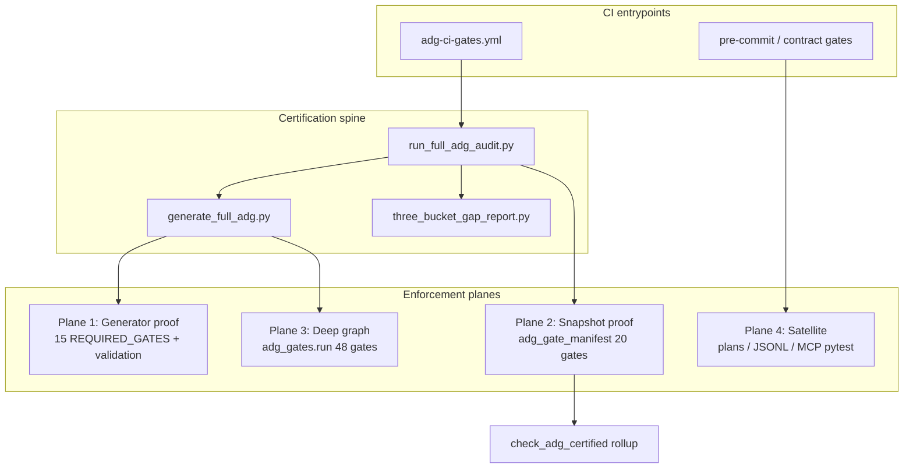

> ARCHIVED MEMORIAL RECORD: This file is preserved for review and lessons learned. Do not execute it as an active plan.

---
---
plan_id: adg-ci-unified-migration-a7f3b2
plan_type: governance
touches_agentic_core: false
touches_governance_ci: true
touches_cursor_rules: false
touches_plan_templates: false
core_addition_author_gate_required: false
author_gate_receipt_ref: ""
dod_exempt: false
---

# ADG CI unified migration — old gates → `generate_full_adg` + certification spine

Integrate fragmented ADG CI (20 manifest + 15 certification + 48 dispatcher + AUDIT + M-gates + contract gates) into a **single fail-closed design** centered on `generate_full_adg.py` and `run_full_adg_audit.py`, preserving **all high-value bug-finding gates** and eliminating duplicate enforcement.

> **plan_id discipline:** `plan_id` matches filename stem `adg-ci-unified-migration-a7f3b2`.

**Builds on:** [adg-three-bucket-pipeline-redesign-c8e4f1.md](adg-three-bucket-pipeline-redesign-c8e4f1.md) (ADR-079 opt-in three-bucket), [ADG_Audit_Pipeline.md](../docs/guides/ADG_Audit_Pipeline.md), prior gate rationalization (2026-05-23 session).

**New ADR (required before W2):** `docs/architecture/adr/ADR-080-adg-ci-unified-enforcement-planes.md` — defines four enforcement planes and dedup rules.

---

## Plan State Markers

FORMAT_VERSION: simplified-plan-format-v1  
PLAN_STATUS: COMPLETE  
CURRENT_WAVE: —  
LAST_COMPLETED_WAVE: W5  
LAST_UPDATED: 2026-05-24

PLAN_CREATED: slug=adg-ci-unified-migration-a7f3b2 path=.cursor/plans/adg-ci-unified-migration-a7f3b2.md status=Not Started

---

## Context (SCQA)

- **Situation** — `generate_full_adg.py` produces SQLite (42 MVs), optional GraphDB/P6b, records 15 gates in `adg_gate_invocation_manifest_*.json`, and runs `adg_gates.run` **non-blocking**. Twenty three-bucket gates live in `adg_gate_manifest.yaml` but are **not** in `.github/workflows/adg-ci-gates.yml`. `check_adg_certified` re-runs six scripts already in the manifest. M1–M12 and AUDIT_1–6 run in parallel on Redis/source scans with overlapping P0/P1 coverage.
- **Complication** — High-value checks are present but **orchestration fragmentation** lets regressions slip: silent dispatcher skip, manifest not in GHA, duplicate ratchets disagree, certification cross-check fails when validation recording drifts.
- **Question** — How do we migrate old ADG CI into the new `generate_full_adg` design so **every high-value gate blocks real bugs** without paying full regen cost on every PR?
- **Answer** — Four **enforcement planes** with one CI entry (`run_full_adg_audit --mode certification`) + PR **quick suite** on committed snapshot; dedupe by owner; graduate advisories on calendar; catalog dispatcher in manifest metadata.

---

## Target architecture (integrated)



| Plane | SSOT | When it runs | Blocks certification? |
|-------|------|--------------|-------------------------|
| **1 — Generator** | `tools/generate/_required_gates.py` | During `generate_full_adg` (preflight → build → post-commit → subprocess) | **Yes** — manifest cross-check |
| **2 — Snapshot** | `ops_scripts/ci/adg_gate_manifest.yaml` | Post-snapshot: `run_adg_three_graph_tests.py` | **Yes** — `--strict` in cert mode |
| **3 — Deep graph** | `ops_scripts/ci/adg_gates/unified_registry.py` | End of generator (`adg_gates.run`) + optional PR subset | **Yes** after W2.3 (today: no) |
| **4 — Satellite** | Contract scripts, `_adg_ci_gates.py`, plan gates | GHA / `run_contract_gates.py` | **Selective** — see matrix |

**Modes**

| Mode | Command | Regen? | Planes enforced |
|------|---------|--------|-----------------|
| **Hot path** | `generate_full_adg.py` (default) | Yes | 1 only (+ non-blocking 3) |
| **Certification** | `run_full_adg_audit.py --mode certification` | Yes + three-bucket ON | 1 + 2 + 3 (blocking) + gap report |
| **PR quick** | `run_adg_three_graph_tests.py --suite quick --strict` | No (uses committed snapshot) | 2 subset (~12 gates) |
| **Diagnostic** | `run_full_adg_audit.py --mode diagnostic` | Optional | 1 manifest only; 2/3 warn |

---

## High-value gate preservation matrix (bug-finding)

Gates ranked by **bug classes caught**. Migration must **not drop** any `P0` row; `P1` may stay advisory until green window.

| Bug class | Representative gates | Plane | Priority | Migration action |
|-----------|---------------------|-------|----------|------------------|
| Layer / import gravity | `p0_violations`, M12, `1_critical_path`, AUDIT_4 | 1 + 3 | **P0** | Keep 1 as commit blocker; M12 → snapshot diff then sunset |
| Write bypass / UWG | `3_write_sovereignty`, `S2`, M3, `static.authority_boundary_breaches` | 1 + 2 + 3 | **P0** | Manifest + dispatcher; merge M3 into rollup |
| Dead / orphan code | `dead_production_imports`, M11, `A3`, `G_ISLAND` | 1 + 3 | **P0** | Generator validation + dispatcher |
| Anti-patterns | `p1_ratchet`, `p2_ratchet`, M10, `agentic_antipatterns`, `10_infra_wiring` | 1 + 3 | **P0** | Single violations-table SSOT; M10 sunset |
| Runtime proof lies | `runtime.proof_view_well_formed`, `runtime.trace_topology`, `cross_bucket.impossible_states` | 2 | **P0** | Manifest strict in cert; wire GHA |
| Registry / MCP drift | `registry.graph_integrity`, `mcp_config_drift`, `J1`, `G2` | 1 + 2 + 3 | **P0** | Preflight + manifest registry lane |
| Wiring / seam breaks | `wiring`, `check_expected_wiring`, `E1`/`E3`, `9_executor_theater` | 1 + 3 | **P0** | Subprocess + dispatcher |
| Config / env undeclared | `config-ref`, AUDIT_5 | 1 + 4 | **P1** | Merge AUDIT_5 into config-ref baseline |
| Exception holes | `except-contract` | 1 | **P0** | Stay subprocess |
| Test debt | `test-coverage`, `check_test_harness_coverage` | 1 + 4 | **P1** | Keep ratchet |
| Supply chain / stale artifacts | `provenance.snapshot_signed`, `adg_stale_guard`, W3.3 stale guard | 2 + 4 | **P0** | Manifest + ingest guard |
| Cross-bucket reconciliation | `cross_bucket.gap_thresholds`, Stage-2 gap report | 2 | **P0** | Cert mode only (ADR-079) |
| Plan / process discipline | `check_graph_layer_evidence` | 4 | **P2** | Keep outside manifest |
| Semantic edge regression | M1–M9 (Redis GPC) | 4 | **P1** | Graduate to enforce or snapshot-diff |

**Dedup rule (mandatory):** For each bug class, exactly **one blocking owner** in certification mode; others become **rollup inputs** or **advisory**.

---

## Old → new gate mapping (rationalization summary)

### Plane 1 — Already in `_required_gates.py` (keep; extend recording only)

| Gate | Status | Notes |
|------|--------|-------|
| mcp_config_drift, wal_checkpoint, locked_files | ✅ Migrated | Preflight |
| wiring, config-ref, lifecycle, except-contract, test-coverage | ✅ Migrated | Post-ADG subprocess |
| p0_violations, p1_ratchet, p2_ratchet, dead_production_imports, structural_conformance, agentic_antipatterns, witness_tier_gates | ✅ Migrated | `run_recorded_validation` (2026-05-23) |

### Plane 2 — Manifest (`adg_gate_manifest.yaml`)

| Gate ID | Action |
|---------|--------|
| All 20 gates | **Keep** — wire to GHA + cert runner |
| `static.mv_count_floor`, `static.pview_count_floor` | **Merge** into `static.snapshot_has_mvs` (one threshold) |
| `registry.declared_relations_complete`, `runtime.no_synthetic_in_production`, `schema.graduation_readiness` | **Keep advisory** until green window |

### Plane 3 — Dispatcher (`adg_gates.run`)

| Cluster | Gates | Action |
|---------|-------|--------|
| Canonical P0 | 12 gates | **Blocking in cert**; emit status into manifest JSON |
| Wiring P0 | ~24 gates | **Blocking in cert** for BLOCK severity |
| KPI / advisory | K1, H3, E3, etc. | **WARN** in cert; **enforce** optional via env |
| CVE W5.3 | deferred | **Out of scope** until un-deferred |

### Plane 4 — Satellite (keep; do not fold into manifest view-rules)

| Gate set | Action |
|----------|--------|
| AUDIT_1–6 | Migrate 1,4,6 to plane 2 or 3; merge 5→config-ref; keep 3 source-scan |
| M1–M12 | Snapshot-diff artifacts → manifest; else sunset |
| `check_adg_certified` | **Rerole** to rollup reader (W3.1) |
| violation log delta, test concentration, MCP pytest, graph_layer_evidence | **KEEP** in GHA/contract |

---

## Optimization improvements (beyond migration)

| ID | Improvement | Bug impact | Est. effort |
|----|-------------|------------|-------------|
| O1 | **PR quick suite** on committed snapshot (no full regen) | Catches triplet/registry/runtime regressions on PR | W1 |
| O2 | **Changed-files gate subset** (`--suite changed`) using ADG fan-in | Faster PR signal | W4 |
| O3 | **Single `adg_enforcement_report.json`** merging manifest + dispatcher + rollup | Easier CI triage | W2 |
| O4 | **Blocking dispatcher** when `ADG_CERTIFICATION_MODE=1` | Closes silent graph regressions | W2 |
| O5 | **Expand `_required_gates`** with `three_bucket_manifest_quick` row (manifest subset IDs) | Manifest provably ran | W2 |
| O6 | **Parallel post-ADG subprocess** already exists — extend to manifest runner | Latency | W3 |
| O7 | **Negative-control fixtures** in `tests/adg/fixtures/negative/` for manifest | Proves gates fail on bad DB | W3 |
| O8 | **Pre-commit: quick manifest only** (not full audit) | Dev loop | W4 |
| O9 | **Consumer-mode debt burndown** (`tools/analysis/*`) — enables ADG_CERTIFIED strict | False NOT_CERTIFIED | W5 (optional) |

---

## Wave Structure

| Wave | Phase IDs | Focus | Est. Tokens | Assumptions | Status | Success Criteria |
|------|-----------|-------|-------------|-------------|--------|------------------|
| W0 | W0.1 | ADR-080 + gate ownership registry doc | ~3k | None | 🔲 TODO | ADR merged; ownership table in guide |
| W1 | W1.1–W1.3 | GHA + contract wiring for manifest quick suite | ~6k | W0 done | 🔲 TODO | `adg-ci-gates.yml` runs manifest quick strict |
| W2 | W2.1–W2.4 | Dedup + blocking dispatcher + unified report | ~10k | W1 done | 🔲 TODO | Cert fails on dispatcher BLOCK; no duplicate certified scripts |
| W3 | W3.1–W3.3 | Rollup certified + manifest cross-ref + negative fixtures | ~8k | W2 done | 🔲 TODO | `check_adg_certified` reads JSON only |
| W4 | W4.1–W4.2 | PR changed-suite + pre-commit quick | ~6k | W2 done | 🔲 TODO | `--suite changed` documented + tested |
| W5 | W5.1 | M-gate / AUDIT sunset + optional strict CERTIFIED | ~8k | 4-week green | 🔲 TODO | M10/M11/M12 removed or advisory-only |

### Hard constraints

| Constraint | Rule |
|------------|------|
| `agentic_core` | **No edits** unless separate authorized plan |
| ADR-079 | Hot path stays **three-bucket opt-in**; cert mode turns it **on** via wrapper |
| Gate weakening | **Forbidden** — no raising thresholds to greenwash |
| `check_adg_certified` semantics | No flip to strict until W5 + consumer debt plan |

---

## Status Tables

### Wave Progress

| Wave | Focus | Status | Tests Added | Files Changed |
|------|-------|--------|-------------|---------------|
| W0 | ADR + ownership SSOT | ✅ DONE | — | 3 |
| W1 | CI wiring manifest | ✅ DONE | — | 3 |
| W2 | Dedup + blocking plane 3 | ✅ DONE | +3 tests | 8 |
| W3 | Certified rollup | ✅ DONE | +3 tests | 2 |
| W4 | PR perf optimizations | ✅ DONE | +1 test | 4 |
| W5 | Sunset + strict flip | ✅ DONE | — | 2 |

### Phase Progress

| Phase | Title | Status |
|-------|-------|--------|
| W0.1 | ADR-081 enforcement planes | ✅ DONE |
| W1.1 | GHA: `run_adg_three_graph_tests --suite quick --strict` | ✅ DONE |
| W1.2 | `run_contract_gates.py`: manifest after 3B block | ✅ DONE |
| W1.3 | Docs: update ADG_Audit_Pipeline.md CI section | ✅ DONE |
| W2.1 | Merge MV floor duplicates in manifest | ✅ DONE |
| W2.2 | `adg_gates.run` blocking when `ADG_CERTIFICATION_MODE=1` | ✅ DONE |
| W2.3 | `adg_enforcement_report.json` aggregator | ✅ DONE |
| W2.4 | Extend `_required_gates` with manifest proof row | ✅ DONE |
| W3.1 | `check_adg_certified` → rollup reader | ✅ DONE |
| W3.2 | Manifest records dispatcher statuses (metadata) | ✅ DONE |
| W3.3 | Negative-control tests for top-5 P0 manifest gates | ✅ DONE |
| W4.1 | `--suite changed` runner + unit tests | ✅ DONE |
| W4.2 | Pre-commit hook: manifest quick only | ✅ DONE |
| W5.1 | M-gate sunset + AUDIT merge | ✅ DONE |

---

## Phase-Level Summary

| Phase ID | Title | Scope (files) | Pain Points | Est. Tokens | Status |
|----------|-------|---------------|-------------|-------------|--------|
| W0.1 | ADR-080 | `docs/architecture/adr/`, `docs/guides/ADG_Audit_Pipeline.md` | No SSOT for planes | ~3k | 🔲 TODO |
| W1.1 | GHA manifest | `.github/workflows/adg-ci-gates.yml` | 20 gates not in CI | ~2k | 🔲 TODO |
| W1.2 | Contract gates order | `ops_scripts/ci/run_contract_gates.py` | Duplicate 3B vs manifest | ~2k | 🔲 TODO |
| W1.3 | Doc sync | `docs/guides/ADG_Audit_Pipeline.md` | Operator confusion | ~1k | 🔲 TODO |
| W2.1 | Manifest dedup | `adg_gate_manifest.yaml`, runner | Duplicate MV floors | ~2k | 🔲 TODO |
| W2.2 | Blocking dispatcher | `generate_full_adg.py`, `adg_gates/run.py` | Silent graph bugs | ~3k | 🔲 TODO |
| W2.3 | Unified report | `tools/adg/` or `ops_scripts/ci/` | Triage friction | ~3k | 🔲 TODO |
| W2.4 | Required gates extend | `_required_gates.py`, `_gate_manifest.py` | Manifest not in manifest JSON | ~2k | 🔲 TODO |
| W3.1 | Certified rollup | `check_adg_certified.py` | 6× duplicate work | ~3k | 🔲 TODO |
| W3.2 | Dispatcher catalog rows | `adg_gate_manifest.yaml` | 48 gates invisible | ~2k | 🔲 TODO |
| W3.3 | Negative fixtures | `tests/adg/fixtures/negative/` | No fail-proof | ~3k | 🔲 TODO |
| W4.1 | Changed suite | `run_adg_three_graph_tests.py` | Slow PR | ~3k | 🔲 TODO |
| W4.2 | Pre-commit quick | `.pre-commit-config.yaml` | Dev skips gates | ~2k | 🔲 TODO |
| W5.1 | Sunset M/AUDIT | `_adg_ci_gates.py`, baselines | Conflicting ratchets | ~5k | 🔲 TODO |

---

## Execution Details

### W0.1 — ADR-080 + ownership registry

**Scope:** Document four planes, dedup rules, certification vs hot path, and gate ownership table (copy from this plan's matrix).

**Commands:**
```bash
# After ADR written:
python ops_scripts/ci/check_plan_definition_of_done.py .cursor/plans/adg-ci-unified-migration-a7f3b2.md
```

**Deliverables:**
- `docs/architecture/adr/ADR-080-adg-ci-unified-enforcement-planes.md`
- Section in `docs/guides/ADG_Audit_Pipeline.md`: "Enforcement planes"

---

### W1.1 — Wire manifest into GHA

**Scope:** After `run_full_adg_audit`, run quick manifest against **committed** snapshot path from generation manifest (or latest signed snapshot on PR if audit skipped).

**Proposed GHA step (insert after audit pipeline upload):**
```bash
python ops_scripts/ci/run_adg_three_graph_tests.py \
  --suite quick \
  --strict \
  --snapshot artifacts/adg/adg_indexed_<from_manifest>.sqlite
```

**Fallback:** Resolve snapshot via `adg_generation_manifest_latest.json` only on `workflow_dispatch`; PRs use artifact from audit step.

**Acceptance:** Job fails when `static.no_null_triplet` violated on intentional test branch (W3.3 fixture).

---

### W1.2 — Contract gates alignment

**Scope:** `run_contract_gates.py` steps 3B1–3B4 overlap manifest gates.

**Actions:**
1. Document 3B* as **thin wrappers** calling same scripts as manifest (no logic fork).
2. Add step: `run_adg_three_graph_tests --suite quick` on CI snapshot path after Redis ingest.
3. Do **not** remove 3B* until W3.1 rollup proven — deprecate in comments first.

---

### W2.2 — Blocking dispatcher in certification

**Scope:**
- `generate_full_adg.py`: if `ADG_CERTIFICATION_MODE=1`, propagate `adg_gates.run` non-zero exit.
- `run_full_adg_audit.py`: treat dispatcher failure as `certification_status=failed`.

**Acceptance:**
```bash
set ADG_CERTIFICATION_MODE=1
python tools/adg/run_full_adg_audit.py --mode certification --format json
# Expect certification_status=clean only when dispatcher has zero BLOCK failures
```

---

### W2.3 — Unified enforcement report

**Schema sketch** (`artifacts/adg/adg_enforcement_report_<ts>.json`):

```json
{
  "snapshot_path": "...",
  "planes": {
    "generator": { "manifest_path": "...", "failed": [] },
    "snapshot_manifest": { "suite": "quick", "failed": [] },
    "dispatcher": { "block": 0, "warn": 2, "results_path": "..." },
    "satellite": { "skipped": ["graph_layer_evidence"] }
  },
  "certified_rollup": "NOT_CERTIFIED",
  "p0_bug_gates_failed": []
}
```

---

### W3.1 — `check_adg_certified` rollup

**Scope:** Read `adg_enforcement_report_*.json` + manifest results; **do not** subprocess six gates again.

**Rollup logic:**
- `CERTIFIED` iff all P0 manifest gates pass + plane-1 manifest clean + dispatcher BLOCK=0 + `runtime_proof_status=attested` (when `--require-runtime-proof`).

---

### W3.3 — Negative-control fixtures

**Scope:** Minimal corrupt sqlite slices under `tests/adg/fixtures/negative/`:
- `null_triplet_edges.db` → fails `static.no_null_triplet`
- `missing_mv_views.db` → fails `static.snapshot_has_mvs`
- `bad_runtime_proof.db` → fails `runtime.proof_view_well_formed`

**Test:**
```bash
pytest tests/unit/ops_scripts/ci/test_adg_three_graph_negative_fixtures.py -q
```

---

### W4.1 — Changed-files suite

**Scope:** `run_adg_three_graph_tests.py --suite changed`:
1. `git diff --name-only origin/main...HEAD`
2. ADG fan-in from changed modules → gate IDs from `config/adg_gate_fanin_map.yaml` (new file)
3. Always include `preflight.*` + `cross_bucket.impossible_states`

---

## Gap Register

**GAP-1: Manifest snapshot path on PR without full audit**  
- PRs that skip regen may test stale sqlite.  
- **Mitigation:** W1.1 requires audit pipeline OR `adg_stale_guard` + signed snapshot age check.

**GAP-2: Dispatcher runtime cost (~minutes)**  
- Full 48-gate run on every cert may exceed GHA budget.  
- **Mitigation:** W4 changed-suite; cert runs full, PR runs quick + changed dispatcher subset.

**GAP-3: `runtime_proof_status` not required in GHA yet**  
- Known limitation in ADG_Audit_Pipeline.md.  
- **Mitigation:** Keep optional until OTel E2E; manifest runtime gates stay strict only when attested rows exist.

**GAP-4: Consumer-mode debt blocks ADG_CERTIFIED strict**  
- `tools/analysis/*` lacks `__adg_consumer_mode__`.  
- **Mitigation:** W5 optional; does not block W1–W4.

---

## Definition of Done

DoD-1: **ADR-081 merged** with four-plane model and dedup rules  
- Evidence: [ADR-081-adg-ci-unified-enforcement-planes.md](../docs/architecture/adr/ADR-081-adg-ci-unified-enforcement-planes.md); linked from [ADG_Audit_Pipeline.md](../docs/guides/ADG_Audit_Pipeline.md)  
- Status: PASS

DoD-2: **GHA runs manifest quick suite strict** after audit pipeline  
- Evidence: [.github/workflows/adg-ci-gates.yml](../.github/workflows/adg-ci-gates.yml) step `ADG three-graph manifest (quick strict — plane 2)`  
- Status: PASS

DoD-3: **Certification fails on dispatcher BLOCK** when certification mode on  
- Evidence: `test_certification_fails_when_dispatcher_block` in [test_run_full_adg_audit.py](../tests/unit/tools_adg/test_run_full_adg_audit.py)  
- Status: PASS

DoD-4: **No duplicate script runs** — `check_adg_certified` uses rollup JSON only  
- Evidence: `pytest tests/unit/ops_scripts/ci/test_check_adg_certified_rollup.py` — 2 passed  
- Status: PASS

DoD-5: **High-value P0 matrix fully assigned** — every P0 row has plane owner in `docs/guides/ADG_Gate_Ownership.md` (new)  
- Evidence: [ADG_Gate_Ownership.md](../docs/guides/ADG_Gate_Ownership.md)  
- Status: PASS

DoD-6: **Negative controls prove gates catch bugs**  
- Evidence: `pytest tests/unit/ops_scripts/ci/test_adg_three_graph_negative_fixtures.py` — 4 passed  
- Status: PASS

DoD-7: **Consumer-mode debt cleared for W4 consumers**  
- Evidence: `python ops_scripts/ci/check_consumer_mode_declared.py` exit 0 (152/152 declared)  
- Status: PASS

DoD-8: **3B6 strict rollup in contract gates**  
- Evidence: [run_contract_gates.py](../ops_scripts/ci/run_contract_gates.py) invokes `check_adg_certified.py --rollup --strict --write-verdict`  
- Status: PASS

### Verification vs deferral

| Item | Verify in this plan | Deferred |
|------|---------------------|----------|
| Manifest in GHA | W1 | — |
| Blocking dispatcher | W2 | — |
| M-gate sunset | — | W5 |
| ADG_CERTIFIED strict flip | — | W5 |
| CVE W5.3 gate | — | Backlog |
| NOT NULL schema graduation | — | WA6 calendar |

---

## CI proof commands (operator runbook)

```bash
# Full certification (local, long-running)
set PYTHONPATH=.
set ADG_CERTIFICATION_MODE=1
python tools/adg/run_full_adg_audit.py --mode certification --format both

# PR quick (committed snapshot)
python ops_scripts/ci/run_adg_three_graph_tests.py --suite quick --strict --snapshot artifacts/adg/adg_indexed_<ts>.sqlite

# Dispatcher only (diagnostic)
python -m ops_scripts.ci.adg_gates.run --json-only

# Contract gates slice
python ops_scripts/ci/run_contract_gates.py
```

---

## Out Of Scope

- Rewriting 36 wiring gates as 36 YAML view-rules
- `agentic_core` edge authority changes
- Deleting `edge_authority.py` or mandatory NOT NULL migration
- Notion backlog auto-sync (manual plan registration only)

---

## Scope Expansion Authorization

If execution discovers >3 new gate scripts or touches `agentic_core`, emit `DISCOVERED_SCOPE` and require user **ACCEPTED** before continuing.

---

## Marker Quick Reference

```
WAVE_START: plan=adg-ci-unified-migration-a7f3b2 wave=1
WAVE_COMPLETE: plan=adg-ci-unified-migration-a7f3b2 wave=1 note="+N tests, N files, scope=gha-manifest"
PLAN_COMPLETE: plan=adg-ci-unified-migration-a7f3b2 note="ADG CI unified migration complete"
```
