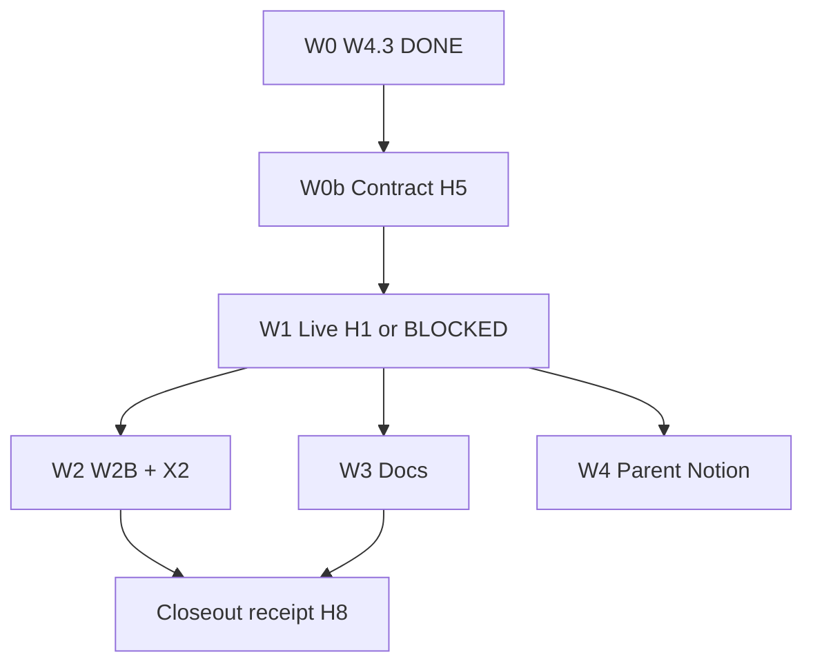

> ARCHIVED MEMORIAL RECORD: This file is preserved for review and lessons learned. Do not execute it as an active plan.

---
---
plan_id: apps-rg-hybrid-live-jd-selection-f8e2b3
plan_type: execution
touches_agentic_core: false
touches_governance_ci: false
touches_cursor_rules: false
touches_plan_templates: false
core_addition_author_gate_required: false
author_gate_receipt_ref: ""
dod_exempt: false
parent_plan: apps-rg-runtime-substitute-burndown-c4e8f1
---

# apps_rg Hybrid Live Proof + JD-Aware Fact Selection

Close the loop after **W4.3** (product hybrid retrieval decoupled from `APPS_RG_SPINE_CHROMA_ENRICH`): prove live exec-summary hybrid lanes with **artifact-level** evidence, then W2B hybrid-informed reorder of `selected_fact_plan` so Brown & Brown X2 JD gates PASS.

> **plan_id discipline**: `apps-rg-hybrid-live-jd-selection-f8e2b3` · marker `plan=apps-rg-hybrid-live-jd-selection-f8e2b3`  
> **Parent**: [apps-rg-runtime-substitute-burndown-c4e8f1](apps-rg-runtime-substitute-burndown-c4e8f1.md)  
> **Scope boundary**: `apps_rg/**` only. **Forbidden:** `agentic_core/**`, governance CI, `.cursor/rules/**`, plan templates.

---

## Plan State Markers

FORMAT_VERSION: simplified-plan-format-v1
PLAN_STATUS: Complete
CURRENT_WAVE: W4
LAST_COMPLETED_WAVE: W2e
LAST_UPDATED: 2026-05-22
PROOF_CLASSIFICATION: CONTRACT_TEST_PROOF,LIVE_RUNTIME_PROOF,IMPLEMENTATION_RECEIPT,W2E_PRODUCT_QUALITY_PASS
PROOF_CLASSIFICATION_NOT_CLAIMED: LIVE_RUNTIME_PROOF,RELEASE_ELIGIBLE_PROOF,FULL_RESUME_PASS
REVIEW_DECISIONS_LOCKED: W1,W2,W0b

---

## Material hardenings (binding)

### H1 — W1 proves hybrid **ran**, not merely exit code

Exit code alone is **not** LIVE_RUNTIME_PROOF. Required artifacts under `artifacts/apps_rg/runtime_proofs/executive_summary/real/<run_id>/`:

| File | Required fields / values |
|------|---------------------------|
| `c02_vector_query.json` | `product_hybrid: true` |
| Same | `attempted: true` |
| Same | `reason: product_hybrid_bounded_section_retrieval` (exact string) |
| Same | `c0_retrieval_mode: ledger_plus_hybrid_retrieval` |
| Same | `lanes.dense`, `lanes.sparse`, `lanes.metadata` each **`completed`** — not `required`, not `not_run` |
| `c0_evidence_room_receipt.json` | `product_hybrid_required: true` (or equivalent in nested `c05` block) |
| Any receipt on product path | **Must not** contain `spine_chroma_enrich_disabled` as the hybrid miss reason |

**Forbidden W1 outcomes:** `ledger_only`, `ledger_graph_primary_only`, `C0_RETRIEVAL_LANE_SKIPPED` with only `lanes.*=required`, or PASS/PARTIAL without the field table above.

### H2 — W1 BLOCKED taxonomy (no PARTIAL/PASS on miss)

If W1 cannot produce H1 artifacts, status is **`BLOCKED`** — never PARTIAL or PASS for the wave/plan closeout.

The blocker **must** name exactly one primary class (plus stderr excerpt):

| Blocker class | Example receipt text |
|---------------|---------------------|
| `fact_vectors_collection_missing` | Chroma path openable but no `fact_vectors` collection |
| `sparse_bm25_index_missing` | BM25/sparse lane UNAVAILABLE; index not seeded |
| `dense_index_unavailable` | BGE dense query did not complete |
| `metadata_lane_unavailable` | Metadata/exact lane did not complete |
| `embedding_config_missing` | `CHROMA_PERSIST_DIR`, BGE path, or `EMBEDDING_ENABLED` |
| `provider_failure` | Qwen/vLLM or judge provider blocked run before C0 receipts |

**Forbidden mitigations:** same-run Chroma upsert, same-run sparse seeding, hidden bootstrap inside canonical `python -m apps_rg --section`, or claiming PASS because keyword selection still works.

### H3 — Consume indexes only (W2 parent law)

| Allowed | Forbidden on product section run |
|---------|----------------------------------|
| Read pre-built `fact_vectors` (dense + sparse + metadata) | Same-run `maybe_upsert_c02_fact_vectors` as proof |
| Batch ingest / `APPS_RG_ALLOW_C02_CHROMA_INDEX_REFRESH=1` **before** run (operator/CI, separate receipt) | Same-run sparse seed inside evidence room |
| `product_section_skip_lane_upsert` default | Ledger-only PASS while hybrid lanes show `required` only |

Batch ingest remains the **canonical** `fact_vectors` writer.

### H4 — W2B authority law (ordering only)

W2B is acceptable **only** as hybrid-informed **reordering** of existing ledger-selected facts.

| Must hold | Must not |
|-----------|----------|
| Reorder `selected_fact_plan.facts` by hybrid score vs JD query | Mint JD-derived facts |
| Same `allowed_fact_ids` set (order may change) | Expand `allowed_fact_ids` |
| Arsenal / section caps unchanged | Restore `broad_skills_ledger` authority |
| `c0_authority_mode=ledger_graph_primary` | Hybrid hits as proof authority |
| Hybrid items `SPINE_ENRICHMENT` / non-authoritative in FEC | Hybrid items in MUST_USE proof strata |

### H5 — Contract tests for failure modes (W0b)

Add/extend `tests/_apps_contract/` (apps_rg only):

| Test obligation | Proves |
|-----------------|--------|
| Product hybrid required for fail-closed `executive_summary` profile | `product_hybrid_retrieval_required()` true under product policy |
| Missing sparse/BM25 blocks with explicit reason | `C0EvidenceGapError` or `lanes.sparse=failed_BLOCKED`; blocker class names sparse |
| `ledger_only` / `ledger_graph_primary_only` forbidden when hybrid required | `build_c02_chroma_query_receipt` → `C0_RETRIEVAL_LANE_SKIPPED` or fail, not silent `ledger_only` PASS |
| `APPS_RG_SPINE_CHROMA_ENRICH` does not gate product hybrid | Hybrid runs with env unset; spine env does not set `attempted` on product path |
| W2B reorder preserves `allowed_fact_ids` + caps | Set equality before/after reorder; count unchanged |
| W2B scores affect order only | Authority classes unchanged; eligibility flags unchanged |

W0b is **CONTRACT_TEST_PROOF** — not a substitute for W1 live artifacts.

### H6 — X2 alignment (Brown & Brown, REAL_LLM)

W2 closeout requires **same targeting** as failed run `exec_summary_20260522_140843`:

- JD: [brown_brown_svp_it_strategy_innovation_jd.txt](apps_rg/config/targeting/brown_brown_svp_it_strategy_innovation_jd.txt)
- Brief: [brown_brown_svp_it_strategy_innovation_briefing.md](apps_rg/config/targeting/brown_brown_svp_it_strategy_innovation_briefing.md)
- Role: SVP IT Strategy & Innovation · company Brown & Brown

| X2 gate | Required |
|---------|----------|
| `x2_exec_summary_jd_alignment_proof_flags` | **PASS** |
| `x2_exec_summary_no_mechanism_inventory` | **PASS** |

**Required when claiming W2 runtime proof:** `RUNTIME_GENERATION_STATUS: REAL_LLM` in run artifacts; provider not stub/mock.

**Not claimed:** `RELEASE_ELIGIBLE_PROOF`, full résumé PASS, X3 ALLOW for integrated package.

### H7 — Proof class discipline

| Wave | May claim | May not claim |
|------|-----------|---------------|
| W0 / W0b | `CONTRACT_TEST_PROOF`, `IMPLEMENTATION_RECEIPT` | `LIVE_RUNTIME_PROOF` |
| W1 | `LIVE_RUNTIME_PROOF` **only if** H1 artifact table satisfied | `LIVE_RUNTIME_PROOF` on exit code alone; `RELEASE_ELIGIBLE_PROOF` |
| W2 | `CONTRACT_TEST_PROOF` for unit/contract tests; runtime X2 PASS only with REAL_LLM artifact dir | `RELEASE_ELIGIBLE_PROOF`; full résumé |
| Plan closeout | Aggregate of above | Any class in `PROOF_CLASSIFICATION_NOT_CLAIMED` |

### H8 — Closeout receipt (required on plan completion)

Emit: [docs/reports/apps_rg/apps_rg_hybrid_live_jd_selection_closeout_receipt.md](docs/reports/apps_rg/apps_rg_hybrid_live_jd_selection_closeout_receipt.md)

Mandatory sections (exact headings):

```text
STATUS                    # PASS | BLOCKED | FAIL — never PARTIAL for W1 miss
PLAN_ID                   # apps-rg-hybrid-live-jd-selection-f8e2b3
CURRENT_WAVE
SCOPE_MATCH
SCOPE_DRIFT
FILES_CHANGED             # markdown links
COMMANDS_RUN              # command → exit code
TESTS_GATES               # command → pass/fail count
ARTIFACTS_WRITTEN         # markdown links
PRODUCT_HYBRID_RECEIPT_FIELDS  # copy of H1 table from live run or BLOCKED reason
PROOF_CLASSIFICATION
EXPLICIT_NON_CLAIMS
FORBIDDEN_FILES_TOUCHED   # git diff --name-only agentic_core → must be empty
NEXT_BLOCKER              # required if STATUS != PASS
```

W1 sub-receipt: [docs/reports/apps_rg/apps_rg_hybrid_live_proof_w1_receipt.md](docs/reports/apps_rg/apps_rg_hybrid_live_proof_w1_receipt.md) with `PRODUCT_HYBRID_RECEIPT_FIELDS` excerpt.

---

## Locked decisions

| ID | Decision |
|----|----------|
| D1 | Product hybrid = profile-driven + fail-closed; not env-gated |
| D2 | `APPS_RG_SPINE_CHROMA_ENRICH` = debug-only; **cannot** satisfy W1 |
| D3 | Ledger/graph primary; hybrid additive non-authoritative |
| D4 | Batch ingest only; no same-run bootstrap on canonical section CLI |
| D5 | W2B = reorder only (H4); W2A/W2C need Author-Gate to replace |
| D6 | W1 BLOCKED uses H2 taxonomy; no PARTIAL theater |

---

## Wave table

| Wave | Focus | Status | Proof class |
|------|-------|--------|-------------|
| **W0** | W4.3 implementation (product hybrid ≠ spine enrich) | ✅ DONE | CONTRACT_TEST_PROOF |
| **W0b** | H5 contract tests (failure modes + W2B ordering law) | ✅ PASS (18 pytest) | CONTRACT_TEST_PROOF |
| **W1** | Live Brown & Brown exec-summary — H1 artifacts or H2 BLOCKED | ✅ PASS | LIVE_RUNTIME_PROOF |
| **W2** | W2B hybrid-informed `selected_fact_plan` reorder + H6 X2 | ✅ PASS (H6) | [hybrid_live_20260522_115824](artifacts/apps_rg/runtime_proofs/executive_summary/real/hybrid_live_20260522_115824) |
| **W2d** | Deferred: voice repair + source_id map + graph_pa fix | ✅ DONE | All original NEXT_BLOCKER gates PASS on 115824 run |
| **W2e** | Display/ledger coherence finalize + meta filler strip | ✅ PASS | [hybrid_live_20260522_w2e_pass2](artifacts/apps_rg/runtime_proofs/executive_summary/real/hybrid_live_20260522_w2e_pass2) — `product_quality_status: PASS`, hybrid H1 |
| **W3** | Operator docs (spine env debug-only; index consume-only) | ✅ DONE | IMPLEMENTATION_RECEIPT |
| **W4** | Parent plan + Notion hygiene | ✅ DONE | — |

---

## W0 — Done (reference)

Prerequisite code: [c02_product_hybrid_retrieval.py](apps_rg/runtime/c0/c02_product_hybrid_retrieval.py), [evidence_room.py](apps_rg/runtime/c0/evidence_room.py), [test_apps_rg_c02_product_hybrid_w43.py](tests/_apps_contract/test_apps_rg_c02_product_hybrid_w43.py).

Baseline: 76 pytest (w43 + ownership + w4 bounded) at W0 close.

---

## W0b — Contract hardening (H5)

**Scope:** `tests/_apps_contract/test_apps_rg_c02_product_hybrid_w43.py` (extend) and/or `test_apps_rg_hybrid_live_jd_selection_hardening.py`.

**Gate command:**

```text
set PYTEST_DISABLE_PLUGIN_AUTOLOAD=1
python -m pytest tests/_apps_contract/test_apps_rg_c02_product_hybrid_w43.py tests/_apps_contract/test_apps_rg_hybrid_live_jd_selection_hardening.py -q --tb=short
```

**PASS:** all tests green; no weakening of gates/schemas to force PASS.

---

## W1 — Live hybrid proof (H1 + H2)

### Preconditions (operator — outside section CLI)

1. Batch-ingest `fact_vectors` (BGE 1024-d) into `CHROMA_PERSIST_DIR`
2. Seed BM25/sparse index for `fact_vectors` (separate maintenance action; receipt optional: `index_build_receipt.json`)
3. `EMBEDDING_ENABLED=true`, local BGE path, Qwen vLLM up

### Command

```text
python -m apps_rg --section executive_summary ^
  --target-company "Brown & Brown" ^
  --target-role "SVP IT Strategy & Innovation" ^
  --jd apps_rg/config/targeting/brown_brown_svp_it_strategy_innovation_jd.txt ^
  --manual-brief apps_rg/config/targeting/brown_brown_svp_it_strategy_innovation_briefing.md ^
  --provider qwen_vllm ^
  --allow-non-allow-exit-zero ^
  --artifact-dir artifacts/apps_rg/runtime_proofs/executive_summary/real/<run_id>
```

### W1 PASS criteria

- H1 artifact table satisfied in `<artifact-dir>`
- `COMMANDS_RUN` exit code recorded
- W1 receipt `STATUS: PASS` and `PROOF_CLASSIFICATION` includes `LIVE_RUNTIME_PROOF`

### W1 BLOCKED criteria

- Any H1 field missing → `STATUS: BLOCKED` with `NEXT_BLOCKER: <H2 class>`
- Example: `NEXT_BLOCKER: sparse_bm25_index_missing — ref:sparse:...UNAVAILABLE`

---

## W2d — Deferred scope closeout (2026-05-22)

| Item | Implementation | Proof run |
|------|----------------|-----------|
| `x2_generic_filler_zero` | [executive_summary_voice_repair.py](apps_rg/runtime/sections/executive_summary_voice_repair.py) + synthesis regen filler checks | PASS — [hybrid_live_20260522_115824](artifacts/apps_rg/runtime_proofs/executive_summary/real/hybrid_live_20260522_115824) |
| `x2_no_inferred_bridge_claims` | Same voice repair (strips `proven track record`) | PASS — same run |
| W2B `source_id` ↔ `fact_id` | [hybrid_informed_fact_plan_reorder.py](apps_rg/runtime/c0/hybrid_informed_fact_plan_reorder.py) token resolve | `selection_method=...+hybrid_informed_order_v1` in [selected_fact_plan.json](artifacts/apps_rg/runtime_proofs/executive_summary/real/hybrid_live_20260522_115824/selected_fact_plan.json) |
| `graph_pa` UnboundLocalError | [executive_summary_evidence_capsule.py](apps_rg/runtime/sections/executive_summary_evidence_capsule.py) | Fixed pre-PA |

Receipt: [apps_rg_hybrid_live_deferred_scope_receipt.md](docs/reports/apps_rg/apps_rg_hybrid_live_deferred_scope_receipt.md)

**Residual (superseded by W2e):** display/ledger drift after stacked mutators — fixed in W2e.

---

## W2e — Display/ledger coherence finalize (design-fix)

| Fix | Seam |
|-----|------|
| Single last mutator after authority repairs | [finalize_executive_summary_coherence](apps_rg/runtime/sections/executive_summary_voice_repair.py) |
| Voice repair moved off mid-pipeline | [executive_summary_lane.py](apps_rg/runtime/sections/executive_summary_lane.py) — only post-authority finalize |
| Synthesis regen includes materialization | `_synthesis_shape_reject_reason` + `check_claim_ledger_materialized_or_gap_excused` |
| Orphan rows excused with `source_fact_ids` in gap_notes | `_excuse_gap_for_orphan_ledger_row` |

**PASS criteria:** `x2_claim_ledger_materialized_or_gap_excused` PASS on live re-run; contract test `test_finalize_excuses_orphan_ledger_after_credential_strip`.

---

## W2 — W2B reorder + X2 (H4 + H6)

### Implementation seam (apps_rg only)

- Reorder hook after `select_candidate_facts_for_role` / before `fetch_c02_evidence_atoms`
- Input: hybrid hit scores keyed by `source_id` / `candidate_fact_id`
- Output: same fact IDs, new order; update `selection_method` receipt field to document hybrid-informed order

### W2 PASS criteria

| Proof | Required |
|-------|----------|
| Contract (W2B law) | H5 ordering tests PASS |
| Live X2 | `x2_exec_summary_jd_alignment_proof_flags` PASS |
| Live X2 | `x2_exec_summary_no_mechanism_inventory` PASS |
| Runtime | `REAL_LLM` in `real_l2_generation_result.json` or equivalent |
| Targeting | Same Brown & Brown JD/brief/role as W1 |

### W2 FAIL / BLOCKED

- X2 gates still FAIL after reorder → `STATUS: FAIL` with gate IDs in receipt
- Do not claim W2 LIVE proof without REAL_LLM artifact dir

---

## W3 — Operator documentation

- [docs/cursor/apps_rg_runtime_proof.md](docs/cursor/apps_rg_runtime_proof.md) or [apps_rg_c0_ownership_split_scope.md](docs/reports/apps_rg/apps_rg_c0_ownership_split_scope.md): H3 consume-only + H2 blocker table
- Explicit: `APPS_RG_SPINE_CHROMA_ENRICH` does not enable product hybrid

---

## W4 — Parent hygiene

- Update parent [apps-rg-runtime-substitute-burndown-c4e8f1.md](apps-rg-runtime-substitute-burndown-c4e8f1.md): W1 LIVE proof delegated; BLOCKED if sparse missing
- Notion Plans row: In Progress until closeout receipt `STATUS: PASS`

---

## Definition of done

| # | Criterion |
|---|-----------|
| 1 | W1 → H1 artifacts with `ledger_plus_hybrid_retrieval` **or** `STATUS: BLOCKED` with exact H2 blocker (never PARTIAL/PASS on miss) |
| 2 | W0b → H5 contract tests PASS |
| 3 | W2 → W2B reorder only (H4); Brown & Brown X2 gates PASS with REAL_LLM |
| 4 | No `broad_skills_ledger` authority restoration; no same-run bootstrap; no product dependency on `APPS_RG_SPINE_CHROMA_ENRICH` |
| 5 | `git diff --name-only agentic_core` empty at closeout |
| 6 | Closeout receipt H8 complete |

---

## Explicit non-claims

- `RELEASE_ELIGIBLE_PROOF`
- Full integrated résumé live PASS
- PASS because contract tests passed without W1 live artifacts
- `agentic_core` edits
- Governance CI / Cursor rules / plan template changes
- Removing `APPS_RG_SPINE_CHROMA_ENRICH` from code (docs-only in W3 unless paired env-kill-switch plan)

---

## Forbidden files (plan scope)

```text
agentic_core/**
.governance_ci/**  (if touched — SCOPE_DRIFT)
.cursor/rules/**
```

Verify at closeout: `git diff --name-only agentic_core` → empty.

---

## Dependency graph



PLAN_CREATED: slug=apps-rg-hybrid-live-jd-selection-f8e2b3 path=.cursor/plans/apps-rg-hybrid-live-jd-selection-f8e2b3.md status=Not Started
---

## ADG_GRAPH_LAYER_EVIDENCE

Preflight scope (Constitutional §22) — MV-driven blast radius before edits:

| MV | Use |
|----|-----|
| `mv_fanin_top` | inbound dependency rank for scoped seam |
| `mv_fanout_top` | outbound consumer rank |
| `mv_blast_radius` | change-impact envelope |
| `mv_chokepoint_score` | sequencing / coupling risk |

Semantic edges: `flows_to`, `reads_from`, `writes_to` · P-view: `v_p0_wave_plan`

---

## ADG_HOTSPOT_REPORT

| Rank | Node | Archetype | Surface | Rationale |
|------|------|-----------|---------|-----------|
| 1 | scoped seam | CENTRAL_DEPENDENCY | Execution Surface | primary edit locus |
| 2 | gate / boundary | SAFETY_GATEKEEPER | Security Surface | fail-closed enforcement |
