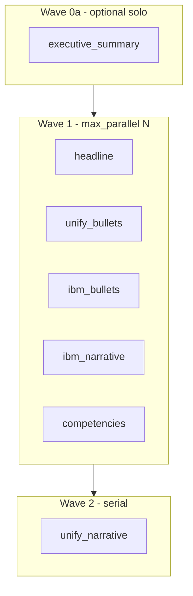

> ARCHIVED MEMORIAL RECORD: This file is preserved for review and lessons learned. Do not execute it as an active plan.

---
---
plan_id: apps-rg-parallel-section-orchestration-f2a8c4
plan_type: refactor
touches_agentic_core: false
touches_governance_ci: false
touches_cursor_rules: false
touches_plan_templates: false
core_addition_author_gate_required: false
author_gate_receipt_ref: ""
dod_exempt: false
---

# apps_rg: managed parallel section orchestration for whole-resume runs

Parallelize modular R4 Phase-1 lane dispatch on the canonical whole-run path (`run_whole_run_with_route_governance` → `GenerateResumeStep` → `run_modular_resume_generation`) using an apps_rg-owned managed section DAG, vLLM-aware concurrency caps, and wave-based scheduling — without weakening per-lane gates or `agentic_core` boundaries.

> **plan_id discipline**: `apps-rg-parallel-section-orchestration-f2a8c4`

---

## Plan State Markers

FORMAT_VERSION: simplified-plan-format-v1
PLAN_STATUS: COMPLETE
CURRENT_WAVE: W2
LAST_COMPLETED_WAVE: W2
LAST_UPDATED: 2026-05-25
NOTION_STATUS: Completed
PLAN_COMPLETED: 2026-05-25
CLOSEOUT_RECEIPT: docs/reports/plans/waiting_plans_execution_receipt_20260525.md
DEFERRED_SCOPE: W3–W4 live whole-run parallel smoke; default parallel off
PROOF_TESTS: tests/unit/apps_rg/test_phase1_parallel_dispatcher.py
NOTION_PAGE_ID: 36627693-f55c-810f-8d37-e31d7656b46c
NOTION_RECONCILED: 2026-05-25
TRIPLECHECK: valid — whole-run parallel lanes not implemented; section spine is serial per CLI
WAITING_FOR: Spine W5 deferred; modular_resume_generation serial Phase-1

---

## Context (SCQA)

- **Situation** — Whole-run `apps_rg` already uses R3R4 managed research (serial) then R4 draft leg with seven in-process lane calls in **serial** order (`modular_resume_generation.py` → `run_canonical_apps_rg_from_cli_primitives` per `GENERATED_LANES`). Each lane is a separate Qwen/vLLM HTTP request with per-lane token trim (exec summary budget policy). L0 route profiles declare `execution_form: MANAGED_WORKFLOW` but production workflow manifest for seven sections is not wired; `workflow_manifest.resume_generation.v1.minimal.yaml` is harness-only.
- **Complication** — Wall-clock scales ~linearly with lane count + X1D judges per lane. Operators expect managed orchestration parallelism, but blind 7-way parallel would stress vLLM **KV cache / max_num_seqs** on Qwen2.5-32B-AWQ (`max_model_len=16384`, practical `max_parallel` ~2–3). `unify_narrative` hard-depends on accepted `unify_bullets` L2. Process-global `os.environ` (`MODULAR_R4_SECTIONS_ROOT`, `APPS_RG_WHOLE_RUN_ENVELOPE`) is unsafe for in-process threads without isolation.
- **Question** — How do we add managed, vLLM-safe parallel Phase-1 section orchestration on the whole-resume path while preserving evidence layout, fail-closed gates, and lane DAG semantics?
- **Answer** — Introduce apps_rg L3 section dispatcher + lane weight classes + wave scheduler (heavy exec summary solo or paired; wave-2 `unify_narrative` serial); isolate lane context; gate behind `ModularResumeProfile.parallel_phase1_lanes` and env knobs; prove with unit tests + flagged whole-run smoke.

---

## Status Tables

### Wave Progress

| Wave | Phase IDs | Focus | Est. Tokens | Assumptions | Status | Success Criteria |
|------|-----------|-------|-------------|-------------|--------|------------------|
| W0 | W0.1–W0.2 | DAG SSOT + concurrency policy design | ~10K | No code until SR/plan approved | 🔲 TODO | Manifest + weight table reviewed |
| W1 | W1.1–W1.2 | `LaneExecutionContext` + single-lane executor | ~18K | Serial path unchanged default | 🔲 TODO | Serial regression tests green |
| W2 | W2.1–W2.3 | Managed dispatcher + vLLM weight waves | ~22K | `max_parallel` default 2–3 | 🔲 TODO | Parallel unit tests prove ordering/cap |
| W3 | W3.1–W3.2 | Whole-run wiring + spine receipts | ~15K | Provider available for live proof | 🔲 TODO | Flagged whole-run artifacts + inventory |
| W4 | W4.1 | Hardening, docs, optional default flip | ~8K | W3 PASS | 🔲 TODO | Closeout receipt; plan Completed |

### Phase Progress

| Phase ID | Title | Scope (files) | Pain Points | Est. Tokens | Status |
|----------|-------|---------------|-------------|-------------|--------|
| W0.1 | Section DAG manifest | `apps_rg/config/domain_contract/workflow_manifest.resume_sections.v1.yaml` | unify_narrative edge | ~5K | 🔲 TODO |
| W0.2 | Concurrency + lane weights | `section_lane_concurrency.py`, env contract | vLLM KV not context sum | ~5K | 🔲 TODO |
| W1.1 | `LaneExecutionContext` dataclass | `section_lane_executor.py` | env mutation races | ~10K | 🔲 TODO |
| W1.2 | Refactor serial loop to executor | `modular_resume_generation.py` | default `parallel=false` | ~8K | 🔲 TODO |
| W2.1 | `managed_section_lane_dispatcher` | new orchestration module | fail-closed cancel | ~10K | 🔲 TODO |
| W2.2 | Weighted waves (exec solo wave) | dispatcher + concurrency | 32B AWQ VRAM | ~8K | 🔲 TODO |
| W2.3 | Parallel dispatch tests | `tests/unit/apps_rg/test_*parallel*` | mock executor | ~4K | 🔲 TODO |
| W3.1 | Env flags + profile knob | `ModularResumeProfile`, `__main__.py` docs | opt-in | ~6K | 🔲 TODO |
| W3.2 | Spine + `phase1_lane_inventory` | `spine_stage_receipts.py`, inventory JSON | proof hyperlinks | ~9K | 🔲 TODO |
| W4.1 | Closeout receipt + Notion | `docs/reports/apps_rg/`, plan row | — | ~8K | 🔲 TODO |

---

## Out Of Scope

- `agentic_core` `ManagedWorkflowRunner` production wiring for resume section names (deferred; apps_rg dispatcher first)
- Parallelizing R3R4 `apps_research` hop (stays serial before draft leg)
- Parallelizing rollup, `locked_copy`, `assemble_final_resume`, or DOCX export
- Parallel X1D judges across lanes (remain per-lane; external APIs)
- Weakening X2/X3 gates, schemas, or fixtures to improve wall-clock
- Seven-way unbounded parallel on single vLLM instance
- Subprocess lane batch as default product path (`tests.helpers.offline_lane_orchestration` stays test-only)
- Fort Knox / L7 certification claims from timing-only evidence

---

## vLLM / Qwen concurrency model (plan invariant)

| Concept | Rule |
|---------|------|
| Context window | **Per lane request** (`max_model_len` ≈ 16384 via `VLLM_MAX_MODEL_LEN` / exec summary budget). Seven parallel lanes ≠ one combined 16k prompt. |
| Bottleneck | **KV cache + `max_num_seqs`** on single Qwen2.5-32B-AWQ server; not summing lane contexts. |
| Default `max_parallel` | **2** (env `APPS_RG_PHASE1_MAX_PARALLEL`); raise to **3** only after live proof on host GPU. |
| Heavy lane | `executive_summary` → **solo wave** or paired only with `headline` / `competencies`. |
| Hard DAG | `unify_narrative` **wave 2 only**, after `unify_bullets` accepted. |
| Wave 1 (parallel eligible) | `headline`, `executive_summary`* , `unify_bullets`, `ibm_bullets`, `ibm_narrative`, `competencies` — *exec in solo sub-wave when parallel mode on. |



---

## Wave 0 — Design SSOT

WAVE_ID: W0
WAVE_STATUS: TODO
WAVE_COMPLETE: NO
AUTHORIZATION_STATUS: NOT_REQUIRED
CHECKPOINT: A

**Phases**:
- **W0.1** — Author `workflow_manifest.resume_sections.v1.yaml` (seven nodes, `unify_narrative` → `unify_bullets`) | ~5K | PHASE_STATUS: TODO | PHASE_COMPLETE: NO
- **W0.2** — `section_lane_concurrency.py`: `parallel_groups`, `lane_weight_class`, `concurrency_plan_hash`, env contract | ~5K | PHASE_STATUS: TODO | PHASE_COMPLETE: NO

**Acceptance**:
- Topo sort unit test: narrative never precedes bullets
- Documented env: `APPS_RG_PHASE1_PARALLEL`, `APPS_RG_PHASE1_MAX_PARALLEL`, optional `APPS_RG_PHASE1_LANE_SUBPROCESS`

---

## Wave 1 — Isolated lane executor (serial default)

WAVE_ID: W1
WAVE_STATUS: TODO
WAVE_COMPLETE: NO
AUTHORIZATION_STATUS: NOT_REQUIRED
CHECKPOINT: B

**Phases**:
- **W1.1** — `LaneExecutionContext` + `run_single_section_lane()` — pass `sections_root`, whole-run envelope, JD/brief, provider, judges explicitly | ~10K | PHASE_STATUS: TODO | PHASE_COMPLETE: NO
- **W1.2** — Refactor existing serial `for lane in GENERATED_LANES` to call executor; `parallel_phase1_lanes=False` default | ~8K | PHASE_STATUS: TODO | PHASE_COMPLETE: NO

**Acceptance**:
- `pytest tests/unit/apps_rg/test_integrated_executive_summary_materialization_w8c.py` — PASS serial
- `pytest tests/_apps_contract/test_apps_rg_generate_resume_step_modular_mode.py` — no regression

---

## Wave 2 — Managed parallel dispatcher

WAVE_ID: W2
WAVE_STATUS: TODO
WAVE_COMPLETE: NO
AUTHORIZATION_STATUS: AUTHOR_GATE_RECOMMENDED
CHECKPOINT: C

**Authorization**: Recommend Author-Gate on executor choice (thread pool + context vs subprocess pool) before W2.1 merge.

**Phases**:
- **W2.1** — `managed_section_lane_dispatcher.dispatch_phase1_lanes()` with `ThreadPoolExecutor`, fail-closed cancel, `emit_integrated_lane_pre_run_failure` on missing dirs | ~10K | PHASE_STATUS: TODO | PHASE_COMPLETE: NO
- **W2.2** — Weighted waves: exec summary solo sub-wave; cap in-flight ≤ `max_parallel` | ~8K | PHASE_STATUS: TODO | PHASE_COMPLETE: NO
- **W2.3** — `tests/unit/apps_rg/test_managed_section_lane_parallel_dispatch.py` — ordering, cap, narrative last | ~4K | PHASE_STATUS: TODO | PHASE_COMPLETE: NO

**Acceptance**:
- Mock executor proves: ≤N concurrent; `unify_narrative` starts only after bullets success
- No `os.environ` mutation in parallel mode (context-only)

---

## Wave 3 — Whole-run wiring + runtime proof

WAVE_ID: W3
WAVE_STATUS: TODO
WAVE_COMPLETE: NO
AUTHORIZATION_STATUS: NOT_REQUIRED
CHECKPOINT: D

**Phases**:
- **W3.1** — Wire `ModularResumeProfile.parallel_phase1_lanes` from `APPS_RG_PHASE1_PARALLEL=1`; document in `apps_rg` AGENTS / interactive discipline | ~6K | PHASE_STATUS: TODO | PHASE_COMPLETE: NO
- **W3.2** — Emit `phase1_concurrency_plan.json` + extend `phase1_lane_inventory.json` (`orchestration_mode`, `lane_timings_ms`, `parallel_groups`); spine cross-ref | ~9K | PHASE_STATUS: TODO | PHASE_COMPLETE: NO

**Acceptance**:
- Flagged whole-run smoke (live Qwen when available):
  ```bash
  set APPS_RG_PHASE1_PARALLEL=1
  set APPS_RG_PHASE1_MAX_PARALLEL=2
  python -m apps_rg --target-company "<co>" --target-role "<role>" ...
  ```
- `artifacts/apps_rg/runtime_proofs/full_resume_<id>/modular_r4/phase1_lane_inventory.json` shows `orchestration_mode: parallel`
- All seven lanes + rollup + assembly gates pass (same bar as serial)
- BLOCKED documented if vLLM OOM/timeouts under parallel — do not claim PASS

---

## Wave 4 — Closeout

WAVE_ID: W4
WAVE_STATUS: TODO
WAVE_COMPLETE: NO
AUTHORIZATION_STATUS: NOT_REQUIRED
CHECKPOINT: E

**Phases**:
- **W4.1** — Closeout receipt on disk; Notion Plans → Completed; optional benchmark table serial vs parallel timings | ~8K | PHASE_STATUS: TODO | PHASE_COMPLETE: NO

**Acceptance**:
- `docs/reports/apps_rg/apps_rg_parallel_section_orchestration_closeout_receipt.md` with PASS/PARTIAL/BLOCKED evidence
- Plan row `Exists On Disk=true`, `Status=Completed`

---

## Execution Details

### W2.1 — Dispatcher sketch (normative)

**New modules (apps_rg only)**:
- `apps_rg/runtime/orchestration/section_lane_concurrency.py`
- `apps_rg/runtime/orchestration/section_lane_executor.py`
- `apps_rg/runtime/orchestration/managed_section_lane_dispatcher.py`

**Integration seam**: `apps_rg/l2_recipe/modular_resume_generation.py` Phase-1 block (~L456).

**Fallback**: `APPS_RG_PHASE1_LANE_SUBPROCESS=1` → subprocess per lane (test/debug; higher startup cost).

### W3.2 — Proof artifacts

| Artifact | Path pattern |
|----------|----------------|
| Lane inventory | `full_resume_<id>/modular_r4/phase1_lane_inventory.json` |
| Concurrency plan | `full_resume_<id>/modular_r4/phase1_concurrency_plan.json` |
| Spine | `full_resume_<id>/spine_run_manifest.json` |
| Per-lane | `full_resume_<id>/modular_r4/sections/<lane>/real/<run_id>/` |

---

## Gap Register

**GAP-1: Production workflow manifest for seven lanes**
- Today `wfm::apps_rg::resume_generation::v1` points at minimal harness manifest, not section nodes.
- Impact: L0 `MANAGED_WORKFLOW` receipt references manifest not driving lane order until W0.1 lands.

**GAP-2: Adaptive concurrency from live vLLM metrics**
- Plan uses static weights; future: read queue depth / OOM from `qwen_transport_diag` to throttle.
- Impact: deferred to post-W4 if W3 shows instability at `max_parallel=2`.

**GAP-3: Author-Gate on thread vs subprocess executor**
- Blast radius differs (env isolation vs performance).
- Impact: resolve at W2 start per `.cursor/rules/003-cursor-author-gate-hitl.mdc`.

---

## Definition of Done

DoD-1: Section DAG manifest + concurrency builder unit-tested
- Evidence: `pytest tests/unit/apps_rg/test_section_lane_concurrency.py -q` → 0 failed
- Status: TODO

DoD-2: Serial modular whole-run path unchanged (default off parallel flag)
- Evidence: `pytest tests/unit/apps_rg/test_integrated_executive_summary_materialization_w8c.py -q` → 0 failed
- Status: TODO

DoD-3: Parallel dispatcher ordering and cap enforced (mocked lanes)
- Evidence: `pytest tests/unit/apps_rg/test_managed_section_lane_parallel_dispatch.py -q` → 0 failed
- Status: TODO

DoD-4: Flagged whole-run smoke produces seven lane dirs + rollup when Qwen live
- Evidence: `python -m apps_rg` with `APPS_RG_PHASE1_PARALLEL=1`; `phase1_lane_inventory.json` lists all lanes ok
- Status: TODO

DoD-5: Closeout receipt + Notion Plans row Completed with disk path
- Evidence: [apps_rg_parallel_section_orchestration_closeout_receipt.md](docs/reports/apps_rg/apps_rg_parallel_section_orchestration_closeout_receipt.md); Notion `Slug=apps-rg-parallel-section-orchestration-f2a8c4`
- Status: TODO

### Verification vs Deferral

| Item | In plan | Deferred |
|------|---------|----------|
| apps_rg parallel Phase-1 dispatcher | W1–W3 | — |
| core ManagedWorkflowRunner wiring | — | Post-W4 optional |
| Parallel X1D judges | — | Out of scope |
| Default `parallel=true` without proof | — | W4 only if W3 PASS |

---

## Scope Expansion Authorization

When scope is discovered during execution, emit markers in order:

```
DISCOVERED_SCOPE: plan=apps-rg-parallel-section-orchestration-f2a8c4 wave=<N> phase=<M> gap="<what>" impact="<severity>"
AUTHORIZATION_DECISION: plan=apps-rg-parallel-section-orchestration-f2a8c4 decision=<ACCEPTED|DEFERRED|SPLIT_TO_NEW_PLAN|REJECTED> authorized_by=<user|author_gate|self> decisive_reason="<why>"
SCOPE_EXPANSION: plan=apps-rg-parallel-section-orchestration-f2a8c4 reason="<summary>" added="<waves/phases>" authorized="yes"
```

---

## Marker Quick Reference

```
PLAN_CREATED: slug=apps-rg-parallel-section-orchestration-f2a8c4 path=.cursor/plans/apps-rg-parallel-section-orchestration-f2a8c4.md status=Not Started
WAVE_START: plan=apps-rg-parallel-section-orchestration-f2a8c4 wave=<N>
WAVE_COMPLETE: plan=apps-rg-parallel-section-orchestration-f2a8c4 wave=<N> note="+N tests, N files, scope=<summary>"
PLAN_COMPLETE: plan=apps-rg-parallel-section-orchestration-f2a8c4 note="<final outcome>"
```

---

## Related

- Prior discussion: managed orchestration + vLLM per-request context vs KV concurrency
- Baseline serial seam: [modular_resume_generation.py](apps_rg/l2_recipe/modular_resume_generation.py)
- Whole-run spine: [r3r4_whole_run_orchestration.py](apps_rg/runtime/orchestration/r3r4_whole_run_orchestration.py)
- Archived modular migration: [.cursor/plans/_archive/2026-05/apps-rg-r4-modular-section-migration-d4e8a1.md](.cursor/plans/_archive/2026-05/apps-rg-r4-modular-section-migration-d4e8a1.md)
- Exec summary token budget: [executive_summary_token_budget.py](apps_rg/runtime/sections/executive_summary_token_budget.py)
- vLLM serving SSOT: [vllm_serving_profile_types.py](agentic_core/L2_execution/types/vllm_serving_profile_types.py)
---

## ADG_GRAPH_LAYER_EVIDENCE

Preflight scope (Constitutional §22) — MV-driven blast radius before edits:

| MV | Use |
|----|-----|
| `mv_fanin_top` | inbound dependency rank for scoped seam |
| `mv_fanout_top` | outbound consumer rank |
| `mv_blast_radius` | change-impact envelope |
| `mv_chokepoint_score` | sequencing / coupling risk |

Semantic edges: `flows_to`, `reads_from`, `writes_to` · P-view: `v_p0_wave_plan`

---

## ADG_HOTSPOT_REPORT

| Rank | Node | Archetype | Surface | Rationale |
|------|------|-----------|---------|-----------|
| 1 | scoped seam | CENTRAL_DEPENDENCY | Execution Surface | primary edit locus |
| 2 | gate / boundary | SAFETY_GATEKEEPER | Security Surface | fail-closed enforcement |
