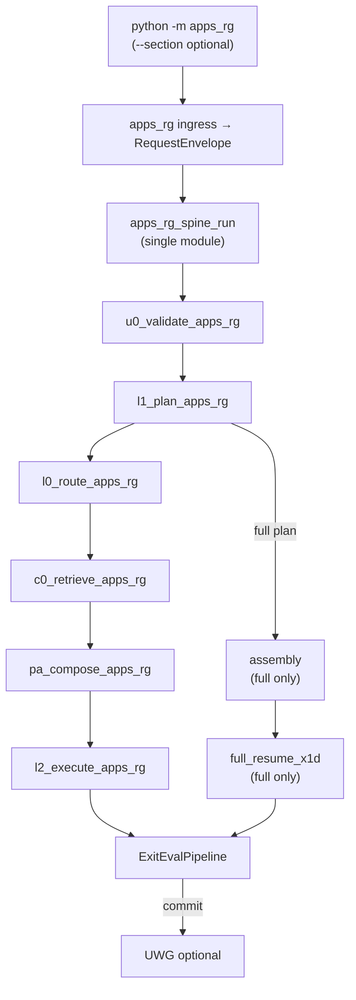

> ARCHIVED MEMORIAL RECORD: This file is preserved for review and lessons learned. Do not execute it as an active plan.

---
---
plan_id: apps-rg-spine-only-unification-d8f4a2
plan_type: architecture
touches_agentic_core: true
touches_governance_ci: true
touches_cursor_rules: true
touches_plan_templates: false
core_addition_author_gate_required: true
author_gate_receipt_ref: ""
dod_exempt: false
---

# apps_rg Spine-Only Unification — Destroy Second Pipeline

**Supersedes bridge-based convergence.** The completed [one-canonical-spine-e8b4a1](one-canonical-spine-e8b4a1.md) kept a **second execution body** (proof_pool → section graph binding → section FEC bridge → lane PA/L2 → lane X3). **This plan forbids that.** No bridges, no parallel interfaces, no lane substitutes for spine contracts.

**Related:** [apps_rg_v40_spine_gap_analysis_20260523.md](../docs/reports/apps_rg/apps_rg_v40_spine_gap_analysis_20260523.md) · [apps-rg-v40-spine-gap-c4a8f1](apps-rg-v40-spine-gap-c4a8f1.md) (gap inventory — execution follows **this** plan)

> **plan_id discipline**: `apps-rg-spine-only-unification-d8f4a2` matches filename stem.

---

## Plan State Markers

FORMAT_VERSION: simplified-plan-format-v1
PLAN_STATUS: COMPLETE
CURRENT_WAVE: W6
LAST_COMPLETED_WAVE: W6
LAST_UPDATED: 2026-05-25
NOTION_STATUS: Completed
NOTION_RECONCILED: 2026-05-25
PLAN_COMPLETED: 2026-05-25
CLOSEOUT_CLASS: PHASE1_W1_W6_SINGLE_SPINE_DONE
PLAN_COMPLETE: plan=apps-rg-spine-only-unification-d8f4a2 note="W1-W4+W6 done; single-spine gate 0 findings; section E2E"
DEFERRED_SCOPE: W5_L3_assembly_package_in_spine_entry,W7_agentic_core_migration
CLOSEOUT_RECEIPT: docs/reports/plans/active_backlog_closeout_receipt_20260525.md
INTERIM_WHOLE_RUN: run_apps_rg_spine scope=full delegates to run_integrated_single_action_spine R4
NOTION_PLANS_ROW: page_id=36927693-f55c-8190-b30b-de1f6534e2a7
PLAN_CREATED: slug=apps-rg-spine-only-unification-d8f4a2 path=.cursor/plans/apps-rg-spine-only-unification-d8f4a2.md status=Not Started
NOTION_PLANS_ROW: page_id=36927693-f55c-8190-b30b-de1f6534e2a7 url=https://www.notion.so/36927693f55c8190b30bde1f6534e2a7
NOTION_STATUS: In Progress
NOTION_RECONCILED: 2026-05-24
ACTIVE_BACKLOG_MANIFEST: docs/reports/plans/active_in_progress_plans_manifest_20260524.md
ACTIVE_BACKLOG_ROLE: master
GIT_MAIN_COMMIT: 3e7ab52413 apps_rg spine-only unification W2-W6 (2026-05-23)

---

## Non-negotiable law

```
ONE SPINE ONLY:
  U0 → L1 → L0 → C0 → PA → L2 → Exit → (UWG → L4 when commit) → L6 after boundary
```

| Forbidden | Replacement |
|-----------|-------------|
| `section_fec_bridge`, FEC-shaped snapshots as C0 authority | `c0_retrieve_apps_rg` → `FinalEvidenceContract` |
| `c03_graphrag_bound` / `section_c03_graph_binding` as C0 | C0 binding with **section-scoped** retrieval profile |
| `proof_pool_resolver` → PA without spine C0 | Proof pool is **C0 source class only**, consumed inside `c0_binding` |
| Lane `aggregate_x3` as disposition authority | `ExitEvalPipeline` → one `ExitDispositionReceipt` / X3 |
| `section_front_spine_bridge` as terminal path | Same spine entry as whole run; scope from L1 only |
| “Mirror” receipts pretending to be spine | Delete mirrors; spine artifacts are SSOT |
| Second pipeline “for speed” | Profile flags: `c0_budget`, `stub_l2`, `skip_cache` — same code path |

**CLI preserved:** `python -m apps_rg --section <id>` remains a **user entry**. Implementation MUST call the **same** governed spine as `python -m apps_rg` with `scope=section`.

---

## Allowed differences: section-only vs full resume

Differences are **data in profiles and L1 plan**, not separate architectures.

| Concern | Section-only (`--section <id>`) | Full resume (no `--section`) |
|---------|----------------------------------|------------------------------|
| **L1 `task_shape`** | `section_regen` + `section_id` | `strategic_tailor` / whole-run modes |
| **L1 work units** | Exactly one unit in `task_plan` | Multiple units + `assemble_output` |
| **L0 route** | `R4_SINGLE_ACTION` or section profile from `route_profiles.yaml` | `R3R4_MANAGED_WORKFLOW` or whole-run profile |
| **C0** | `c0_retrieval_profile` scoped to section + proof-pool sources | Broader JD/briefing/resume evidence |
| **PA** | `prompt_profile` / BOM slot for one `section_id` | Per-section profiles invoked by L3 loop, or one whole-doc profile |
| **L2** | One `l2_execute_apps_rg` with section recipe | N executions + **assembly** step (deterministic merge, locked blocks) |
| **X1D** | Section rubrics from `apps_rg/config/domain_contract/judges/` | Section judges **plus** **full-resume coherence bundle** (flow, feel, redundancy, cross-section tone) |
| **Exit** | Spine X3 scoped to “section publishable” | Spine X3 on **assembled package** |
| **UWG / L4** | Not invoked | Invoked when Exit emits commit (cache, artifacts) |
| **L6** | Shadow allowed; no current-run mutation | Post-run ingest only |

**Full-resume-only additions (not “one extra judge”):**

1. **L3 or explicit multi-step L1 plan** — ordered section generation.
2. **Assembly** — `final_resume_assembler` (or successor) runs **after** all section L2 seals, **before** package Exit.
3. **Full-resume X1D** — aggregate judges on assembled JSON/DOCX (existing targets: `full_resume_llm_coherence`, `x1d_full_resume_judge_outputs`).
4. **Package Exit** — single X3; no rollup from lane `x3_disposition.json`.

---

## Target runtime shape



**Single entry function (to create):** `apps_rg/runtime/spine/apps_rg_spine_run.py` — wraps `run_ag2_retrieval_and_prompt` + L2 + Exit; **no** branch to `_*_lane_from_cli` monoliths.

---

## Deletion inventory (second pipeline — burn down)

### W3 — Delete bridge / substitute modules

| Delete or gut | Reason |
|---------------|--------|
| `apps_rg/runtime/section_front_spine_bridge.py` | Spine entry absorbs U0/L1/L0 |
| `apps_rg/runtime/c03_graphrag_bound.py` | Not C0; fold neighbor expansion into C0 profile if still needed |
| `apps_rg/runtime/section_fec_bridge.py` (and FEC bridge helpers) | FEC only from `c0_binding` |
| `apps_rg/runtime/dispatch/input_authority_prompt_block.py` (graph-as-C0 claims) | PA consumes spine FEC only |
| `apps_rg/runtime/section_exit_spine_receipt.py` (mirror-only) | Spine Exit receipt is SSOT |
| `apps_rg/runtime/section_runtime_exhaust_spine_receipt.py` (mirror) | Use core `RuntimeExhaustBundle` |
| `apps_rg/runtime/section_one_spine_no_two_path.py` | Replaced by CI “no second pipeline” gate |
| Lane `*_x3.py` `aggregate_x3` as authority | Keep judge math; Exit owns disposition |

### W4 — Retire monolithic lane runners

Replace `canonical_dispatch._run_*_lane_from_cli` with:

```text
run_canonical_apps_rg_from_cli_primitives(...)
  → apps_rg_spine_run(scope=section|full, section_id=..., ...)
```

**Keep (refactor, do not delete outright in W4):**

- `apps_rg/runtime/sections/*` — shrink to **prompt helpers + section X2 validators + golden fixtures** only.
- `apps_rg/prompt_assembly/prompt_bom.yaml` — PA profile input.
- `apps_rg/runtime/proof_pool_resolver.py` — **only** called from `c0_binding` source adapter.

### W6 — Tests / docs that enshrine two paths

- Rewrite `one_spine_inventory.py` — `two_paths_found: false` required.
- Archive or rewrite reports under `docs/reports/apps_rg/one_spine_*` that claim bridge PASS.
- Update `section_spine_terminology.py` — remove “lane chain” as product path; keep as **historical** enum only until deleted.

---

## Waves

| Wave | Goal | agentic_core | Proof |
|------|------|--------------|-------|
| **W1** | Lock architecture + CI ratchet | Comment/docs only | New gate: fail import of bridge modules from product path; fail `aggregate_x3` as sole disposition writer |
| **W2** | `apps_rg_spine_run` + dispatch rewrite | `apps_rg_dispatch` delegates to spine_run only | Contract: `--section` emits same contract filenames as integrated proof |
| **W3** | Delete bridge modules | — | `rg` deleted paths = 0 imports; pytest collection |
| **W4** | Gut `_*_lane_from_cli`; section logic = profiles | ExitEvalPipeline config for section scope | One lane (executive_summary) E2E on spine only |
| **W5** | Full resume: L3 loop + assembly + full-resume X1D | Package Exit uses spine X3 only | Whole-run proof dir with assembly + `x1d_full_resume_*` + one Exit receipt |
| **W6** | Delete lane authority artifacts + mirrors | `x3_disposition` comment cleanup | `test_apps_rg_no_second_pipeline.py` |
| **W7** | core boundary: prerequisite gate + judges to apps_rg | Move policy YAML; generic evaluators | Boundary tests + migration receipt |

**No bridge wave.** W3 is delete, not deprecate-with-adapter.

---

## W1 deliverables (start here)

1. **ADR:** [ADR-apps-rg-spine-only-unification.md](../docs/adr/ADR-apps-rg-spine-only-unification.md) — declares second pipeline dead.
2. **CI gate:** [check_apps_rg_single_spine.py](../ops_scripts/ci/check_apps_rg_single_spine.py) + [apps_rg_single_spine_scan.py](../ops_scripts/ci/apps_rg_single_spine_scan.py)
3. **Contract tests:** [test_apps_rg_no_second_pipeline.py](../tests/_apps_contract/test_apps_rg_no_second_pipeline.py)
4. **Plan supersession marker** on `one-canonical-spine-e8b4a1.md` — STATUS SUPERSEDED.

**W1 status:** CI ratchet landed (`check_apps_rg_single_spine.py`, `test_apps_rg_no_second_pipeline.py`).

**W2–W4 (2026-05-23, commit `3e7ab52413`):** `apps_rg/runtime/spine/apps_rg_spine_run.py` + `section_cli_runners.py`; `canonical_dispatch` delegates only to spine; bridge modules deleted/relocated under `spine/` + `c0/`; section lanes use `finalize_section_lane_x3` (ExitEvalPipeline path).

**W6 (2026-05-23, same commit):** `one_spine_inventory.py` `two_paths_found: false`; single-spine gate **PASS** (0 ERROR findings); contract tests green after negative-control fix.

**E2E spine proof (2026-05-23):** Live `python -m apps_rg --section executive_summary` (CI-Probe fixtures) completed spine path — run [exec_summary_20260523_171726](../artifacts/apps_rg/runtime_proofs/executive_summary/real/exec_summary_20260523_171726): contract artifacts present (`validated_request.json`, `final_evidence_contract.json`, `sealed_l2_artifact.json`, `exit_disposition_receipt.json`, `x3_disposition.json`); `CLI_PATH_STATUS=PASS`, `PRODUCT_QUALITY_STATUS=PASS`, `PRODUCT_X3_STATUS=X3_REVIEW_JUDGE_SOFT_FAIL` (Track C — not spine failure).

**Post-commit wiring fixes (local, pending commit):** (1) `run_apps_rg_spine` filters kwargs per section runner signature; (2) `ExitEvalPipeline()` without invalid `app_name=`; (3) exit authority deferred until after `sealed_l2_artifact.json` via `finalize_section_spine_exit_after_sealed_l2` hooked from `finalize_section_l2_after_output`.

**DoD W1:** ADR + gate + tests on disk; `run_contract_gates` includes APPS-RG-SINGLE-SPINE; no `agentic_core` edits.

---

## W2 deliverables

1. Create `apps_rg/runtime/spine/apps_rg_spine_run.py`:
   - `run_apps_rg_spine(*, scope: Literal["section","full"], section_id: str | None, ...)`
   - Sequences: U0 → L1 → L0 → `run_ag2_retrieval_and_prompt` → L2 → Exit
2. `canonical_dispatch.run_canonical_apps_rg_from_cli_primitives` — **remove** all `_run_*_lane_from_cli` branches; call `run_apps_rg_spine`.
3. Artifact writer: always write `validated_request.json`, `l1_plan_contract.json`, `route_contract.json`, `final_evidence_contract.json`, `compiled_prompt_artifact.json`, `sealed_l2_artifact.json`, `exit_disposition_receipt.json` under `artifact_dir`.

**DoD W2:** `python -m apps_rg --section executive_summary` produces spine contract set (live or stub L2 per env).

---

## W5 deliverables (full resume)

1. L1 emits multi-unit plan when `generation_mode` in full modes.
2. Orchestrator inside `apps_rg_spine_run` (or L3 profile): for each section_id → nested spine call with `scope=section`.
3. `final_resume_assembler` consumes `SealedL2Artifact` list → assembled resume.
4. Register **full-resume X1D** judges in Exit profile (flow, redundancy, coherence).
5. Single package Exit X3; delete `resume_package_disposition` rollup from lane mirrors.

**DoD W5:** `python -m apps_rg` (no section) → assembly artifact + full-resume judge outputs + one Exit receipt.

---

## agentic_core scope (W7 — not optional)

| Item | Action |
|------|--------|
| `apps_rg_prerequisite_gate` | Policy → `apps_rg/config/`; core = generic evaluator |
| `resume_judges/*` | Rubrics → `apps_rg/config/domain_contract/judges/` |
| `ValidatedRequest` DTO | **Keep in core** unless ADR moves to `apps_rg/schemas/` (defer if blocks W2) |

**No new `apps_rg_*_binding.py` shims in core.**

---

## Risks and mitigations

| Risk | Mitigation |
|------|------------|
| Live proof blocked (Chroma/BM25/Qwen) | `APPS_RG_L2_FORCE_STUB=1` on **same** spine path — stub is not a second pipeline |
| Lane regressions | Per-section golden tests against spine artifacts |
| Long-running full resume | L3 step cache + section-level artifact reuse (R1B) on **same** spine |
| Big-bang merge | Waves still delete bridges in W3 — user mandated no bridges, not “hide behind flag” |

---

## Wave execution log (disk SSOT)

| Wave | Status | Evidence |
|------|--------|----------|
| W1 | **COMPLETE** | ADR + [check_apps_rg_single_spine.py](../ops_scripts/ci/check_apps_rg_single_spine.py) |
| W2 | **COMPLETE** | [apps_rg_spine_run.py](../apps_rg/runtime/spine/apps_rg_spine_run.py); dispatch rewrite; commit `3e7ab52413` |
| W3 | **COMPLETE** | Bridge modules deleted; logic under `apps_rg/runtime/spine/` |
| W4 | **COMPLETE** | [section_x3_finalize.py](../apps_rg/runtime/spine/section_x3_finalize.py); all section lanes |
| W5 | **OPEN** | Full résumé L3 loop + assembly + package X1D not in spine entry |
| W6 | **COMPLETE** | Gate PASS; [one_spine_inventory.py](../apps_rg/runtime/one_spine_inventory.py) `two_paths_found: false` |
| W7 | **DEFERRED** | `agentic_core` moves — author-gate required |

```text
WAVE_COMPLETE: plan=apps-rg-spine-only-unification-d8f4a2 wave=1 note="CI ratchet + ADR + contract tests"
WAVE_COMPLETE: plan=apps-rg-spine-only-unification-d8f4a2 wave=2 note="apps_rg_spine_run + dispatch; commit 3e7ab52413"
WAVE_COMPLETE: plan=apps-rg-spine-only-unification-d8f4a2 wave=3 note="bridge deletion; spine package"
WAVE_COMPLETE: plan=apps-rg-spine-only-unification-d8f4a2 wave=4 note="section_x3_finalize + ExitEvalPipeline"
WAVE_COMPLETE: plan=apps-rg-spine-only-unification-d8f4a2 wave=6 note="inventory two_paths false; gate 0 findings"
```

---

## Open scope (2026-05-23)

See [spine_unification_open_scope_20260523.md](../docs/reports/apps_rg/spine_unification_open_scope_20260523.md).

| Priority | ID | Item |
|----------|-----|------|
| P0 | OS-TRACK-C | Unanimous `X3_ALLOW` (judge soft-fail) — [apps-rg-proof-pool-c0-ssot-a7f3e2](apps-rg-proof-pool-c0-ssot-a7f3e2.md) |
| P0 | OS-LIVE-ES-BB | Brown & Brown live exec-summary post-spine (beyond CI-Probe e2e) |
| P1 | OS-W5 | Multi-section L3 loop + assembly + full-resume X1D in `apps_rg_spine_run` |
| P1 | OS-W7 | Core prerequisite gate + judges migration (author-gate) |
| P1 | OS-W2-AG2 | Section lanes still proof-pool→FEC compose inside modules, not full `run_ag2_retrieval_and_prompt` at spine entry |
| P1 | OS-E2E-WIRING | Commit post-`3e7ab52413` spine wiring fixes (kwargs filter, ExitEvalPipeline init, sealed-L2-before-exit ordering) |
| P2 | OS-W3-C03 | `c03_graphrag_bound.py` still on disk (not product-forbidden) |
| P2 | OS-W3-MIRROR | `section_l2_spine_receipt`, `section_runtime_exhaust_spine_receipt`, etc. |
| P2 | OS-PYTEST-WIN | Windows `lib64` collection noise — gate script remains SSOT |

## Review checklist

- [x] Confirm: **zero** forbidden bridge **modules** after W3 (logic moved to `spine/`; legacy FEC alias kept)
- [x] W1 CI ratchet — gate PASS on product paths
- [x] Gold lane E2E — `executive_summary` live spine path (CI-Probe; `exec_summary_20260523_171726`)
- [ ] Commit OS-E2E-WIRING fixes to `main`
- [ ] Confirm: full resume = assembly + full-resume X1D + package Exit (W5)
- [ ] All seven `--section` lanes live-smoke on spine (only exec_summary proven)
- [ ] Author-gate before W7 core moves

---

## Explicit non-claims

- W1 does not claim live provider PASS.
- Deleting lanes in W4 does not remove section **prompt content** — only monolithic orchestration.
- Supersedes bridge semantics in `one-canonical-spine-e8b4a1`; does not rewrite its historical receipts.
---

## ADG_GRAPH_LAYER_EVIDENCE

Preflight scope (Constitutional §22) — MV-driven blast radius before edits:

| MV | Use |
|----|-----|
| `mv_fanin_top` | inbound dependency rank for scoped seam |
| `mv_fanout_top` | outbound consumer rank |
| `mv_blast_radius` | change-impact envelope |
| `mv_chokepoint_score` | sequencing / coupling risk |

Semantic edges: `flows_to`, `reads_from`, `writes_to` · P-view: `v_p0_wave_plan`

---

## ADG_HOTSPOT_REPORT

| Rank | Node | Archetype | Surface | Rationale |
|------|------|-----------|---------|-----------|
| 1 | scoped seam | CENTRAL_DEPENDENCY | Execution Surface | primary edit locus |
| 2 | gate / boundary | SAFETY_GATEKEEPER | Security Surface | fail-closed enforcement |
