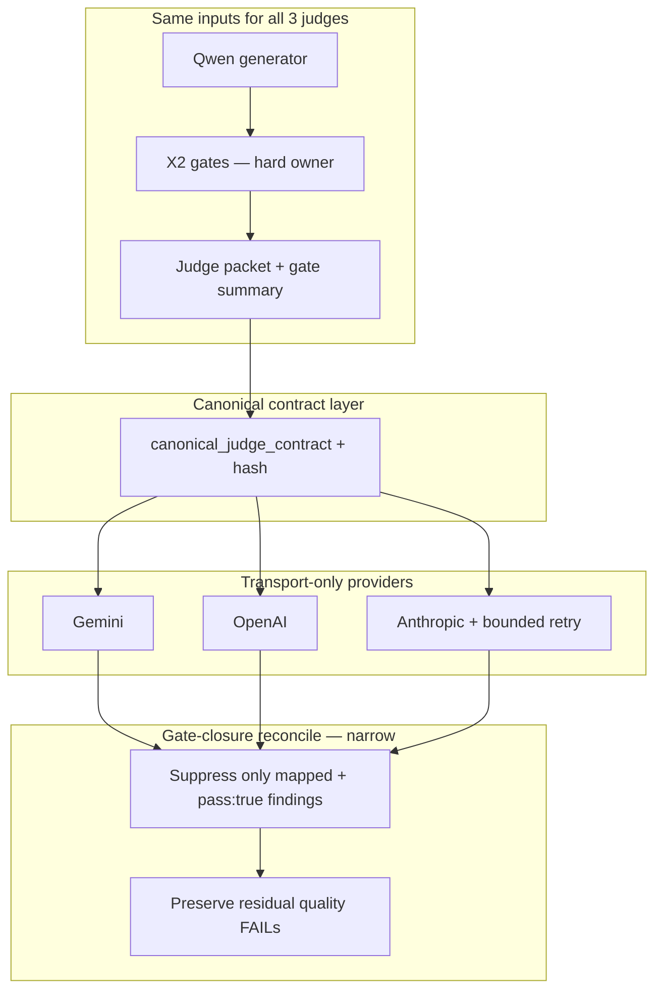

> ARCHIVED MEMORIAL RECORD: This file is preserved for review and lessons learned. Do not execute it as an active plan.

---
---
plan_id: exec-summary-x1d-transport-parity-d8f2a1
plan_type: governance
touches_agentic_core: false
touches_governance_ci: true
touches_cursor_rules: false
touches_plan_templates: false
core_addition_author_gate_required: false
author_gate_receipt_ref: ""
dod_exempt: false
---

# Executive Summary X1D — Full Transport Parity & Judge Contract SSOT

**North star:** All three proof judges (Gemini 3.1 Pro, GPT 5.5, Claude Opus) receive the **same canonical grade-only contract** (byte-stable digest) and return scores through the **same** normalization + **deterministic gate-closure reconcile** path. Provider modules are **transport-only** (HTTP, auth, model env, API-specific JSON enforcement). **X2 owns hard gates** — judges may not penalize **enumerated X2-closed axes** when the mapped deterministic gate passed; judges **may still fail** on residual prose quality outside X2 ownership.

**Anti-pattern (forbidden):** A reconcile layer that clamps arbitrary low scores or converts `MODEL_BACKED_FAIL` → `MODEL_BACKED_PASS` because X2 passed broadly. Reconcile suppresses **only** structured findings explicitly mapped to a passed gate with valid evidence ref.

**RCA (locked):** Live Brown & Brown runs (`exec_summary_20260524_001344`, `014222`, `005722`) show X2 all PASS, Gemini/OpenAI PASS (~4.0–5.0), Claude FAIL (~2.5–2.8) on the **same** paragraph. Root cause: (1) `GRAPH_ONLY_GRADE_ONLY_RUBRIC` lacks SRFS dim-8 “only penalize `pass:false` gates” while dim 6 still soft-penalizes credential/metric/JD axes X2 cleared; (2) `unused_fact_ids` in packet conflicts with `x2_exec_summary_evidence_utilization: pass`; (3) Anthropic adapter uses minimal system + no JSON lock vs OpenAI/Gemini; (4) `reconcile_grade_only_judge_result` only fixes retired S1–S5 fragments.

**Related (do not duplicate):** [`exec-summary-operator-ship-a3f7c2.md`](exec-summary-operator-ship-a3f7c2.md) (DRAFT_READY vs CERTIFIED, judge regen). [`section-product-shape-alignment-b4e7a1.md`](section-product-shape-alignment-b4e7a1.md) (shape SSOT). [`core-judge-panel-harness-f3c8d1.md`](core-judge-panel-harness-f3c8d1.md) — long-term SSOT: `agentic_core/runtime/judges/panel` + apps adapters (`x1d_panel_bridge`). This plan fixes **apps_rg contract + transport + reconcile**; core harness owns multi-provider orchestration law.

> **plan_id discipline:** `exec-summary-x1d-transport-parity-d8f2a1` ↔ file stem ↔ markers `plan=exec-summary-x1d-transport-parity-d8f2a1`

**Hardening status:** NEEDS HARDENING → **APPLIED 2026-05-24** (W3 reconcile scope, negative controls, canonical contract hash, transport-failure taxonomy, X2 ownership proof). **Implement W3.0 spec before W3.1/W3.2.**

---

## Plan State Markers

FORMAT_VERSION: simplified-plan-format-v1
PLAN_STATUS: COMPLETED
CURRENT_WAVE: —
LAST_COMPLETED_WAVE: W3
LAST_UPDATED: 2026-05-24
IMPLEMENTATION_NOTE: W1–W3 DONE; DoD-1–4,6 PASS; DoD-5 live 3/3 DEFERRED to exec-summary-operator-ship-a3f7c2 (synthesis/regen). Post-regen soft-rerun uses post-X2 packet. Live exec_summary_20260524_111311 = 2/3 PASS, shared judge_packet_hash.
W3_LIVE_RUN_ID: exec_summary_20260524_111311
W3_LIVE_RECEIPT: [exec_summary_x1d_transport_parity_20260524_receipt.md](docs/reports/apps_rg/exec_summary_x1d_transport_parity_20260524_receipt.md)
DEFERRED_SCOPE: live_brown_3_of_3_model_backed_pass → plan=exec-summary-operator-ship-a3f7c2 wave=W5 reason=residual_synthesis_quality_not_x1d_transport
PLAN_COMPLETE: plan=exec-summary-x1d-transport-parity-d8f2a1 note="gate-closure+transport+adversarial PASS; live 3/3 deferred operator-ship; receipt on disk"

NOTION_PAGE_ID: 36a27693-f55c-8100-81af-f56aa9b4421c
NOTION_PLAN_URL: https://www.notion.so/exec-summary-x1d-transport-parity-d8f2a1-36a27693f55c810081aff56aa9b4421c

PLAN_CREATED: slug=exec-summary-x1d-transport-parity-d8f2a1 path=.cursor/plans/exec-summary-x1d-transport-parity-d8f2a1.md status=Not Started notion_page=36a27693-f55c-8100-81af-f56aa9b4421c

---

## Context (SCQA)

- **Situation** — Executive summary X1D uses `build_executive_summary_judge_packet` → `run_llm_judges` with three providers. Post-X2 packet includes authoritative `deterministic_gate_summary`. Product path uses `GRAPH_ONLY_GRADE_ONLY_RUBRIC` (`judge_rubric_mode: graph_only_c03`).
- **Complication** — Packet sends contradictory instructions (gates passed + rubric soft penalties + `unused_fact_ids`). Provider adapters differ: Gemini `responseSchema`, OpenAI `json_object` + `JUDGE_SCORE_SCHEMA` in system, Anthropic short system only, `ANTHROPIC_JUDGE_MAX_OUTPUT_TOKENS=1024`. Claude consistently `MODEL_BACKED_FAIL` while others pass; findings cite “despite passing the deterministic gate.”
- **Question** — How do we standardize judges so all three apply the same contract and CERTIFIED can require 3/3 **without** a pass-forcing reconcile layer or weakening X2?
- **Answer** — **Canonical judge contract SSOT** (stable digest), **transport-only providers**, **structured gate-closure reconcile matrix** (suppress only contract-invalid findings), **frozen + adversarial contract tests**, then live 3/3 as **necessary but not sufficient** proof.

---

## Architecture Invariants

| ID | Invariant |
|----|-----------|
| INV-1 | **Do not edit** `agentic_core`. |
| INV-2 | **Do not weaken** X2 gates, fixtures, thresholds, or pass/fail semantics to force judge PASS. |
| INV-3 | **X2-closed axes (enumerated):** Judges may not penalize **claims, evidence utilization, credential/metric/source-scope, or JD-surrogate issues** when the mapped deterministic gate `pass === true` with valid evidence ref. Judges **may** penalize residual prose quality (executive clarity, relevance, coherence, commercial fit, unsupported phrasing) **not** fully determined by X2. |
| INV-4 | Provider files (`_call_gemini`, `_call_openai`, `_call_anthropic`) differ only in API transport — not rubric text, pass math, or reconciliation policy. |
| INV-5 | **CERTIFIED** (when enabled by operator-ship ADR) requires **3/3** `MODEL_BACKED_PASS` at the same normalized threshold — no Claude exception. |
| INV-6 | `unused_fact_ids` when `x2_exec_summary_evidence_utilization.pass === true` are **optional weave targets**, not defect signals. |
| INV-7 | Reconciliation is **code law** (structured matrix + stable finding codes), not model politeness. **Never** convert `MODEL_BACKED_FAIL` → `MODEL_BACKED_PASS` unless **every** failing finding is proven contract-invalid under the matrix. |
| INV-8 | Frozen packet from `exec_summary_20260524_001344` is regression SSOT for contract tests. |
| INV-9 | **No score clamping** on “all gates pass” alone. Reconcile may suppress/neutralize **only** findings mapped to a passed gate; all other findings preserved. |
| INV-10 | Provider transport failure (truncation, parse error after one bounded retry) → `JUDGE_PROVIDER_BLOCKED` or `MODEL_BACKED_INCONCLUSIVE` — **not** content-quality FAIL or PASS. |
| INV-11 | `deterministic_gate_summary` is **input evidence** for judges and reconcile; models must not edit or override it. |
| INV-12 | Canonical rendered judge contract has a **stable digest** (`judge_contract_hash`); all three providers must consume the same hash per packet. |

---

## Product Decisions (lock W0)

| ID | Decision |
|----|----------|
| PD-1 | Merge SRFS **dim 8** into active graph rubric (or single `GRADE_ONLY_RUBRIC` SSOT used by packet builder). |
| PD-2 | `render_judge_prompt_from_packet` adds conditional **EVIDENCE_UTILIZATION** banner when util gate passed. |
| PD-3 | Emit `canonical_judge_contract.json` (or `.txt`) + `judge_contract_hash`; all providers log hash in request receipt. |
| PD-4 | Anthropic: align `max_tokens` with OpenAI/Gemini class; truncation → **one** bounded retry (same contract hash, packet hash, model family, higher token budget + retry receipt); else `JUDGE_PROVIDER_BLOCKED` / `MODEL_BACKED_INCONCLUSIVE`. |
| PD-5 | Replace `reconcile_grade_only_judge_result` with **`reconcile_judge_result_against_deterministic_gate_closures`** backed by structured gate-closure map (stable finding codes; string fragments = compatibility shim only). |
| PD-6 | **Out of scope:** lowering Claude threshold, dropping Claude from roster, new X2 narrative gates for “sounds like list.” |
| PD-7 | W3.2 live Brown 3/3 is **required** but **insufficient** alone; release proof = frozen regression + adversarial negative control + transport parity + live 3/3 + no-weakening receipts. |

---

## Gate-Closure Map SSOT (W3.0 — structured data)

**Forbidden:** brittle string-fragment matching as sole authority.

**Required record shape** (code/data module, e.g. `executive_summary_x1d_gate_closure_map.py`):

| Field | Purpose |
|-------|---------|
| `gate_id` | X2 gate identifier |
| `closed_axis` | Human label (credential, util, JD-surrogate, …) |
| `forbidden_finding_codes` | Findings judges must not emit when gate `pass` |
| `allowed_residual_finding_codes` | Quality findings still allowed on this axis |
| `required_gate_status` | `pass` |
| `evidence_ref_required` | `true` — must cite `deterministic_gate_summary[gate_id]` |

String fragments may remain as **compatibility shims** mapping legacy model text → stable codes; SSOT is the structured map.

---

## Reconciliation Receipt (required per reconcile invocation)

Emit `judge_reconciliation_receipt.json` (or embedded block in judge output) with:

- `original_score`, `original_verdict`, `original_findings`
- `suppressed_findings[]` (each: `finding_code`, `suppressing_gate_id`, `suppressing_gate_pass_evidence_ref`)
- `preserved_findings[]`
- `final_score`, `final_verdict`
- `reconciliation_policy_version`

**Rules:**

- Suppress/neutralize **only** findings explicitly mapped to a gate with `pass:true` + valid evidence ref.
- Preserve all findings on **non-X2** quality dimensions.
- Preserve findings mapped to **failed**, **missing**, **UNKNOWN**, or **NOT_APPLICABLE** without reason.
- **Never** FAIL→PASS unless every failing finding is contract-invalid per matrix.

---

## Canonical Judge Contract (W2 — byte-comparable)

| Artifact | Purpose |
|----------|---------|
| `canonical_judge_contract.json` (or `.txt`) | Stable serialization of rubric + packet render + gate summary refs |
| `judge_contract_hash` | SHA-256 (or repo-standard digest) logged per provider request |
| Provider request receipt | Must include `canonical_contract_hash`, `packet_hash`, `schema_hash` |

**Test:** `test_x1d_canonical_contract_hash_parity` — Gemini/OpenAI/Anthropic wiring consumes **identical** `judge_contract_hash` for the same frozen packet (stronger than approximate system-prompt string compare).

Provider wrappers may differ (schema placement, `json_object`, etc.); canonical layer must not.

---

## Execution Order

| Wave | Focus | Est. Tokens |
|------|-------|-------------|
| **W1** | Judge contract SSOT (rubric, packet, enumerated X2-closed axes, drift CI) | ~80K |
| **W2** | Transport parity + canonical contract hash + Anthropic bounded retry | ~70K |
| **W3** | Gate-closure reconcile matrix + adversarial tests + layered proof | ~90K |

**Cursor rule:** Do not implement W3.1/W3.2 until W3.0 reconcile spec + negative-control fixtures are reviewed.

---

## Status Tables

### Wave Summary

| Wave | Phase IDs | Focus | Est. Tokens | Assumptions | Status | Success Criteria |
|------|-----------|-------|-------------|-------------|--------|------------------|
| W1 | W1.0–W1.3 | Rubric SSOT, packet, enumerated closures, drift CI | ~80K | GRAPH lane primary | ✅ DONE | Rubric ⊇ dim 8; drift CI exit 0 |
| W2 | W2.0–W2.3 | Canonical hash, transport-only adapters, Anthropic retry taxonomy | ~70K | APIs unchanged | ✅ DONE | Same `canonical_contract_hash` on live run |
| W3 | W3.0–W3.2 | Gate-closure reconcile, +/- adversarial, layered proof | ~90K | Live run | ✅ DONE | Contract PASS; live 2/3; 3/3 deferred operator-ship |

### Phase-Level Summary

| Phase ID | Title | Scope (files) | Pain Points | Est. Tokens | Status |
|----------|-------|---------------|-------------|-------------|--------|
| W1.0 | Rubric SSOT merge | `executive_summary_judge_packet.py` | GRAPH dim 6 vs X2 pass | ~25K | ✅ DONE |
| W1.1 | Packet evidence semantics | `render_judge_prompt_from_packet`, `build_executive_summary_judge_packet` | unused_fact_ids conflict | ~20K | ✅ DONE |
| W1.2 | X2/X1D drift extension | `executive_summary_x2_x1d_contract.py`, drift CI | judge rubric drift | ~15K | ✅ DONE |
| W1.3 | Instruction tighten | `GRADE_ONLY_INSTRUCTION` | residual quality vs closed axes | ~20K | ✅ DONE |
| W2.0 | Canonical contract + hash | `executive_summary_x1d.py`, artifact emit | prompt string drift | ~25K | ✅ DONE |
| W2.1 | Anthropic transport + retry | `_call_anthropic`, env defaults | truncation misclassified as content fail | ~25K | ✅ DONE |
| W2.2 | Provider transport parity | `test_x1d_provider_transport_parity.py` | adapter divergence | ~15K | ✅ DONE |
| W2.3 | Provider receipt parity | request receipt fields per provider | audit gap | ~5K | ✅ DONE |
| W3.0 | Gate-closure reconcile matrix | `reconcile_judge_result_against_deterministic_gate_closures` | pass laundering risk | ~35K | ✅ DONE |
| W3.1 | Frozen +/- adversarial | `test_executive_summary_x1d_judge_contract.py` | blanket pass normalizer | ~30K | ✅ DONE |
| W3.2 | Layered proof + closeout | live run + receipts | live-only proof insufficient | ~25K | ✅ DONE (live 3/3 deferred) |

---

## Out Of Scope

- 2/3 judge quorum for CERTIFIED (separate ADR; operator-ship)
- Judge score calibration / lowering thresholds per provider
- Removing Claude from `REQUIRED_JUDGE_PROVIDERS`
- New deterministic X2 gates for narrative quality (“sounds like list”)
- `agentic_core` X1D changes
- Other sections’ judge transport (follow-on plan if pattern works)
- Blanket score clamp when all X2 gates pass

---

## Wave 1 — Judge Contract SSOT

WAVE_ID: W1
WAVE_STATUS: COMPLETE
WAVE_COMPLETE: YES
AUTHORIZATION_STATUS: NOT_REQUIRED
CHECKPOINT: A

**Phases**:
- **W1.0** — Merge SRFS dim 8 + retired-criteria block into active graph rubric (or unified `GRADE_ONLY_RUBRIC_SSOT`) | ~25K | PHASE_STATUS: DONE
- **W1.1** — Conditional `EVIDENCE_UTILIZATION` banner when util gate `pass:true` | ~20K | PHASE_STATUS: DONE
- **W1.2** — Extend `executive_summary_x2_x1d_contract` + drift CI for rubric↔X2 gate mapping | ~15K | PHASE_STATUS: DONE
- **W1.3** — Tighten `GRADE_ONLY_INSTRUCTION`: **enumerated** X2-closed axes when `pass:true`; **explicit** residual quality dimensions judges may still score | ~20K | PHASE_STATUS: DONE

**Acceptance**:
- `python ops_scripts/ci/check_section_x2_x1d_drift.py` exits 0
- Rubric/tests: no soft-fail on passed gate IDs; residual quality dimensions documented
- Frozen `001344` prompt: no “penalize unused” when util passed
- No prompt language telling judges to ignore real non-X2 defects

**Key files**:
- [`apps_rg/runtime/judges/executive_summary_judge_packet.py`](apps_rg/runtime/judges/executive_summary_judge_packet.py)
- [`apps_rg/runtime/sections/executive_summary_x2_x1d_contract.py`](apps_rg/runtime/sections/executive_summary_x2_x1d_contract.py)

---

## Wave 2 — Full Transport Parity + Canonical Contract

WAVE_ID: W2
WAVE_STATUS: COMPLETE
WAVE_COMPLETE: YES
AUTHORIZATION_STATUS: NOT_REQUIRED
CHECKPOINT: B

**Phases**:
- **W2.0** — Build canonical contract artifact + `judge_contract_hash`; shared transport input from canonical layer (not per-provider rubric strings) | ~25K | PHASE_STATUS: DONE
- **W2.1** — Anthropic: shared canonical contract; `max_tokens` ≥ OpenAI class; on truncation/parse-invalid:
  - **One** retry only: same `judge_contract_hash`, same `packet_hash`, same model family, higher `max_tokens`, explicit `anthropic_judge_retry_receipt.json`
  - If still truncated/parse-invalid → `JUDGE_PROVIDER_BLOCKED` or `MODEL_BACKED_INCONCLUSIVE` (INV-10)
  - **Do not** count as content-quality FAIL/PASS | ~25K | PHASE_STATUS: DONE
- **W2.2** — `test_x1d_provider_transport_parity.py` + `test_x1d_canonical_contract_hash_parity`: identical hash across providers; document Gemini schema / OpenAI `json_object` as transport-only | ~15K | PHASE_STATUS: DONE
- **W2.3** — Provider request receipt parity (each provider): `provider_name`, `model_env_source`, `canonical_contract_hash`, `packet_hash`, `schema_hash`, `max_tokens`, `temperature`, `response_format`, `stop_reason`/`finish_reason`, `parse_status`, `normalized_score`, `normalized_verdict` | ~5K | PHASE_STATUS: DONE

**Acceptance**:
- No provider-specific rubric strings in `_call_*` beyond transport
- Transport failure control: malformed/truncated response → blocked/inconclusive, not content fail
- OpenAI/Gemini behavior unchanged or stricter on passing frozen cases

**Key files**:
- [`apps_rg/runtime/judges/executive_summary_x1d.py`](apps_rg/runtime/judges/executive_summary_x1d.py)

---

## Wave 3 — Gate-Closure Reconcile, Adversarial Tests, Layered Proof

WAVE_ID: W3
WAVE_STATUS: COMPLETE
WAVE_COMPLETE: YES
AUTHORIZATION_STATUS: NOT_REQUIRED
CHECKPOINT: C

**Phases**:

### W3.0 — Deterministic gate closure reconcile matrix (~35K)

Implement **`reconcile_judge_result_against_deterministic_gate_closures`**.

The reconcile layer may suppress **only** structured judge findings that are:

- Explicitly mapped to a deterministic gate with `pass:true`, and
- Listed in `forbidden_finding_codes` for that gate in the gate-closure map SSOT, and
- Accompanied by valid `suppressing_gate_pass_evidence_ref`.

It **must**:

- Preserve all non-mapped findings
- Preserve findings mapped to failed / missing / UNKNOWN / NOT_APPLICABLE-without-reason gates
- Preserve all residual quality findings outside X2 ownership
- Emit reconciliation receipt (schema above) with `reconciliation_policy_version`
- **Never** convert FAIL→PASS unless every failing finding is proven contract-invalid by the matrix

**Forbidden:** clamping score because “all gates pass” or because a finding loosely matches a string fragment.

**Key files:** new `executive_summary_x1d_gate_closure_map.py`; reconcile in judge_packet or x1d module.

### W3.1 — Frozen packet adversarial controls (~30K)

Using `artifacts/.../exec_summary_20260524_001344/executive_summary_judge_packet_post_x2.json`:

| Control | Mock | Expected after reconcile |
|---------|------|------------------------|
| **Positive** | Claude-style findings penalizing **only** X2-passed axes (credential stack, unused facts when util pass) | PASS or neutralized invalid findings only; receipt shows suppression |
| **Negative** | Claude-style findings for **legitimate residual quality** (unclear executive positioning, weak narrative coherence, poor commercial fit, unsupported phrasing **not** covered by a passed gate) | **FAIL/REVIEW preserved** — no blanket pass |
| **Transport** | Truncated/malformed Anthropic body | `JUDGE_PROVIDER_BLOCKED` / `MODEL_BACKED_INCONCLUSIVE` — not content fail, not content pass |

### W3.2 — Layered proof + closeout (~25K)

**All required** (live alone is insufficient):

1. Frozen packet regression PASS (positive control)
2. Adversarial negative-control PASS
3. Provider transport + canonical hash parity tests PASS
4. Live Brown & Brown 3/3 `MODEL_BACKED_PASS` — **DEFERRED** → [`exec-summary-operator-ship-a3f7c2.md`](exec-summary-operator-ship-a3f7c2.md) W5 (achieved 2/3 on `exec_summary_20260524_111311`; transport parity confirmed)
5. Receipt: `git diff -- agentic_core` empty
6. Receipt: no X2 threshold/fixture weakening (diff review + `check_section_x2_x1d_drift.py` + existing X2 contract suite green)

**Live command:**
```bash
python -m apps_rg --section executive_summary \
  --target-company "Brown & Brown" \
  --target-role "SVP IT Strategy & Innovation" \
  --jd apps_rg/config/targeting/brown_brown_svp_it_strategy_innovation_jd.txt \
  --manual-brief apps_rg/config/targeting/brown_brown_svp_it_strategy_innovation_briefing.md
```

**Acceptance**:
- Full contract bundle PASS (see Commands)
- Live `x1d_llm_judge_outputs.json`: all three `MODEL_BACKED_PASS`
- Closeout receipt with command output + explicit non-claims

**Commands (CI bundle — run before live):**
```bash
python ops_scripts/ci/check_section_x2_x1d_drift.py

PYTEST_DISABLE_PLUGIN_AUTOLOAD=1 python -m pytest \
  tests/unit/apps_rg/test_executive_summary_x1d_judge_contract.py \
  tests/unit/apps_rg/test_x1d_provider_transport_parity.py \
  tests/unit/apps_rg/test_x1d_canonical_contract_hash_parity.py \
  tests/_apps_contract/test_section_x2_x1d_drift_ci.py -q
```

---

## X2 Hard Gate Ownership — Proof Checklist (W3.2 / closeout)

Closeout must demonstrate:

- [x] No X2 thresholds lowered
- [x] No X2 pass/fail semantics changed
- [x] No fixture edits that make weak evidence pass
- [x] No judge prompt instructing models to ignore real defects
- [x] `deterministic_gate_summary` remains read-only input evidence

Evidence: git diff on `apps_rg/runtime/validators/executive_summary_x2.py`, fixtures, thresholds JSON; pytest X2 contract suite; drift CI exit 0.

---

## Gap Register

**GAP-1: Anthropic structured-output API**
- If native JSON schema available, use in W2.1; else canonical contract via system+user split.
- Impact: Low.

**GAP-2: CERTIFIED quorum policy**
- Technical 3/3 enabled here; 2/3 vs 3/3 ADR remains in operator-ship.
- Impact: None on W1–W3 execution.

**GAP-3: Provider behavior drift**
- Live 3/3 alone insufficient; frozen + adversarial contract tests are release gate (PD-7).
- Impact: Mitigated by canonical hash + frozen packet SSOT.

---

## Definition of Done

DoD-1: Unified rubric + packet — enumerated X2-closed axes; no soft penalty on passed gates
- Evidence: judge_packet diff; drift CI OK
- Status: **PASS**

DoD-2: Canonical contract hash parity across providers
- Evidence: `test_x1d_canonical_contract_hash_parity.py` PASS; receipts include `judge_contract_hash`
- Status: **PASS**

DoD-3: Transport parity + transport-failure taxonomy
- Evidence: `test_x1d_provider_transport_parity.py` PASS; truncation → blocked/inconclusive
- Status: **PASS**

DoD-4: Gate-closure reconcile — positive **and negative** adversarial controls
- Evidence: `test_executive_summary_x1d_judge_contract.py` PASS (both controls + transport control)
- Status: **PASS**

DoD-5: Layered proof — frozen + adversarial + transport + live 3/3
- Evidence: pytest bundle PASS; live `exec_summary_20260524_111311` 2/3 + shared `judge_packet_hash`; X2 checklist PASS
- Status: **PARTIAL** — contract layers PASS; live 3/3 **DEFERRED** operator-ship

DoD-6: Closeout receipt on disk with explicit non-claims
- Evidence: [exec_summary_x1d_transport_parity_20260524_receipt.md](docs/reports/apps_rg/exec_summary_x1d_transport_parity_20260524_receipt.md)
- Status: **PASS**

### Verification vs Deferral

| Item | In plan | Deferred |
|------|---------|----------|
| Rubric/packet/reconcile | W1, W3 | — |
| Canonical hash + provider transport | W2 | — |
| Live Brown 3/3 judge PASS | — | operator-ship W5 (synthesis/regen) |
| 2/3 CERTIFIED quorum ADR | — | operator-ship ADR |
| Other sections X1D transport | — | follow-on plan |

### Closeout — Explicit Non-Claims

Receipt **must** state:

- Does **not** certify other sections’ X1D transport
- Does **not** change operator CERTIFIED quorum policy (2/3 vs 3/3)
- Does **not** weaken X2 gates, thresholds, or fixtures
- Does **not** make Claude optional
- Does **not** treat live 3/3 alone as sufficient without frozen + adversarial contract proof
- Does **not** implement a blanket pass normalizer on reconcile

---

## Mermaid (RCA + target)



---

## Marker Quick Reference

```
PLAN_CREATED: slug=exec-summary-x1d-transport-parity-d8f2a1 path=.cursor/plans/exec-summary-x1d-transport-parity-d8f2a1.md status=Not Started
WAVE_COMPLETE: plan=exec-summary-x1d-transport-parity-d8f2a1 wave=1 note="+N tests, scope=judge-contract+enumerated-closures"
WAVE_COMPLETE: plan=exec-summary-x1d-transport-parity-d8f2a1 wave=2 note="+canonical-hash, transport-parity, provider-receipts"
WAVE_COMPLETE: plan=exec-summary-x1d-transport-parity-d8f2a1 wave=3 note="+gate-closure-reconcile, +/-adversarial, layered-proof"
PLAN_COMPLETE: plan=exec-summary-x1d-transport-parity-d8f2a1 note="layered proof PASS; explicit non-claims in receipt"
```
