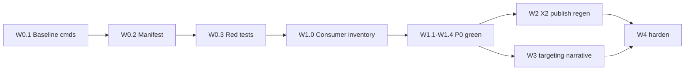

> ARCHIVED MEMORIAL RECORD: This file is preserved for review and lessons learned. Do not execute it as an active plan.

---
---
plan_id: prompt-judge-x2-alignment-closeout-c8e4a2
plan_type: governance
touches_agentic_core: false
touches_governance_ci: true
touches_cursor_rules: false
touches_plan_templates: false
core_addition_author_gate_required: false
author_gate_receipt_ref: ""
dod_exempt: false
---

# Prompt ↔ Judge ↔ X2 Alignment Closeout

Close the remaining gaps between **executable PA prompts**, **X1D judge rubrics**, **X2 deterministic gates**, and **executive-summary regen publish policy** so generated resume lanes do not teach one contract while graders enforce another.

> **plan_id discipline:** `prompt-judge-x2-alignment-closeout-c8e4a2` ↔ file stem ↔ markers `plan=prompt-judge-x2-alignment-closeout-c8e4a2`

---

## Plan State Markers

FORMAT_VERSION: simplified-plan-format-v1
PLAN_STATUS: COMPLETE
CURRENT_WAVE: closeout
LAST_COMPLETED_WAVE: closeout
LAST_UPDATED: 2026-05-26

---

## Context (SCQA)

- **Situation** — Alignment machinery exists: [`section_product_shape_ssot.py`](apps_rg/runtime/sections/section_product_shape_ssot.py), [`section_prompt_drift_audit.py`](apps_rg/runtime/sections/section_prompt_drift_audit.py), [`section_prompt_judge_alignment.py`](apps_rg/runtime/sections/section_prompt_judge_alignment.py), [`executive_summary_x1d_dimension_verdicts.py`](apps_rg/runtime/judges/executive_summary_x1d_dimension_verdicts.py), lockstep tests, exec-summary regen loop. Prior plan [`section-product-shape-alignment-b4e7a1`](.cursor/plans/section-product-shape-alignment-b4e7a1.md) is **claimed COMPLETE** — **not an unquestioned dependency** for this plan (see dependency revalidation below).
- **Complication** — Static review (2026-05-26) found forked contracts: exec-summary X1D `RUBRIC` lists six dimensions while SSOT expects eight; claim-ledger PA contradiction; competencies U0 vs X2 keys; drift-audit POSIX path bug (proves shape plan closeout was not fully revalidated on all seams); bullet X2 lacks line discipline; regen publish can surface judge-failing candidates without Exit/X3 consequence; lockstep may audit YAML while runtime uses `_legacy_i0`.
- **Question** — How do we close alignment without weakening gates, shipping red CI, or claiming runtime certification we did not run?
- **Answer** — W0 baseline + minimal prompt-authority manifest + red-before-green tests (implementation evidence only); W1 P0 fixes on same branch/PR; W2–W3 P1; W4 P2 observability — with explicit proof classes and non-claims at closeout.

### Prior plan dependency (revalidation required)

| Prior artifact | Status for this plan |
|----------------|----------------------|
| [section-product-shape-alignment-b4e7a1](.cursor/plans/section-product-shape-alignment-b4e7a1.md) | **Claimed complete — revalidated here.** Drift-audit POSIX bug still present → do not treat shape alignment as blocking prerequisite. Re-run shape/drift baseline in W0; W1.4 must green drift audit. |
| [exec-summary-judge-regen-control-loop-f8a3c2](.cursor/plans/exec-summary-judge-regen-control-loop-f8a3c2.md) | Related regen owner; publish/Exit policy extended in W2.2 |
| [graph-skills-quality-enhancement-c4e8a1](.cursor/plans/graph-skills-quality-enhancement-c4e8a1.md) | Graph ledger rule (W1.2) |

### Review triage (agree / nuance / defer)

| Finding | Verdict | Notes |
|---------|---------|-------|
| Exec summary X1D six vs eight dimensions | **Agree — P0** | `_build_judge_user_prompt` uses 6-dimension `RUBRIC`. |
| Claim ledger 3–6 vs one-row-per-sentence | **Agree — P0** | Unify to material-sentence coverage. |
| Competencies key drift | **Agree — P0** | Consumer inventory before alias removal (W1.3). |
| Drift audit POSIX path | **Agree — P0** | Repo-bound safe resolve (W1.4). |
| Executable prompt YAML vs `_legacy_i0` | **Agree — W0/W1** | Minimal manifest before P0 lockstep (not W4-only). |
| Publish without judge pass | **Agree — P1** | `certified` vs `best_effort` + **Exit/X3 consequence** (W2.2). |
| X1D targeting | **Agree — P1** | Same capsule digests as generation; parity receipt (W3.1). |
| Regen word-count floor | **Agree — change approach** | **No hard `X2_FLOOR` on `prior_word_count`**; soft preservation prompt only (W2.3). |
| Bullet line discipline | **Agree — P1** | Shared `split_sentences` utility + abbreviation tests (W2.1). |
| Headline | **Defer** | W4.3 unless production receipts |

---

## Architecture Invariants

| ID | Invariant |
|----|-----------|
| INV-1 | **Do not edit** `agentic_core`. |
| INV-2 | **Do not weaken** X2 gates, rubrics, fixtures, or tests to make bad output pass. |
| INV-3 | **X1D = semantic; X2 = mechanical** — no prose judging in X2. |
| INV-4 | Exec-summary dimensions SSOT: `EXEC_SUMMARY_RUBRIC_DIMENSION_IDS` — all judge surfaces derive from it. |
| INV-5 | **Publish disposition drives Exit/X3:** `certified` → ALLOW-style / `proof_eligible`; `best_effort` → REVIEW, not X1D-certified, not `proof_eligible`, requires `best_effort_publish_allowed=true` + `blocking_judge_ids`. |
| INV-6 | **Drift audit paths:** repo-relative refs only; reject absolute paths, `..`, and resolved paths outside repo root. |
| INV-7 | **Lockstep/drift audits validate executable corpus** per [`section_prompt_authority_ssot.py`](apps_rg/runtime/sections/section_prompt_authority_ssot.py) (W0.2), not YAML alone. |
| INV-8 | **Judge targeting parity:** `generation_targeting_digest` and `judge_targeting_digest` from same capsule builder; JD/briefing targeting-only, never proof. |
| INV-9 | **No hard regen word-count floor** — SSOT max words, X2 sentence count, and schema ledger mins remain hard; material-claim preservation is prompt guidance or WARN receipt only. |
| INV-10 | **W0 red tests are not a shippable checkpoint** — final branch/PR must include W1 fixes and green tests. |

---

## Proof classes (closeout non-claims)

This plan does **not** claim unless explicitly executed and evidenced:

| Class | In scope | Explicitly NOT claimed |
|-------|----------|-------------------------|
| **static** | Code review, grep, manifest inventory | — |
| **unit_contract** | pytest unit + `_apps_contract` + lockstep/drift asserts | — |
| **smoke** | `python -c` import/assert one-liners below | — |
| **canonical_runtime** | — | No live provider certification; no full Brown/Forge canonical run; no release eligibility |

Closeout receipt MUST state proof class per DoD row. **BLOCKED** is allowed when drift audit cannot reach zero after W1.4 (document violation count + owner).

---

## Status Tables

### Wave Progress

| Wave | Phase IDs | Focus | Est. Tokens | Assumptions | Status | Success Criteria |
|------|-----------|-------|-------------|-------------|--------|------------------|
| W0 | W0.1–W0.3 | Baseline commands, prompt-authority manifest, red-before-green tests | ~20K | Drift violations may be non-zero pre-W1.4 | ✅ DONE | Baseline receipt; manifest; 4 red + 2 green tests |
| W1 | W1.0–W1.4 | P0 fixes + green tests (same PR as W0 reds) | ~50K | Single branch red→green | ✅ DONE | 6/6 W0 tests green; drift 0; lockstep pass |
| W2 | W2.1–W2.3 | Bullet X2, publish/Exit, regen deltas + soft preservation | ~55K | `split_sentences` reused | 🔲 TODO | Contract tests; publish disposition in X3 path |
| W3 | W3.1–W3.2 | Targeting parity; narrative mechanical X2 | ~35K | Capsule in fixtures | 🔲 TODO | Parity digests in artifacts |
| W4 | W4.1–W4.3 | Manifest hardening, regen receipts, headline defer | ~35K | — | 🔲 TODO | Full authority SSOT + observability |

### Phase-Level Summary

| Phase ID | Title | Scope (files) | Pain Points | Est. Tokens | Status |
|----------|-------|---------------|-------------|-------------|--------|
| W0.1 | Drift + lockstep baseline | [prompt_judge_x2_alignment_w0_baseline_receipt.md](docs/reports/apps_rg/prompt_judge_x2_alignment_w0_baseline_receipt.md) | Shape plan assumed done | ~5K | ✅ DONE |
| W0.2 | Minimal prompt authority manifest | [section_prompt_authority_ssot.py](apps_rg/runtime/sections/section_prompt_authority_ssot.py) | YAML vs `_legacy_i0` | ~8K | ✅ DONE |
| W0.3 | Red-before-green test stubs | [test_prompt_judge_x2_alignment_w0.py](tests/unit/apps_rg/test_prompt_judge_x2_alignment_w0.py) | Broken CI if merged alone | ~7K | ✅ DONE |
| W1.0 | Competencies consumer inventory | [competencies_schema_consumer_inventory.md](docs/reports/apps_rg/competencies_schema_consumer_inventory.md) | Silent export break | ~5K | ✅ DONE |
| W1.1 | Exec summary X1D rubric unification | `executive_summary_x1d.py`, dimension_verdicts | 6 vs 8 dimensions | ~15K | ✅ DONE |
| W1.2 | Claim ledger single rule | `executive_summary_pa.py` | Contradictory guidance | ~8K | ✅ DONE |
| W1.3 | Competencies prompt/schema lock | `competencies_pa.py` | `categories`/`text` in U0 | ~12K | ✅ DONE |
| W1.4 | Drift audit repo-bound paths | `section_prompt_drift_audit.py` | POSIX + traversal | ~10K | ✅ DONE |
| W2.1 | Bullet line-discipline X2 | bullet X2, `executive_summary_sentence_utils` | Brittle terminators | ~25K | 🔲 TODO |
| W2.2 | Publish + Exit/X3 policy | lane, pool, done policy, X3 aggregate | Silent certify | ~20K | 🔲 TODO |
| W2.3 | Regen deltas + soft preservation | delta policy, remediation | Bloated floor | ~10K | 🔲 TODO |
| W3.1 | Targeting parity digests | judge packet, lane receipts | Judge/gen drift | ~20K | 🔲 TODO |
| W3.2 | Narrative mechanical X2 | narrative X2 validators | Mechanical leaks | ~15K | 🔲 TODO |
| W4.1 | Authority manifest hardening | extend W0.2 SSOT | Full lane coverage | ~15K | 🔲 TODO |
| W4.2 | Regen observability | lane receipts, remediation naming | Opaque cycles | ~15K | 🔲 TODO |
| W4.3 | Headline defer checkpoint | receipts | Low ROI | ~5K | 🔲 TODO |

---

## Out Of Scope

- Full YAML migration for `_legacy_i0` lanes.
- `agentic_core` changes.
- Live multi-provider / canonical Brown runtime proof in CI.
- Merging W0 red tests without W1 fixes on the default branch.
- Headline rework unless W4.3 trigger fires.

---

## Wave 0 — Baseline, Manifest & Red-Before-Green Evidence

WAVE_ID: W0
WAVE_STATUS: TODO
AUTHORIZATION_STATUS: NOT_REQUIRED

> **Checkpoint discipline:** W0 is **red-before-green implementation evidence** on a feature branch. It is **not** a shippable milestone. Do not merge to default branch with failing tests. Final PR must land **W0 tests + W1 fixes together** with all tests green.

### W0.1 — Drift and lockstep baseline (required)

Record baseline before any W1 patch. **Non-zero violation count is expected** until W1.4.

```bash
PYTHONPATH=. python -c "from apps_rg.runtime.sections.section_prompt_drift_audit import audit_all_generated_lanes; v=audit_all_generated_lanes(); print(len(v)); [print(x) for x in v[:20]]"
```

```bash
PYTHONPATH=. python -c "from apps_rg.runtime.sections.section_prompt_judge_alignment import audit_all_generated_sections_prompt_judge; v=audit_all_generated_sections_prompt_judge(); print(len(v)); [print(x) for x in v[:20]]"
```

Store counts + first 20 violations in wave note / closeout receipt. **Closeout requirement:** drift audit `len(v)==0` after W1.4, or status **BLOCKED** with explicit reason.

### W0.2 — Minimal executable prompt authority manifest (required before W1 lockstep)

Add [`section_prompt_authority_ssot.py`](apps_rg/runtime/sections/section_prompt_authority_ssot.py) (minimal in W0; hardened in W4.1):

```python
# section_id -> list of executable source descriptors
EXECUTABLE_PROMPT_SOURCES: dict[str, list[dict[str, str]]] = {
    "executive_summary": [{"kind": "yaml_template", "ref": "apps_rg/prompt_assembly/templates/..."}],
    "unify_bullets": [{"kind": "legacy_i0", "ref": "apps_rg.runtime.sections.unify_bullets_pa._legacy_i0"}],
    # ... all GENERATED_LANES
}
```

Helper: `collect_executable_prompt_corpus(section_id) -> str` — used by lockstep/drift for **P0 lanes at minimum** in W1:

- `executive_summary`, `competencies`, `unify_bullets`, `ibm_bullets`, `unify_narrative`, `ibm_narrative`

**Invariant:** W1 lockstep tests for P0 lanes assert against **executable** corpus, not YAML files alone.

### W0.3 — Red-before-green tests (same PR as W1)

Create failing tests on feature branch (do not merge alone):

| Test | Defect encoded |
|------|----------------|
| `test_exec_summary_x1d_rubric_lists_all_ssot_dimensions` | 6 vs 8 in live judge prompt |
| `test_exec_summary_pa_claim_ledger_guidance_consistent` | u0 vs graph-only guard |
| `test_competencies_u0_schema_matches_x2` | `competencies`/`term` in U0 |
| `test_drift_audit_repo_path_posix_safe` | safe resolve + traversal rejection |
| `test_prompt_authority_executable_corpus_non_empty` | manifest wired for P0 lanes |

**Acceptance (W0 alone):** tests exist and fail for the right reason; baseline commands recorded. **Not** green CI.

---

## Wave 1 — P0 Contract Defects (same PR as W0 reds)

WAVE_ID: W1
WAVE_STATUS: TODO
AUTHORIZATION_STATUS: NOT_REQUIRED

> **Ship gate:** Merging W1 without W0.3 tests is forbidden. Merging W0.3 without W1 fixes is forbidden.

### W1.0 — Competencies consumer inventory (before alias removal)

Static inventory (document in PR / `docs/reports/apps_rg/competencies_schema_consumer_inventory.md`):

| Consumer area | Check |
|---------------|-------|
| [`modular_rg_output_builder.py`](apps_rg/l2_recipe/modular_rg_output_builder.py) `_competencies_to_skills` | reads `competencies` key |
| [`competencies_lane_execution.py`](apps_rg/runtime/sections/competencies_lane_execution.py) | `parsed.get("competencies")` |
| [`bullet_pool_claude_selector.py`](apps_rg/runtime/judges/bullet_pool_claude_selector.py) | pool paths |
| Export / package / L6 shadow packets | grep `categories`, `competencies`, `"term"` |

**Rule:** Final **product-facing prompt** teaches `categories` + `text` only. Legacy `competencies` / `term` may remain as **input normalizers** or transitional read adapters with explicit tests — not in U0 output contract.

### W1.1 — Executive summary X1D rubric unification

1. Single builder from `EXEC_SUMMARY_RUBRIC_DIMENSION_IDS` for `RUBRIC`, compact output, and judge packet prose.
2. Lockstep uses **executable** exec-summary corpus (W0.2).
3. Proof (executable corpus):

```bash
PYTHONPATH=. python -c "from apps_rg.runtime.sections.section_prompt_judge_alignment import assert_all_sections_prompt_judge_lockstep; assert_all_sections_prompt_judge_lockstep()"
```

### W1.2 — Claim ledger single rule

Canonical rule in `u0` **and** `format_graph_only_quality_guardrails_block()`:

> Claim ledger must cover every **material** sentence. Rows may support multiple sentences when one source fact backs a synthesized claim. Target **3–6 rows**; do not default to one row per sentence; document intentional omissions in `gap_notes`.

### W1.3 — Competencies prompt/schema lock

After W1.0 inventory: update U0, schema descriptions, X2 normalizers; add adapter tests for any retained legacy readers.

### W1.4 — Drift audit repo-bound path fix

```python
def _repo_path(ref: str) -> Path:
    ref = str(ref).strip().replace("\\", "/")  # normalize only
    if not ref:
        raise ValueError("empty template ref")
    if ref.startswith("/") or (len(ref) > 1 and ref[1] == ":"):  # absolute / Windows drive
        raise ValueError(f"absolute template ref forbidden: {ref!r}")
    if ".." in ref.split("/"):
        raise ValueError(f"path traversal forbidden: {ref!r}")
    resolved = (_REPO_ROOT / ref).resolve()
    if _REPO_ROOT.resolve() not in resolved.parents and resolved != _REPO_ROOT.resolve():
        raise ValueError(f"template ref escapes repo: {ref!r}")
    return resolved
```

Tests: forward-slash refs on Windows; `..` and absolute refs raise; existing templates resolve.

**Closeout drift command (must pass or BLOCKED):**

```bash
PYTHONPATH=. python -c "from apps_rg.runtime.sections.section_prompt_drift_audit import audit_all_generated_lanes; v=audit_all_generated_lanes(); assert not v, v"
```

---

## Wave 2 — P1 Mechanical X2, Publish/Exit & Regen

WAVE_ID: W2
WAVE_STATUS: DONE
AUTHORIZATION_STATUS: NOT_REQUIRED

### W2.1 — Bullet line discipline (shared sentence parsing)

**Do not** use raw `.`/`!`/`?` counts.

Use [`executive_summary_sentence_utils.split_sentences`](apps_rg/runtime/validators/executive_summary_sentence_utils.py) (or extract shared `resume_sentence_utils` if bullet validators should not import exec-summary module — prefer shared util without layer violation).

| Gate | Rule |
|------|------|
| `x2_*_bullet_single_thought` | `len(split_sentences(bullet_text)) == 1` |
| `x2_*_bullet_no_embedded_newline` | no `\n` / `\n\n` in bullet body |
| `x2_*_bullet_no_paragraph_block` | char cap from SSOT |
| `x2_ibm_narrative_slot_reservation` | IBM: heuristic capstone/narrative bleed |

**Tests:** abbreviations (`Dr.`, `Inc.`, `U.S.`, `e.g.`) must not false-split; multi-sentence bullets FAIL; paragraph blocks FAIL.

### W2.2 — Publish disposition + Exit/X3 consequence

| `publish_disposition` | Judge state | Artifacts / operator | Exit / X3 |
|----------------------|-------------|----------------------|-----------|
| `certified` | All required model-backed judges pass on selected snapshot | `proof_eligible=true`, `x1d_certified=true` | Eligible for **ALLOW**-style handoff when X2 also passes |
| `best_effort` | Pool argmax; ≥1 judge fail | `proof_eligible=false`, `x1d_certified=false`, `blocking_judge_ids=[...]` | **REVIEW** / non-certified; requires `best_effort_publish_allowed=true` in run config |

**Forbidden:** Representing `best_effort` as X1D-certified, proof-eligible, or ALLOW without explicit override flag recorded in receipt.

Wire into: [`executive_summary_candidate_pool.py`](apps_rg/runtime/sections/executive_summary_candidate_pool.py), lane terminus, X3 aggregate path, [`executive_summary_operator_guide.md`](docs/apps_rg/executive_summary_operator_guide.md) layman summary ("approved" vs "saved for review").

Split eligibility fields if needed: `x2_publish_eligible` vs `judge_certified`.

### W2.3 — Regen deltas + soft material preservation (no word-count floor)

**Remove** any hard prompt line of the form `X2_FLOOR: ≥{prior_word_count} words`.

**Hard gates (unchanged):** SSOT max words, exactly-six-sentence X2 gate, schema/X2 ledger row minimums.

**Soft regen guidance only:**

> Preserve material claims and ledger-backed support unless removal is required to satisfy X2 or judge feedback. Stay within max word cap. Do not pad or bloat to match prior length.

Optional receipt fields (non-blocking): `prior_word_count`, `after_word_count`, `word_count_delta_warn` when shrink exceeds threshold.

Delta classes: `resume_voice_humanize`, `ats_targeting_without_stuffing`, `anti_overfit_reduce_jd_echo`, `deterministic_alignment_structure`, `evidence_utilization_weave`.

---

## Wave 3 — Targeting Parity & Narrative Mechanical X2

WAVE_ID: W3
WAVE_STATUS: DONE
AUTHORIZATION_STATUS: NOT_REQUIRED

### W3.1 — Judge targeting bound to generation capsule

**Do not** build an independent judge-only target profile.

Per run artifacts:

```json
{
  "generation_targeting_digest": "<sha256 canonical capsule fields>",
  "judge_targeting_digest": "<sha256 same builder>",
  "targeting_parity_status": "match|mismatch",
  "target_title": "...",
  "target_company": "..."
}
```

- Use same capsule formatter as PA generation ([`format_graph_targeting_capsule_for_pa`](apps_rg/runtime/c0/exec_summary_graph_targeting_capsule.py) or shared helper).
- Judge may use title/company/capsule for **relevance** grading only.
- **JD_TEXT / BRIEFING remain targeting-only; never proof** (unchanged).

Fail closed or WARN on `targeting_parity_status=mismatch` before judge panel (configurable strict mode in tests).

### W3.2 — Narrative mechanical X2

Lightweight deterministic checks (semantic quality stays X1D): one sentence via `split_sentences`, metric cap, bullet-text overlap threshold, SSOT forbidden openers.

---

## Wave 4 — Manifest Hardening & Observability

WAVE_ID: W4
WAVE_STATUS: DONE
AUTHORIZATION_STATUS: NOT_REQUIRED

### W4.1 — Extend W0.2 manifest to all `GENERATED_LANES`

Full coverage, CI advisory gate optional, drift/lockstep call `collect_executable_prompt_corpus` everywhere.

### W4.2 — Regen observability

- `judge_regen_cycles`, `transport_attempts_per_cycle`, `semantic_rewrite_attempts`
- `judge_feedback_lines_total` / `_included` / `_dropped` / `dropped_reason`
- `publishable_baseline_hash`, `rewrite_from`, `use_rejected_as_negative_example`
- Rename `accepted` → `draft_parse_ok`; reserve `accepted` for post-gate pass

### W4.3 — Headline defer

Only if production receipts show failures; else DEFERRED in closeout.

---

## Definition of Done

| # | Criterion | Proof class | Verification |
|---|-----------|-------------|--------------|
| D1 | Exec summary judge lists 8 SSOT dimensions | unit_contract | W0.3 test green post-W1.1 |
| D2 | Claim ledger guidance consistent | unit_contract | W0.3 test green post-W1.2 |
| D3 | Competencies U0 + consumer inventory | static + unit_contract | W1.0 doc + W1.3 tests |
| D4 | Drift audit zero violations | smoke | drift assert command or BLOCKED |
| D5 | P0 lanes lockstep on **executable** corpus | smoke + unit_contract | manifest helper + lockstep assert |
| D6 | Bullet single-thought X2 | unit_contract | rigor weak payloads + abbreviation tests |
| D7 | Publish disposition drives X3/Exit | unit_contract | pool/lane tests: certified vs best_effort |
| D8 | No hard regen word floor | static + unit_contract | grep + remediation tests |
| D9 | Targeting parity digests | unit_contract | artifact fixture asserts |
| D10 | No agentic_core diff | static | `git diff -- agentic_core` empty |
| D11 | Closeout non-claims documented | static | proof class table in receipt |

### Closeout verification commands (all must pass or BLOCKED with reason)

```bash
PYTHONPATH=. python -c "from apps_rg.runtime.sections.section_prompt_drift_audit import audit_all_generated_lanes; v=audit_all_generated_lanes(); assert not v, v"
```

```bash
PYTHONPATH=. python -c "from apps_rg.runtime.sections.section_prompt_judge_alignment import assert_all_sections_prompt_judge_lockstep; assert_all_sections_prompt_judge_lockstep()"
```

```bash
python -m pytest tests/unit/apps_rg/test_section_prompt_judge_lockstep.py tests/unit/apps_rg/test_executive_summary_judge_regen_loop.py -q -o addopts=
```

```bash
python -m pytest tests/_apps_contract/ -k "competencies or prompt_judge or product_shape" -q -o addopts=
```

```bash
git diff -- agentic_core
```

### Explicit non-claims (required in closeout receipt)

- No live provider certification
- No full canonical Brown/Forge runtime run
- No release eligibility beyond unit/contract/smoke unless separately executed and evidenced
- Prior shape plan treated as **revalidated**, not assumed authoritative

### Verification vs Deferral

| Item | Wave | Defer if |
|------|------|----------|
| W0 red-only merge | — | **Never on default branch** |
| Drift audit zero | W1.4 | Document BLOCKED + violation list |
| Canonical runtime | — | Always deferred from this plan |
| Headline | W4.3 | No production failures |

---

## Dependencies & Sequencing



- W1 lockstep depends on W0.2 manifest.
- W2.2 depends on W1.1 dimension verdicts.
- W1.3 depends on W1.0 inventory.

---

## Risk Register

| Risk | Mitigation |
|------|------------|
| Red tests merged without W1 | INV-10; PR checklist |
| Manifest wrong source for lane | Executable corpus integration test per lane |
| `split_sentences` false positives | Abbreviation fixture table |
| best_effort shown as certified | Exit/X3 wire + operator guide |
| Export breaks on competencies rename | W1.0 inventory + adapter tests |

---

## Related Plans & Artifacts

| Artifact | Relationship |
|----------|--------------|
| [section-product-shape-alignment-b4e7a1](.cursor/plans/section-product-shape-alignment-b4e7a1.md) | **Claimed complete — revalidated by this plan** (drift path bug) |
| [exec-summary-judge-regen-control-loop-f8a3c2](.cursor/plans/exec-summary-judge-regen-control-loop-f8a3c2.md) | Regen receipts W4.2; publish W2.2 |
| [graph-skills-quality-enhancement-c4e8a1](.cursor/plans/graph-skills-quality-enhancement-c4e8a1.md) | W1.2 graph-only ledger |

---

PLAN_CREATED: slug=prompt-judge-x2-alignment-closeout-c8e4a2 path=.cursor/plans/prompt-judge-x2-alignment-closeout-c8e4a2.md status=Not Started

WAVE_COMPLETE: plan=prompt-judge-x2-alignment-closeout-c8e4a2 wave=0 note="baseline receipt, section_prompt_authority_ssot, test_prompt_judge_x2_alignment_w0 4F/2P, red-before-green"
WAVE_COMPLETE: plan=prompt-judge-x2-alignment-closeout-c8e4a2 wave=1 note="P0: 8-dim rubric, ledger rule, categories U0, safe drift paths, consumer inventory, 6/6 tests green"
