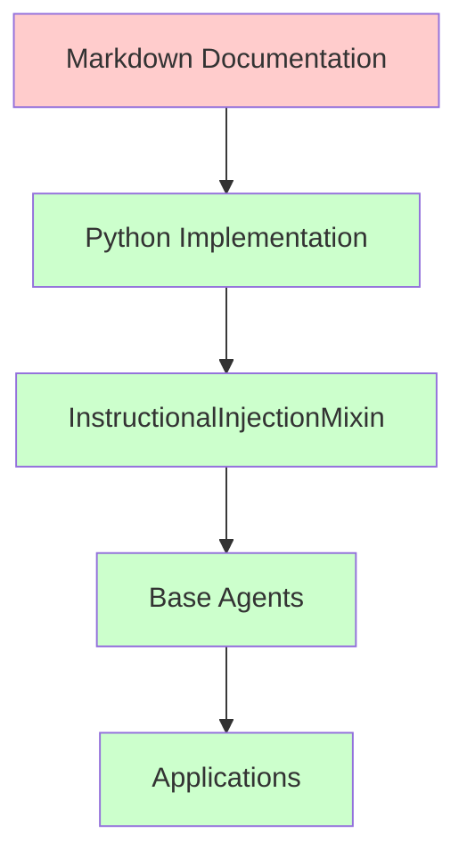

> ARCHIVED MEMORIAL RECORD: This file is preserved for review and lessons learned. Do not execute it as an active plan.

---
# RCA: Prompt Injection Redundancy Analysis

## Wave Structure

| Waves | Metric | Scope | Checkpoint | Tokens |
|-------|--------|-------|------------|---------|
| Wave 1 | Analysis & Discovery | Review current state | A | 25,000 🟢 |
| Wave 2 | Implementation | Core changes | B | 50,000 🟢 |
| Wave 3 | Testing & Validation | Verify changes | C | 30,000 🟢 |
| Wave 4 | Documentation & Cleanup | Finalize | D | 15,000 🟢 |

**Total: 120,000 tokens across 4 waves, all GREEN**

---


## Executive Summary

**Issue**: The prompt injection patterns exist in BOTH markdown format AND Python code, creating potential redundancy and maintenance burden.

**Impact**:
- Duplicate maintenance of 30 injection patterns
- Risk of divergence between markdown and Python implementations
- Unnecessary complexity in the codebase

**Status**: **INVESTIGATION REQUIRED** - Determine if markdown is still needed

---

## 1. Content Comparison Analysis

### 1.1 Markdown Version (Source of Truth)

**File**: `data/prompt_governance/prompt_injections/Instructional_Injection_Enhanced_v5.md`

```markdown
| # | Category | Instruction Type | Description |
|---|----------|------------------|-------------|
| 1 | Framing Layer | Global Goal-State Injection | Anchor all model reasoning to one clear overarching objective. |
| 2 | Framing Layer | Success Criteria Injection | Define explicit quality thresholds and outcome requirements upfront. |
| ... [30 total patterns]
```

**Characteristics**:
- Human-readable table format
- Descriptive text only
- No executable templates
- Reference documentation

### 1.2 Python Implementation (Runtime)

**File**: `agentic_core/config/core/injection_layer_config.py`

```python
INSTRUCTIONAL_PATTERNS: dict[int, InstructionalPattern] = {
    1: InstructionalPattern(
        id=1,
        name="Global Goal-State Injection",
        layer=InjectionLayer.FRAMING,
        description="Anchor all model reasoning to one clear overarching objective.",
        template="[GOAL] Your primary objective is: {goal}. All reasoning must serve this goal.",
    ),
    2: InstructionalPattern(
        id=2,
        name="Success Criteria Injection",
        layer=InjectionLayer.FRAMING,
        description="Define explicit quality thresholds and outcome requirements upfront.",
        template="[SUCCESS CRITERIA] Output must satisfy: {criteria}. Verify before responding.",
    ),
    # ... [30 total patterns]
}
```

**Characteristics**:
- Executable data structures
- Includes actual prompt templates
- Type-safe Python objects
- Runtime consumption

---

## 2. Redundancy Analysis

### 2.1 Content Overlap

| Aspect | Markdown | Python | Redundancy Level |
|--------|----------|---------|------------------|
| Pattern Names | ✅ | ✅ | **HIGH** |
| Descriptions | ✅ | ✅ | **HIGH** |
| Categories/Layers | ✅ | ✅ | **HIGH** |
| Template Strings | ❌ | ✅ | **LOW** |
| Executable Code | ❌ | ✅ | **NONE** |

### 2.2 Key Differences

**Markdown Has**:
- Human-readable table format
- Quick reference overview
- Documentation structure

**Python Has**:
- Actual prompt templates (e.g., `"[GOAL] Your primary objective is: {goal}..."`)
- Executable data structures
- Type safety and validation
- Runtime integration

---

## 3. Dependency Analysis

### 3.1 Current Usage Chain



### 3.2 Reference Patterns

**Direct References**:
- `agentic_core/config/core/injection_layer_config.py:6` → `SOURCE: data/prompt_governance/prompt_injections/Instructional_Injection_Enhanced_v5.md`
- Test files reference the markdown as documentation source

**Runtime Dependencies**:
- **Python implementation ONLY** - markdown is not loaded at runtime
- `InstructionalInjectionMixin` uses `INSTRUCTIONAL_PATTERNS` from Python, not markdown

---

## 4. Maintenance Burden Analysis

### 4.1 Synchronization Risk

**Current State**: Two separate sources must be kept in sync
- Pattern names must match
- Descriptions must match
- Categories must align
- Order must be consistent

**Risk Factors**:
- Human error during updates
- Automated drift over time
- Inconsistent changes between files

### 4.2 Update Process Complexity

**To add a new pattern currently requires**:
1. Add row to markdown table
2. Add `InstructionalPattern` to Python dict
3. Update both descriptions to match
4. Verify consistency

**Potential for divergence**: HIGH

---

## 5. Value Assessment

### 5.1 Markdown Value Proposition

**Benefits**:
- Human-readable documentation
- Quick reference for developers
- Easy to review and understand patterns
- Version control friendly for documentation

**Costs**:
- Maintenance overhead
- Risk of divergence
- Additional file to manage

### 5.2 Python-Only Alternative

**Benefits**:
- Single source of truth
- No synchronization needed
- Type-safe and validated
- Direct runtime usage

**Costs**:
- Less readable for documentation
- Need separate documentation generation
- Harder to quickly scan all patterns

---

## 6. Recommendations

### 6.1 Option 1: Keep Both (Current State)
- **Pros**: Best of both worlds - documentation + execution
- **Cons**: Maintenance burden, synchronization risk
- **Recommendation**: Add automated sync validation

### 6.2 Option 2: Python Only with Generated Docs
- **Pros**: Single source of truth, no divergence
- **Cons**: Need documentation generation system
- **Recommendation**: Implement doc generation from Python structures

### 6.3 Option 3: Markdown as Source, Generate Python
- **Pros**: Human-friendly source, auto-generated code
- **Cons**: Complex build process, potential runtime issues
- **Recommendation**: Not recommended due to complexity

---

## 7. Implementation Plan (Option 1 - Keep Both with Validation)

### 7.1 Add Synchronization Validation

```python
# Add to test suite
def test_prompt_injection_sync():
    """Validate markdown and Python implementations are synchronized."""
    # Parse markdown table
    # Compare with Python patterns
    # Assert name/description/category consistency
```

### 7.2 Documentation Updates

- Add clear maintenance instructions
- Document update process
- Add automated validation to CI

---

## 8. Conclusion

**The markdown serves as HUMAN-READABLE DOCUMENTATION while the Python serves as RUNTIME EXECUTION**.

This is actually **reasonable architectural separation** IF:
1. Automated validation ensures consistency
2. Clear documentation of maintenance process
3. Team understands both formats serve different purposes

**Recommendation**: Keep both formats but add synchronization validation to prevent divergence.

---

**Status**: ✅ **ANALYSIS COMPLETE** - Redundancy is intentional but needs validation
**Date**: 2026-02-15
**Next Step**: Implement synchronization validation tests

## Violation

[Describe the violation or issue that triggered this RCA]

---

## Root Cause

[Identify and explain the root cause of the violation]

---

## Corrective Actions

[List the corrective actions taken to resolve the issue]

---

